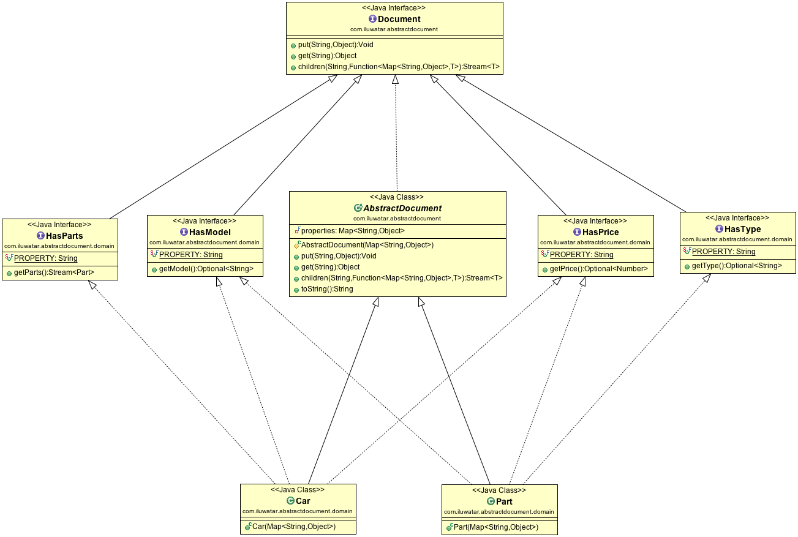
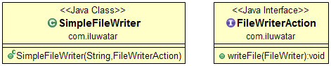
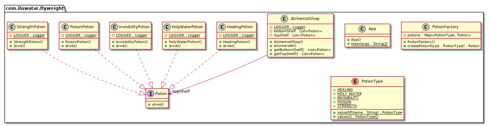
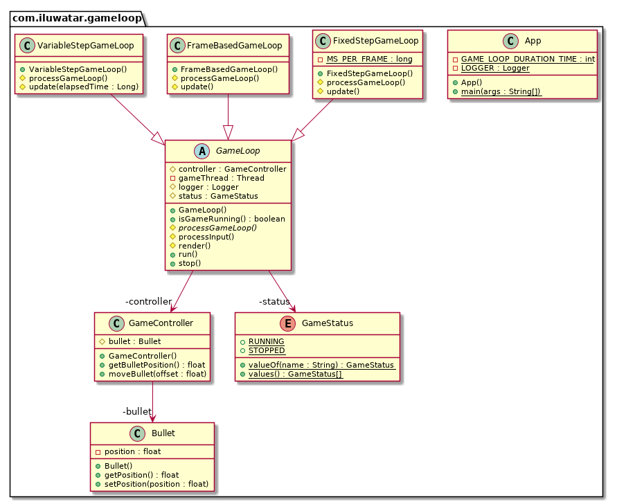
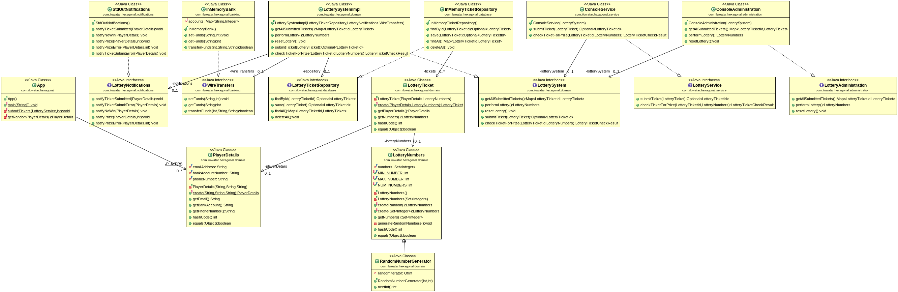
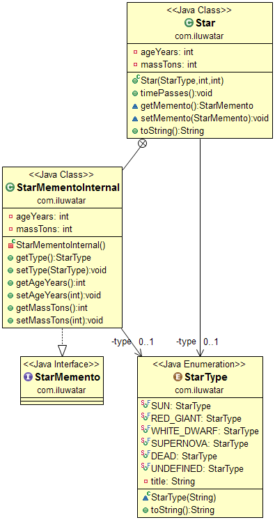
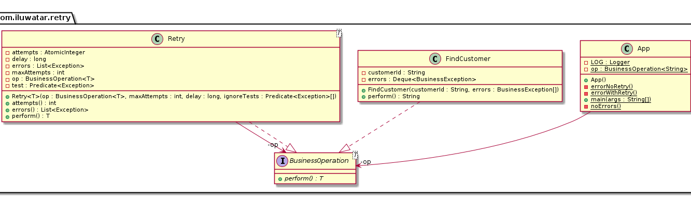
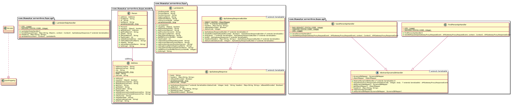
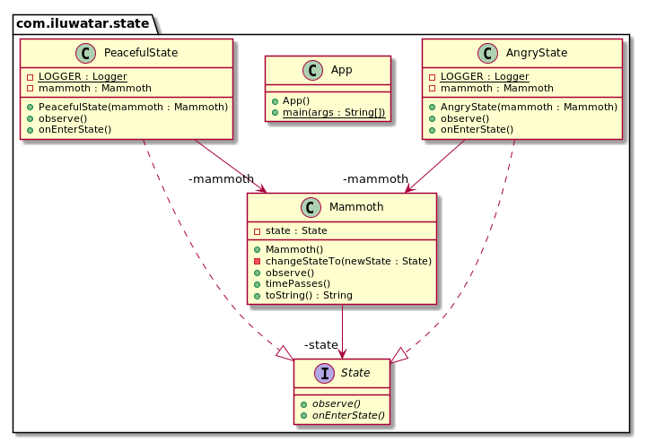
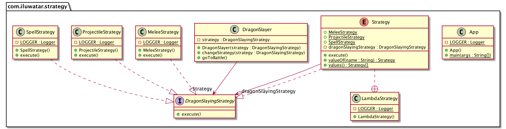

# Java design patterns

## Content
[1. Abstract Document](#abstract-document)

[2. Abstract Factory](#abstract-factory)

[3. Acyclic Visitor](#acyclic-visitor)

[4. Adapter](#adapter)

[5. Aggregator Microservices](#aggregator-microservices)

[6. Ambassaddor](#ambassador)

[7. Api Gatway](#api-gateway)

[8. Arrange/Act/Assert](#arrangeactassert)

[9. Async Method Invocation](#async-method-invocation)

[10. Balking](#balking)

[11. Bridge](#bridge)

[12. Builder](#builder)

[13. Business Delegete](#business-delegate)

[14. Bytecode](#bytecode)

[15. Caching](#caching)

[16. Callback](#callback)

[17. Chain of Responsibility](#chain-of-responsibility)

[18. Circuit Breaker](#circuit-breaker)

[19. Collection Pipeline](#collection-pipelline)

[20. Combinator](#combinator)

[21. Command](#command)

[22. Commander](#commander)

[23. Composite](#composite)

[24. Converter](#converter)

[25. CQRS](#cqrs)

[26. DAO](#DAO)

[27. Data Bus](#data-bus)

[28. Data Locality](#data-locality)

[29. Data Mapper](#data-mapper)

[30. Data Transfer Object](#data-transfer-object)

[31. Decorator](#decorator)

[32. Delegation](#delegation)

[33. Dependency Injection](#dependency-injection)

[34. Dirty Flag](#dirty-flag)

[35. Double Buffer](#double-buffer)

[36. Double Checked Locking](#double-checked-locking)

[37. Double Dispatch](#double-dispatch)

[38. EIP Aggregator](#eip-aggregator)

[39. EIP Message Channel](#eip-message-channel)

[40. EIP Publish Subscribe](#eip-publish-subscribe)

[41. EIP Splitter](#eip-splitter)

[42. EIP Wire Tap](#eip-wire-tap)

[43. Event Aggregator](#event-aggregator)

[44. Event Asynchronous](#event-asynchronous)

[45. Event Driven Architecture](#event-driven-architecture)

[46. Event Queue](#event-queue)

[47. Event Sourcing](#event-sourcing)

[48. Execute Around](#execute-around)

[49. Extension Objects](#extension-objects)

[50. Facade](#facade)

[51. Factory](#factory)

[52. Factory Kit](#factory-kit)

[53. Factory Method](#factory-method)

[54. Feature Toogle](#feature-toggle)

[55. Filterer](#filterer)

[56. Fluent Interface](#fluent-interface)

[57. Flux](#flux)

[58. Flyweight](#flyweight)

[59. Front Controller](#front-controller)

[60. Game Loop](#game-loop)

[61. Guarded Suspension](#guarded-suspension)

[62. Half Sync Half Async](#half-synchalf-async)

[63. Hexagonal Architecture](#hexagonal-architecture)

[64. Intercepting Filter](#intercepting-filter)

[65. Interpreter](#interpreter)

[66. Iterator](#iterator)

[67. Layers](#layers)

[68. Lazy Loading](#lazy-loading)

[69. Leader Election](#leader-election)

[70. Leader Followers](#leader-followers)

[71. Marker Interface](#marker-interface)

[72. Master Worker](#master-worker)

[73. Mediator](#mediator)

[74. Memento](#memento)

[75. Model View Controller](#model-view-controller)

[76. Model View Presenter](#model-view-presenter)

[77. Module](#module)

[78. Monad](#monad)

[79. Monostate](#monostate)

[80. Multiton](#multiton)

[81. Mute Idiom](#mute-idiom)

[82. Naked Objects](#naked-objects)

[83. Null Object](#null-object)

[84. Object Mother](#object-mother)

[85. Object Pool](#object-pool)

[86. Observer](#observer)

[87. Page Object](#page-object)

[88. Partial Response](#partial-response)

[89. Pipeline](#pipeline)

[90. Poison Pill](#poison-pill)

[91. Priority Queue](#priority-queue-pattern)

[92. Private Class Data](#private-class-data)

[93. Producer Consumer](#producer-consumer)

[94. Promise](#promise)

[95. Property](#property)

[96. Prototype](#prototype)

[97. Proxy](#proxy)

[98. Queue Load Leveling](#queue-based-load-leveling)

[99. Reactor](#reactor)

[100. Reder Writer Lock](#reader-writer-lock)

[101. Registry](#registry)

[102. Repository](#repository)

[103. Resource Acquisition Is Initialization](#resource-acquisition-is-initialization)

[104. Retry](#retry)

[105. Role Object](#role-object)

[106. Saga](#saga)

[107. Separated Interface](#separated-interface)

[108. Servant](#servant)

[109. Serverless](#serverless)

[110. Service Layer](#service-layer)

[111. Service Locator](#service-locator)

[112. Sharding](#sharding)

[113. Singleton](#singleton)

[114. Spatial Partition](#spatial-partition)

[115. Special Case](#special-case)

[116. Specification](#specification)

[117. State](#state)

[118. Step Builder](#step-builder)

[119. Strangler](#strangler)

[120. Strategy](#strategy)

[121. Subclass Sandbox](#subclass-sandbox)

[122. Template Method](#template-method)

[123. Thread Pool](#thread-pool)

[124. Throttling](#throttling)

[125. Thread Local Storage](#thread-local-storage)

[126. Tolerant Reader](#tolerant-reader)

[127. Trampoline](#trampoline)

[128. Transaction Script](#transaction-script)

[129. Twin](#twin)

[130. Type Object Pattern](#type-object-pattern)

[131. Unit of Work](#unit-of-work)

[132. Update Method](#update-method)

[133. Value Object](#value-object)

[134. Version Number](#version-number)

[135. Visitor](#visitor)


  


---
## Abstract Document                                                                                                                                    
[⬆](#content)


---
layout: pattern
title: Abstract Document
folder: abstract-document
permalink: /patterns/abstract-document/
categories: Structural
tags: 
 - Extensibility
---

### Intent

Use dynamic properties and achieve flexibility of untyped languages while keeping type-safety. 

### Explanation

The Abstract Document pattern enables handling additional, non-static properties. This pattern
uses concept of traits to enable type safety and separate properties of different classes into
set of interfaces.

Real world example

>  Consider a car that consists of multiple parts. However we don't know if the specific car really has all the parts, or just some of them. Our cars are dynamic and extremely flexible.

In plain words

> Abstract Document pattern allows attaching properties to objects without them knowing about it.

Wikipedia says

> An object-oriented structural design pattern for organizing objects in loosely typed key-value stores and exposing 
the data using typed views. The purpose of the pattern is to achieve a high degree of flexibility between components 
in a strongly typed language where new properties can be added to the object-tree on the fly, without losing the 
support of type-safety. The pattern makes use of traits to separate different properties of a class into different 
interfaces.

**Programmatic Example**

Let's first define the base classes `Document` and `AbstractDocument`. They basically make the object hold a property
map and any amount of child objects.

```java
public interface Document {

  Void put(String key, Object value);

  Object get(String key);

  <T> Stream<T> children(String key, Function<Map<String, Object>, T> constructor);
}

public abstract class AbstractDocument implements Document {

  private final Map<String, Object> properties;

  protected AbstractDocument(Map<String, Object> properties) {
    Objects.requireNonNull(properties, "properties map is required");
    this.properties = properties;
  }

  @Override
  public Void put(String key, Object value) {
    properties.put(key, value);
    return null;
  }

  @Override
  public Object get(String key) {
    return properties.get(key);
  }

  @Override
  public <T> Stream<T> children(String key, Function<Map<String, Object>, T> constructor) {
    return Stream.ofNullable(get(key))
        .filter(Objects::nonNull)
        .map(el -> (List<Map<String, Object>>) el)
        .findAny()
        .stream()
        .flatMap(Collection::stream)
        .map(constructor);
  }
  ...
}
```
Next we define an enum `Property` and a set of interfaces for type, price, model and parts. This allows us to create
static looking interface to our `Car` class.

```java
public enum Property {

  PARTS, TYPE, PRICE, MODEL
}

public interface HasType extends Document {

  default Optional<String> getType() {
    return Optional.ofNullable((String) get(Property.TYPE.toString()));
  }
}

public interface HasPrice extends Document {

  default Optional<Number> getPrice() {
    return Optional.ofNullable((Number) get(Property.PRICE.toString()));
  }
}
public interface HasModel extends Document {

  default Optional<String> getModel() {
    return Optional.ofNullable((String) get(Property.MODEL.toString()));
  }
}

public interface HasParts extends Document {

  default Stream<Part> getParts() {
    return children(Property.PARTS.toString(), Part::new);
  }
}
```

Now we are ready to introduce the `Car`.

```java
public class Car extends AbstractDocument implements HasModel, HasPrice, HasParts {

  public Car(Map<String, Object> properties) {
    super(properties);
  }
}
```

And finally here's how we construct and use the `Car` in a full example.

```java
    LOGGER.info("Constructing parts and car");

    var wheelProperties = Map.of(
        Property.TYPE.toString(), "wheel",
        Property.MODEL.toString(), "15C",
        Property.PRICE.toString(), 100L);

    var doorProperties = Map.of(
        Property.TYPE.toString(), "door",
        Property.MODEL.toString(), "Lambo",
        Property.PRICE.toString(), 300L);

    var carProperties = Map.of(
        Property.MODEL.toString(), "300SL",
        Property.PRICE.toString(), 10000L,
        Property.PARTS.toString(), List.of(wheelProperties, doorProperties));

    var car = new Car(carProperties);

    LOGGER.info("Here is our car:");
    LOGGER.info("-> model: {}", car.getModel().orElseThrow());
    LOGGER.info("-> price: {}", car.getPrice().orElseThrow());
    LOGGER.info("-> parts: ");
    car.getParts().forEach(p -> LOGGER.info("\t{}/{}/{}",
        p.getType().orElse(null),
        p.getModel().orElse(null),
        p.getPrice().orElse(null))
    );

    // Constructing parts and car
    // Here is our car:
    // model: 300SL
    // price: 10000
    // parts: 
    // wheel/15C/100
    // door/Lambo/300
```

### Class diagram



### Applicability

Use the Abstract Document Pattern when

* There is a need to add new properties on the fly
* You want a flexible way to organize domain in tree like structure
* You want more loosely coupled system

### Credits

* [Wikipedia: Abstract Document Pattern](https://en.wikipedia.org/wiki/Abstract_Document_Pattern)
* [Martin Fowler: Dealing with properties](http://martinfowler.com/apsupp/properties.pdf)
* [Pattern-Oriented Software Architecture Volume 4: A Pattern Language for Distributed Computing (v. 4)](https://www.amazon.com/gp/product/0470059028/ref=as_li_qf_asin_il_tl?ie=UTF8&tag=javadesignpat-20&creative=9325&linkCode=as2&creativeASIN=0470059028&linkId=e3aacaea7017258acf184f9f3283b492)


## Abstract Factory 
[⬆](#content)

---
layout: pattern
title: Abstract Factory
folder: abstract-factory
permalink: /patterns/abstract-factory/
categories: Creational
tags:
 - Gang of Four
---

### Also known as

Kit

### Intent

Provide an interface for creating families of related or dependent
objects without specifying their concrete classes.

### Explanation

Real world example

> To create a kingdom we need objects with a common theme. Elven kingdom needs an Elven king, Elven castle and Elven army whereas Orcish kingdom needs an Orcish king, Orcish castle and Orcish army. There is a dependency between the objects in the kingdom.

In plain words

> A factory of factories; a factory that groups the individual but related/dependent factories together without specifying their concrete classes.

Wikipedia says

> The abstract factory pattern provides a way to encapsulate a group of individual factories that have a common theme without specifying their concrete classes

**Programmatic Example**

Translating the kingdom example above. First of all we have some interfaces and implementation for the objects in the 
kingdom.

```java
public interface Castle {
  String getDescription();
}

public interface King {
  String getDescription();
}

public interface Army {
  String getDescription();
}

// Elven implementations ->
public class ElfCastle implements Castle {
  static final String DESCRIPTION = "This is the Elven castle!";
  @Override
  public String getDescription() {
    return DESCRIPTION;
  }
}
public class ElfKing implements King {
  static final String DESCRIPTION = "This is the Elven king!";
  @Override
  public String getDescription() {
    return DESCRIPTION;
  }
}
public class ElfArmy implements Army {
  static final String DESCRIPTION = "This is the Elven Army!";
  @Override
  public String getDescription() {
    return DESCRIPTION;
  }
}

// Orcish implementations similarly -> ...

```

Then we have the abstraction and implementations for the kingdom factory

```java
public interface KingdomFactory {
  Castle createCastle();
  King createKing();
  Army createArmy();
}

public class ElfKingdomFactory implements KingdomFactory {
  public Castle createCastle() {
    return new ElfCastle();
  }
  public King createKing() {
    return new ElfKing();
  }
  public Army createArmy() {
    return new ElfArmy();
  }
}

public class OrcKingdomFactory implements KingdomFactory {
  public Castle createCastle() {
    return new OrcCastle();
  }
  public King createKing() {
    return new OrcKing();
  }
  public Army createArmy() {
    return new OrcArmy();
  }
}
```

Now we have our abstract factory that lets us make family of related objects i.e. Elven kingdom factory creates Elven castle, king and army etc.

```java
var factory = new ElfKingdomFactory();
var castle = factory.createCastle();
var king = factory.createKing();
var army = factory.createArmy();

castle.getDescription();
king.getDescription();
army.getDescription();
```

Program output:

```java
This is the Elven castle!
This is the Elven king!
This is the Elven Army!
```

Now, we can design a factory for our different kingdom factories. In this example, we created FactoryMaker, responsible for returning an instance of either ElfKingdomFactory or OrcKingdomFactory.  
The client can use FactoryMaker to create the desired concrete factory which, in turn, will produce different concrete objects (Army, King, Castle).  
In this example, we also used an enum to parameterize which type of kingdom factory the client will ask for.

```java
public static class FactoryMaker {

  public enum KingdomType {
    ELF, ORC
  }

  public static KingdomFactory makeFactory(KingdomType type) {
    switch (type) {
      case ELF:
        return new ElfKingdomFactory();
      case ORC:
        return new OrcKingdomFactory();
      default:
        throw new IllegalArgumentException("KingdomType not supported.");
    }
  }
}

public static void main(String[] args) {
  var app = new App();

  LOGGER.info("Elf Kingdom");
  app.createKingdom(FactoryMaker.makeFactory(KingdomType.ELF));
  LOGGER.info(app.getArmy().getDescription());
  LOGGER.info(app.getCastle().getDescription());
  LOGGER.info(app.getKing().getDescription());

  LOGGER.info("Orc Kingdom");
  app.createKingdom(FactoryMaker.makeFactory(KingdomType.ORC));
  -- similar use of the orc factory
}
```

### Class diagram


### Applicability

Use the Abstract Factory pattern when

* The system should be independent of how its products are created, composed and represented
* The system should be configured with one of multiple families of products
* The family of related product objects is designed to be used together, and you need to enforce this constraint
* You want to provide a class library of products, and you want to reveal just their interfaces, not their implementations
* The lifetime of the dependency is conceptually shorter than the lifetime of the consumer.
* You need a run-time value to construct a particular dependency
* You want to decide which product to call from a family at runtime.
* You need to supply one or more parameters only known at run-time before you can resolve a dependency.
* When you need consistency among products
* You don’t want to change existing code when adding new products or families of products to the program.

### Example use cases	

* Selecting to call to the appropriate implementation of FileSystemAcmeService or DatabaseAcmeService or NetworkAcmeService at runtime.
* Unit test case writing becomes much easier
* UI tools for different OS

### Consequences

* Dependency injection in java hides the service class dependencies that can lead to runtime errors that would have been caught at compile time.
* While the pattern is great when creating predefined objects, adding the new ones might be challenging.
* The code becomes more complicated than it should be, since a lot of new interfaces and classes are introduced along with the pattern.

### Tutorial

* [Abstract Factory Pattern Tutorial](https://www.journaldev.com/1418/abstract-factory-design-pattern-in-java) 

### Known uses

* [javax.xml.parsers.DocumentBuilderFactory](http://docs.oracle.com/javase/8/docs/api/javax/xml/parsers/DocumentBuilderFactory.html)
* [javax.xml.transform.TransformerFactory](http://docs.oracle.com/javase/8/docs/api/javax/xml/transform/TransformerFactory.html#newInstance--)
* [javax.xml.xpath.XPathFactory](http://docs.oracle.com/javase/8/docs/api/javax/xml/xpath/XPathFactory.html#newInstance--)

### Related patterns

[Factory Method](https://java-design-patterns.com/patterns/factory-method/)
[Factory Kit](https://java-design-patterns.com/patterns/factory-kit/)

### Credits

* [Design Patterns: Elements of Reusable Object-Oriented Software](https://www.amazon.com/gp/product/0201633612/ref=as_li_tl?ie=UTF8&camp=1789&creative=9325&creativeASIN=0201633612&linkCode=as2&tag=javadesignpat-20&linkId=675d49790ce11db99d90bde47f1aeb59)
* [Head First Design Patterns: A Brain-Friendly Guide](https://www.amazon.com/gp/product/0596007124/ref=as_li_tl?ie=UTF8&camp=1789&creative=9325&creativeASIN=0596007124&linkCode=as2&tag=javadesignpat-20&linkId=6b8b6eea86021af6c8e3cd3fc382cb5b)


## Acyclic Visitor
[⬆](#content)

---
layout: pattern
title: Acyclic Visitor
folder: acyclic-visitor
permalink: /patterns/acyclic-visitor/
categories: Behavioral
tags:
 - Extensibility
---

### Intent

Allow new functions to be added to existing class hierarchies without affecting those hierarchies, and without creating 
the troublesome dependency cycles that are inherent to the GoF Visitor Pattern.

### Explanation

Real world example

> We have a hierarchy of modem classes. The modems in this hierarchy need to be visited by an external algorithm based 
> on filtering criteria (is it Unix or DOS compatible modem). 

In plain words

> Acyclic Visitor allows functions to be added to existing class hierarchies without modifying the hierarchies.

[WikiWikiWeb](https://wiki.c2.com/?AcyclicVisitor) says

> The Acyclic Visitor pattern allows new functions to be added to existing class hierarchies without affecting those 
> hierarchies, and without creating the dependency cycles that are inherent to the GangOfFour VisitorPattern.

**Programmatic Example**

Here's the `Modem` hierarchy.

```java
public abstract class Modem {
  public abstract void accept(ModemVisitor modemVisitor);
}

public class Zoom extends Modem {
  ...
  @Override
  public void accept(ModemVisitor modemVisitor) {
    if (modemVisitor instanceof ZoomVisitor) {
      ((ZoomVisitor) modemVisitor).visit(this);
    } else {
      LOGGER.info("Only ZoomVisitor is allowed to visit Zoom modem");
    }
  }
}

public class Hayes extends Modem {
  ...
  @Override
  public void accept(ModemVisitor modemVisitor) {
    if (modemVisitor instanceof HayesVisitor) {
      ((HayesVisitor) modemVisitor).visit(this);
    } else {
      LOGGER.info("Only HayesVisitor is allowed to visit Hayes modem");
    }
  }
}
```

Next we introduce the `ModemVisitor` hierarchy.

```java
public interface ModemVisitor {
}

public interface HayesVisitor extends ModemVisitor {
  void visit(Hayes hayes);
}

public interface ZoomVisitor extends ModemVisitor {
  void visit(Zoom zoom);
}

public interface AllModemVisitor extends ZoomVisitor, HayesVisitor {
}

public class ConfigureForDosVisitor implements AllModemVisitor {
  ...
  @Override
  public void visit(Hayes hayes) {
    LOGGER.info(hayes + " used with Dos configurator.");
  }
  @Override
  public void visit(Zoom zoom) {
    LOGGER.info(zoom + " used with Dos configurator.");
  }
}

public class ConfigureForUnixVisitor implements ZoomVisitor {
  ...
  @Override
  public void visit(Zoom zoom) {
    LOGGER.info(zoom + " used with Unix configurator.");
  }
}
```

Finally, here are the visitors in action.

```java
    var conUnix = new ConfigureForUnixVisitor();
    var conDos = new ConfigureForDosVisitor();
    var zoom = new Zoom();
    var hayes = new Hayes();
    hayes.accept(conDos);
    zoom.accept(conDos);
    hayes.accept(conUnix);
    zoom.accept(conUnix);   
```

Program output:

```
    // Hayes modem used with Dos configurator.
    // Zoom modem used with Dos configurator.
    // Only HayesVisitor is allowed to visit Hayes modem
    // Zoom modem used with Unix configurator.
```

### Class diagram


### Applicability

This pattern can be used:

* When you need to add a new function to an existing hierarchy without the need to alter or affect that hierarchy.
* When there are functions that operate upon a hierarchy, but which do not belong in the hierarchy itself. e.g. the ConfigureForDOS / ConfigureForUnix / ConfigureForX issue.
* When you need to perform very different operations on an object depending upon its type.
* When the visited class hierarchy will be frequently extended with new derivatives of the Element class.
* When the recompilation, relinking, retesting or redistribution of the derivatives of Element is very expensive.

### Consequences

The good:

* No dependency cycles between class hierarchies.
* No need to recompile all the visitors if a new one is added.
* Does not cause compilation failure in existing visitors if class hierarchy has a new member.

The bad:

* Violates [Liskov's Substitution Principle](https://java-design-patterns.com/principles/#liskov-substitution-principle) by showing that it can accept all visitors but actually only being interested in particular visitors.
* Parallel hierarchy of visitors has to be created for all members in visitable class hierarchy.

### Related patterns

* [Visitor Pattern](https://java-design-patterns.com/patterns/visitor/)

### Credits

* [Acyclic Visitor by Robert C. Martin](http://condor.depaul.edu/dmumaugh/OOT/Design-Principles/acv.pdf)
* [Acyclic Visitor in WikiWikiWeb](https://wiki.c2.com/?AcyclicVisitor)


## Adapter
[⬆](#content)

---
layout: pattern
title: Adapter
folder: adapter
permalink: /patterns/adapter/
categories: Structural
tags:
 - Gang of Four
---

### Also known as
Wrapper

### Intent
Convert the interface of a class into another interface the clients expect. Adapter lets classes work together that 
couldn't otherwise because of incompatible interfaces.

### Explanation

Real world example

> Consider that you have some pictures in your memory card and you need to transfer them to your computer. In order to transfer them you need some kind of adapter that is compatible with your computer ports so that you can attach memory card to your computer. In this case card reader is an adapter.
> Another example would be the famous power adapter; a three legged plug can't be connected to a two pronged outlet, it needs to use a power adapter that makes it compatible with the two pronged outlet.
> Yet another example would be a translator translating words spoken by one person to another

In plain words

> Adapter pattern lets you wrap an otherwise incompatible object in an adapter to make it compatible with another class.

Wikipedia says

> In software engineering, the adapter pattern is a software design pattern that allows the interface of an existing class to be used as another interface. It is often used to make existing classes work with others without modifying their source code.

**Programmatic Example**

Consider a captain that can only use rowing boats and cannot sail at all.

First we have interfaces `RowingBoat` and `FishingBoat`

```java
public interface RowingBoat {
  void row();
}

public class FishingBoat {
  private static final Logger LOGGER = LoggerFactory.getLogger(FishingBoat.class);
  public void sail() {
    LOGGER.info("The fishing boat is sailing");
  }
}
```

And captain expects an implementation of `RowingBoat` interface to be able to move

```java
public class Captain {

  private final RowingBoat rowingBoat;
  // default constructor and setter for rowingBoat
  public Captain(RowingBoat rowingBoat) {
    this.rowingBoat = rowingBoat;
  }

  public void row() {
    rowingBoat.row();
  }
}
```

Now let's say the pirates are coming and our captain needs to escape but there is only fishing boat available. We need to create an adapter that allows the captain to operate the fishing boat with his rowing boat skills.

```java
public class FishingBoatAdapter implements RowingBoat {

  private static final Logger LOGGER = LoggerFactory.getLogger(FishingBoatAdapter.class);

  private final FishingBoat boat;

  public FishingBoatAdapter() {
    boat = new FishingBoat();
  }

  @Override
  public void row() {
    boat.sail();
  }
}
```

And now the `Captain` can use the `FishingBoat` to escape the pirates.

```java
var captain = new Captain(new FishingBoatAdapter());
captain.row();
```

### Class diagram


### Applicability
Use the Adapter pattern when

* you want to use an existing class, and its interface does not match the one you need
* you want to create a reusable class that cooperates with unrelated or unforeseen classes, that is, classes that don't necessarily have compatible interfaces
* you need to use several existing subclasses, but it's impractical to adapt their interface by subclassing every one. An object adapter can adapt the interface of its parent class.
* most of the applications using third party libraries use adapters as a middle layer between the application and the 3rd party library to decouple the application from the library. If another library has to be used only an adapter for the new library is required without having to change the application code.

### Consequences
Class and object adapters have different trade-offs. A class adapter

*	adapts Adaptee to Target by committing to a concrete Adaptee class. As a consequence, a class adapter won’t work when we want to adapt a class and all its subclasses.
*	let’s Adapter override some of Adaptee’s behavior, since Adapter is a subclass of Adaptee.
*	introduces only one object, and no additional pointer indirection is needed to get to the adaptee.

An object adapter	

*	let’s a single Adapter work with many Adaptees—that is, the Adaptee itself and all of its subclasses (if any). The Adapter can also add functionality to all Adaptees at once.
*	makes it harder to override Adaptee behavior. It will require subclassing Adaptee and making Adapter refer to the subclass rather than the Adaptee itself.


## Real world examples

* [java.util.Arrays#asList()](http://docs.oracle.com/javase/8/docs/api/java/util/Arrays.html#asList%28T...%29)
* [java.util.Collections#list()](https://docs.oracle.com/javase/8/docs/api/java/util/Collections.html#list-java.util.Enumeration-)
* [java.util.Collections#enumeration()](https://docs.oracle.com/javase/8/docs/api/java/util/Collections.html#enumeration-java.util.Collection-)
* [javax.xml.bind.annotation.adapters.XMLAdapter](http://docs.oracle.com/javase/8/docs/api/javax/xml/bind/annotation/adapters/XmlAdapter.html#marshal-BoundType-)


### Credits

* [Design Patterns: Elements of Reusable Object-Oriented Software](https://www.amazon.com/gp/product/0201633612/ref=as_li_tl?ie=UTF8&camp=1789&creative=9325&creativeASIN=0201633612&linkCode=as2&tag=javadesignpat-20&linkId=675d49790ce11db99d90bde47f1aeb59)
* [J2EE Design Patterns](https://www.amazon.com/gp/product/0596004273/ref=as_li_tl?ie=UTF8&camp=1789&creative=9325&creativeASIN=0596004273&linkCode=as2&tag=javadesignpat-20&linkId=48d37c67fb3d845b802fa9b619ad8f31)
* [Head First Design Patterns: A Brain-Friendly Guide](https://www.amazon.com/gp/product/0596007124/ref=as_li_tl?ie=UTF8&camp=1789&creative=9325&creativeASIN=0596007124&linkCode=as2&tag=javadesignpat-20&linkId=6b8b6eea86021af6c8e3cd3fc382cb5b)
* [Refactoring to Patterns](https://www.amazon.com/gp/product/0321213351/ref=as_li_tl?ie=UTF8&camp=1789&creative=9325&creativeASIN=0321213351&linkCode=as2&tag=javadesignpat-20&linkId=2a76fcb387234bc71b1c61150b3cc3a7)


## Aggregator Microservices
[⬆](#content)

---
layout: pattern
title: Aggregator Microservices
folder: aggregator-microservices
permalink: /patterns/aggregator-microservices/
categories: Architectural
tags:
- Cloud distributed
- Decoupling
- Microservices
---

### Intent

The user makes a single call to the aggregator service, and the aggregator then calls each relevant microservice.

### Explanation

Real world example

> Our web marketplace needs information about products and their current inventory. It makes a call to an aggregator
> service which in turn calls the product information microservice and product inventory microservice returning the
> combined information. 

In plain words

> Aggregator Microservice collects pieces of data from various microservices and returns an aggregate for processing. 

Stack Overflow says

> Aggregator Microservice invokes multiple services to achieve the functionality required by the application.

**Programmatic Example**

Let's start from the data model. Here's our `Product`.

```java
public class Product {
  private String title;
  private int productInventories;
  // getters and setters ->
  ...
}
```

Next we can introduce our `Aggregator` microservice. It contains clients `ProductInformationClient` and
`ProductInventoryClient` for calling respective microservices.

```java
@RestController
public class Aggregator {

  @Resource
  private ProductInformationClient informationClient;

  @Resource
  private ProductInventoryClient inventoryClient;

  @RequestMapping(path = "/product", method = RequestMethod.GET)
  public Product getProduct() {

    var product = new Product();
    var productTitle = informationClient.getProductTitle();
    var productInventory = inventoryClient.getProductInventories();

    //Fallback to error message
    product.setTitle(requireNonNullElse(productTitle, "Error: Fetching Product Title Failed"));

    //Fallback to default error inventory
    product.setProductInventories(requireNonNullElse(productInventory, -1));

    return product;
  }
}
```

Here's the essence of information microservice implementation. Inventory microservice is similar, it just returns
inventory counts.

```java
@RestController
public class InformationController {
  @RequestMapping(value = "/information", method = RequestMethod.GET)
  public String getProductTitle() {
    return "The Product Title.";
  }
}
```

Now calling our `Aggregator` REST API returns the product information.

```bash
curl http://localhost:50004/product
{"title":"The Product Title.","productInventories":5}
```

### Class diagram


### Applicability

Use the Aggregator Microservices pattern when you need a unified API for various microservices, regardless the client device.

### Credits

* [Microservice Design Patterns](http://web.archive.org/web/20190705163602/http://blog.arungupta.me/microservice-design-patterns/)
* [Microservices Patterns: With examples in Java](https://www.amazon.com/gp/product/1617294543/ref=as_li_qf_asin_il_tl?ie=UTF8&tag=javadesignpat-20&creative=9325&linkCode=as2&creativeASIN=1617294543&linkId=8b4e570267bc5fb8b8189917b461dc60)
* [Architectural Patterns: Uncover essential patterns in the most indispensable realm of enterprise architecture](https://www.amazon.com/gp/product/B077T7V8RC/ref=as_li_qf_asin_il_tl?ie=UTF8&tag=javadesignpat-20&creative=9325&linkCode=as2&creativeASIN=B077T7V8RC&linkId=c34d204bfe1b277914b420189f09c1a4)

## Ambassador
[⬆](#content)

---
layout: pattern
title: Ambassador
folder: ambassador
permalink: /patterns/ambassador/
categories: Structural
tags:
  - Decoupling
  - Cloud distributed
---

### Intent

Provide a helper service instance on a client and offload common functionality away from a shared resource.

### Explanation

Real world example

> A remote service has many clients accessing a function it provides. The service is a legacy application and is 
> impossible to update. Large numbers of requests from users are causing connectivity issues. New rules for request 
> frequency should be implemented along with latency checks and client-side logging.

In plain words

> With the Ambassador pattern, we can implement less-frequent polling from clients along with latency checks and 
> logging.

Microsoft documentation states

> An ambassador service can be thought of as an out-of-process proxy which is co-located with the client. This pattern 
> can be useful for offloading common client connectivity tasks such as monitoring, logging, routing, 
> security (such as TLS), and resiliency patterns in a language agnostic way. It is often used with legacy applications, 
> or other applications that are difficult to modify, in order to extend their networking capabilities. It can also 
> enable a specialized team to implement those features.

**Programmatic Example**

With the above introduction in mind we will imitate the functionality in this example. We have an interface implemented 
by the remote service as well as the ambassador service:

```java
interface RemoteServiceInterface {
    long doRemoteFunction(int value) throws Exception;
}
```

A remote services represented as a singleton.

```java
public class RemoteService implements RemoteServiceInterface {

    private static final Logger LOGGER = LoggerFactory.getLogger(RemoteService.class);
    private static RemoteService service = null;

    static synchronized RemoteService getRemoteService() {
        if (service == null) {
            service = new RemoteService();
        }
        return service;
    }

    private RemoteService() {}

    @Override
    public long doRemoteFunction(int value) {
        long waitTime = (long) Math.floor(Math.random() * 1000);

        try {
            sleep(waitTime);
        } catch (InterruptedException e) {
            LOGGER.error("Thread sleep interrupted", e);
        }

        return waitTime >= 200 ? value * 10 : -1;
    }
}
```

A service ambassador adding additional features such as logging, latency checks

```java
public class ServiceAmbassador implements RemoteServiceInterface {

  private static final Logger LOGGER = LoggerFactory.getLogger(ServiceAmbassador.class);
  private static final int RETRIES = 3;
  private static final int DELAY_MS = 3000;

  ServiceAmbassador() {
  }

  @Override
  public long doRemoteFunction(int value) {
    return safeCall(value);
  }

  private long checkLatency(int value) {
    var startTime = System.currentTimeMillis();
    var result = RemoteService.getRemoteService().doRemoteFunction(value);
    var timeTaken = System.currentTimeMillis() - startTime;

    LOGGER.info("Time taken (ms): " + timeTaken);
    return result;
  }

  private long safeCall(int value) {
    var retries = 0;
    var result = (long) FAILURE;

    for (int i = 0; i < RETRIES; i++) {
      if (retries >= RETRIES) {
        return FAILURE;
      }

      if ((result = checkLatency(value)) == FAILURE) {
        LOGGER.info("Failed to reach remote: (" + (i + 1) + ")");
        retries++;
        try {
          sleep(DELAY_MS);
        } catch (InterruptedException e) {
          LOGGER.error("Thread sleep state interrupted", e);
        }
      } else {
        break;
      }
    }
    return result;
  }
}
```

A client has a local service ambassador used to interact with the remote service:

```java
public class Client {

  private static final Logger LOGGER = LoggerFactory.getLogger(Client.class);
  private final ServiceAmbassador serviceAmbassador = new ServiceAmbassador();

  long useService(int value) {
    var result = serviceAmbassador.doRemoteFunction(value);
    LOGGER.info("Service result: " + result);
    return result;
  }
}
```

Here are two clients using the service.

```java
public class App {
  public static void main(String[] args) {
    var host1 = new Client();
    var host2 = new Client();
    host1.useService(12);
    host2.useService(73);
  }
}
```

Here's the output for running the example:

```java
Time taken (ms): 111
Service result: 120
Time taken (ms): 931
Failed to reach remote: (1)
Time taken (ms): 665
Failed to reach remote: (2)
Time taken (ms): 538
Failed to reach remote: (3)
Service result: -1
```

### Class diagram


### Applicability

Ambassador is applicable when working with a legacy remote service which cannot be modified or would be extremely 
difficult to modify. Connectivity features can be implemented on the client avoiding the need for changes on the remote 
service.

* Ambassador provides a local interface for a remote service.
* Ambassador provides logging, circuit breaking, retries and security on the client.

## Typical Use Case

* Control access to another object
* Implement logging
* Implement circuit breaking
* Offload remote service tasks
* Facilitate network connection

### Known uses

* [Kubernetes-native API gateway for microservices](https://github.com/datawire/ambassador)

### Related patterns

* [Proxy](https://java-design-patterns.com/patterns/proxy/)

### Credits

* [Ambassador pattern](https://docs.microsoft.com/en-us/azure/architecture/patterns/ambassador)
* [Designing Distributed Systems: Patterns and Paradigms for Scalable, Reliable Services](https://books.google.co.uk/books?id=6BJNDwAAQBAJ&pg=PT35&lpg=PT35&dq=ambassador+pattern+in+real+world&source=bl&ots=d2e7GhYdHi&sig=Lfl_MDnCgn6lUcjzOg4GXrN13bQ&hl=en&sa=X&ved=0ahUKEwjk9L_18rrbAhVpKcAKHX_KA7EQ6AEIWTAI#v=onepage&q=ambassador%20pattern%20in%20real%20world&f=false)

## Api Gateway
[⬆](#content)

---
layout: pattern
title: API Gateway
folder: api-gateway
permalink: /patterns/api-gateway/
categories: Architectural
tags:
  - Cloud distributed
  - Decoupling
  - Microservices
---

### Intent

Aggregate calls to microservices in a single location, the API Gateway. The user makes a single call 
to the API Gateway, and the API Gateway then calls each relevant microservice.

### Explanation

With the Microservices pattern, a client may need data from multiple different microservices. If the 
client called each microservice directly, that could contribute to longer load times, since the 
client would have to make a network request for each microservice called. Moreover, having the 
client call each microservice directly ties the client to that microservice - if the internal 
implementations of the microservices change (for example, if two microservices are combined sometime 
in the future) or if the location (host and port) of a microservice changes, then every client that 
makes use of those microservices must be updated.

The intent of the API Gateway pattern is to alleviate some of these issues. In the API Gateway 
pattern, an additional entity (the API Gateway) is placed between the client and the microservices. 
The job of the API Gateway is to aggregate the calls to the microservices. Rather than the client 
calling each microservice individually, the client calls the API Gateway a single time. The API 
Gateway then calls each of the microservices that the client needs.

Real world example

> We are implementing microservices and API Gateway pattern for an e-commerce site. In this system 
> the API Gateway makes calls to the Image and Price microservices.

In plain words

> For a system implemented using microservices architecture, API Gateway is the single entry point 
> that aggregates the calls to the individual microservices. 

Wikipedia says

> API Gateway is a server that acts as an API front-end, receives API requests, enforces throttling 
> and security policies, passes requests to the back-end service and then passes the response back 
> to the requester. A gateway often includes a transformation engine to orchestrate and modify the 
> requests and responses on the fly. A gateway can also provide functionality such as collecting 
> analytics data and providing caching. The gateway can provide functionality to support 
> authentication, authorization, security, audit and regulatory compliance.

**Programmatic Example**

This implementation shows what the API Gateway pattern could look like for an e-commerce site. The 
`ApiGateway` makes calls to the Image and Price microservices using the `ImageClientImpl` and 
`PriceClientImpl` respectively. Customers viewing the site on a desktop device can see both price 
information and an image of a product, so the `ApiGateway` calls both of the microservices and 
aggregates the data in the `DesktopProduct` model. However, mobile users only see price information; 
they do not see a product image. For mobile users, the `ApiGateway` only retrieves price 
information, which it uses to populate the `MobileProduct`.

Here's the Image microservice implementation.

```java
public interface ImageClient {
  String getImagePath();
}

public class ImageClientImpl implements ImageClient {
  @Override
  public String getImagePath() {
    var httpClient = HttpClient.newHttpClient();
    var httpGet = HttpRequest.newBuilder()
        .GET()
        .uri(URI.create("http://localhost:50005/image-path"))
        .build();

    try {
      var httpResponse = httpClient.send(httpGet, BodyHandlers.ofString());
      return httpResponse.body();
    } catch (IOException | InterruptedException e) {
      e.printStackTrace();
    }

    return null;
  }
}
```

Here's the Price microservice implementation.

```java
public interface PriceClient {
  String getPrice();
}

public class PriceClientImpl implements PriceClient {

  @Override
  public String getPrice() {
    var httpClient = HttpClient.newHttpClient();
    var httpGet = HttpRequest.newBuilder()
        .GET()
        .uri(URI.create("http://localhost:50006/price"))
        .build();

    try {
      var httpResponse = httpClient.send(httpGet, BodyHandlers.ofString());
      return httpResponse.body();
    } catch (IOException | InterruptedException e) {
      e.printStackTrace();
    }

    return null;
  }
}
```

Here we can see how API Gateway maps the requests to the microservices.

```java
public class ApiGateway {

  @Resource
  private ImageClient imageClient;

  @Resource
  private PriceClient priceClient;

  @RequestMapping(path = "/desktop", method = RequestMethod.GET)
  public DesktopProduct getProductDesktop() {
    var desktopProduct = new DesktopProduct();
    desktopProduct.setImagePath(imageClient.getImagePath());
    desktopProduct.setPrice(priceClient.getPrice());
    return desktopProduct;
  }

  @RequestMapping(path = "/mobile", method = RequestMethod.GET)
  public MobileProduct getProductMobile() {
    var mobileProduct = new MobileProduct();
    mobileProduct.setPrice(priceClient.getPrice());
    return mobileProduct;
  }
}
```

### Class diagram


### Applicability

Use the API Gateway pattern when

* You're using microservices architecture and need a single point of aggregation for your microservice calls.

### Credits

* [microservices.io - API Gateway](http://microservices.io/patterns/apigateway.html)
* [NGINX - Building Microservices: Using an API Gateway](https://www.nginx.com/blog/building-microservices-using-an-api-gateway/)
* [Microservices Patterns: With examples in Java](https://www.amazon.com/gp/product/1617294543/ref=as_li_qf_asin_il_tl?ie=UTF8&tag=javadesignpat-20&creative=9325&linkCode=as2&creativeASIN=1617294543&linkId=ac7b6a57f866ac006a309d9086e8cfbd)
* [Building Microservices: Designing Fine-Grained Systems](https://www.amazon.com/gp/product/1491950358/ref=as_li_qf_asin_il_tl?ie=UTF8&tag=javadesignpat-20&creative=9325&linkCode=as2&creativeASIN=1491950358&linkId=4c95ca9831e05e3f0dadb08841d77bf1)


## Arrange/Act/Assert
[⬆](#content)

---
layout: pattern
title: Arrange/Act/Assert
folder: arrange-act-assert
permalink: /patterns/arrange-act-assert/
categories: Idiom
tags:
 - Testing
---

### Also known as

Given/When/Then

### Intent

Arrange/Act/Assert (AAA) is a pattern for organizing unit tests.
It breaks tests down into three clear and distinct steps:

1. Arrange: Perform the setup and initialization required for the test.
2. Act: Take action(s) required for the test.
3. Assert: Verify the outcome(s) of the test.

### Explanation

This pattern has several significant benefits. It creates a clear separation between a test's
setup, operations, and results. This structure makes the code easier to read and understand. If
you place the steps in order and format your code to separate them, you can scan a test and
quickly comprehend what it does.

It also enforces a certain degree of discipline when you write your tests. You have to think
clearly about the three steps your test will perform. It makes tests more natural to write at
the same time since you already have an outline.

Real world example

> We need to write comprehensive and clear unit test suite for a class.

In plain words

> Arrange/Act/Assert is a testing pattern that organizes tests into three clear steps for easy
> maintenance.

WikiWikiWeb says

> Arrange/Act/Assert is a pattern for arranging and formatting code in UnitTest methods. 

**Programmatic Example**

Let's first introduce our `Cash` class to be unit tested.

```java
public class Cash {

  private int amount;

  Cash(int amount) {
    this.amount = amount;
  }

  void plus(int addend) {
    amount += addend;
  }

  boolean minus(int subtrahend) {
    if (amount >= subtrahend) {
      amount -= subtrahend;
      return true;
    } else {
      return false;
    }
  }

  int count() {
    return amount;
  }
}
```

Then we write our unit tests according to Arrange/Act/Assert pattern. Notice the clearly
separated steps for each unit test.

```java
public class CashAAATest {

  @Test
  public void testPlus() {
    //Arrange
    var cash = new Cash(3);
    //Act
    cash.plus(4);
    //Assert
    assertEquals(7, cash.count());
  }

  @Test
  public void testMinus() {
    //Arrange
    var cash = new Cash(8);
    //Act
    var result = cash.minus(5);
    //Assert
    assertTrue(result);
    assertEquals(3, cash.count());
  }

  @Test
  public void testInsufficientMinus() {
    //Arrange
    var cash = new Cash(1);
    //Act
    var result = cash.minus(6);
    //Assert
    assertFalse(result);
    assertEquals(1, cash.count());
  }

  @Test
  public void testUpdate() {
    //Arrange
    var cash = new Cash(5);
    //Act
    cash.plus(6);
    var result = cash.minus(3);
    //Assert
    assertTrue(result);
    assertEquals(8, cash.count());
  }
}
```

### Applicability

Use Arrange/Act/Assert pattern when

* You need to structure your unit tests so that they're easier to read, maintain, and enhance. 

### Credits

* [Arrange, Act, Assert: What is AAA Testing?](https://blog.ncrunch.net/post/arrange-act-assert-aaa-testing.aspx)
* [Bill Wake: 3A – Arrange, Act, Assert](https://xp123.com/articles/3a-arrange-act-assert/)
* [Martin Fowler: GivenWhenThen](https://martinfowler.com/bliki/GivenWhenThen.html)
* [xUnit Test Patterns: Refactoring Test Code](https://www.amazon.com/gp/product/0131495054/ref=as_li_qf_asin_il_tl?ie=UTF8&tag=javadesignpat-20&creative=9325&linkCode=as2&creativeASIN=0131495054&linkId=99701e8f4af2f7e8dd50d720c9b63dbf)
* [Unit Testing Principles, Practices, and Patterns](https://www.amazon.com/gp/product/1617296279/ref=as_li_qf_asin_il_tl?ie=UTF8&tag=javadesignpat-20&creative=9325&linkCode=as2&creativeASIN=1617296279&linkId=74c75cf22a63c3e4758ae08aa0a0cc35)
* [Test Driven Development: By Example](https://www.amazon.com/gp/product/0321146530/ref=as_li_qf_asin_il_tl?ie=UTF8&tag=javadesignpat-20&creative=9325&linkCode=as2&creativeASIN=0321146530&linkId=5c63a93d8c1175b84ca5087472ef0e05)


## Async Method Invocation
[⬆](#content)

---
layout: pattern
title: Async Method Invocation
folder: async-method-invocation
permalink: /patterns/async-method-invocation/
categories: Concurrency
tags:
 - Reactive
---

### Intent
Asynchronous method invocation is pattern where the calling thread
is not blocked while waiting results of tasks. The pattern provides parallel
processing of multiple independent tasks and retrieving the results via
callbacks or waiting until everything is done. 

# Class diagram


### Applicability
Use async method invocation pattern when

* you have multiple independent tasks that can run in parallel
* you need to improve the performance of a group of sequential tasks
* you have limited amount of processing capacity or long running tasks and the
  caller should not wait the tasks to be ready

## Real world examples

* [FutureTask](http://docs.oracle.com/javase/8/docs/api/java/util/concurrent/FutureTask.html), [CompletableFuture](https://docs.oracle.com/javase/8/docs/api/java/util/concurrent/CompletableFuture.html) and [ExecutorService](http://docs.oracle.com/javase/8/docs/api/java/util/concurrent/ExecutorService.html) (Java)
* [Task-based Asynchronous Pattern](https://msdn.microsoft.com/en-us/library/hh873175.aspx) (.NET)

## Balking
[⬆](#content)

---
layout: pattern
title: Balking
folder: balking
permalink: /patterns/balking/
categories: Concurrency
tags:
 - Decoupling
---

### Intent
Balking Pattern is used to prevent an object from executing certain code if it is an
incomplete or inappropriate state

### Class diagram


### Applicability
Use the Balking pattern when

* you want to invoke an action on an object only when it is in a particular state
* objects are generally only in a state that is prone to balking temporarily
but for an unknown amount of time

### Related patterns
* Guarded Suspension Pattern
* Double Checked Locking Pattern

## Bridge
[⬆](#content)

---
layout: pattern
title: Bridge
folder: bridge
permalink: /patterns/bridge/
categories: Structural
tags:
 - Gang of Four
---

### Also known as

Handle/Body

### Intent

Decouple an abstraction from its implementation so that the two can vary independently.

### Explanation

Real world example

> Consider you have a weapon with different enchantments, and you are supposed to allow mixing 
> different weapons with different enchantments. What would you do? Create multiple copies of each 
> of the weapons for each of the enchantments or would you just create separate enchantment and set 
> it for the weapon as needed? Bridge pattern allows you to do the second.

In Plain Words

> Bridge pattern is about preferring composition over inheritance. Implementation details are pushed 
> from a hierarchy to another object with a separate hierarchy.

Wikipedia says

> The bridge pattern is a design pattern used in software engineering that is meant to "decouple an abstraction from its implementation so that the two can vary independently"

**Programmatic Example**

Translating our weapon example from above. Here we have the `Weapon` hierarchy:

```java
public interface Weapon {
  void wield();
  void swing();
  void unwield();
  Enchantment getEnchantment();
}

public class Sword implements Weapon {

  private final Enchantment enchantment;

  public Sword(Enchantment enchantment) {
    this.enchantment = enchantment;
  }

  @Override
  public void wield() {
    LOGGER.info("The sword is wielded.");
    enchantment.onActivate();
  }

  @Override
  public void swing() {
    LOGGER.info("The sword is swinged.");
    enchantment.apply();
  }

  @Override
  public void unwield() {
    LOGGER.info("The sword is unwielded.");
    enchantment.onDeactivate();
  }

  @Override
  public Enchantment getEnchantment() {
    return enchantment;
  }
}

public class Hammer implements Weapon {

  private final Enchantment enchantment;

  public Hammer(Enchantment enchantment) {
    this.enchantment = enchantment;
  }

  @Override
  public void wield() {
    LOGGER.info("The hammer is wielded.");
    enchantment.onActivate();
  }

  @Override
  public void swing() {
    LOGGER.info("The hammer is swinged.");
    enchantment.apply();
  }

  @Override
  public void unwield() {
    LOGGER.info("The hammer is unwielded.");
    enchantment.onDeactivate();
  }

  @Override
  public Enchantment getEnchantment() {
    return enchantment;
  }
}
```

Here's the separate enchantment hierarchy:

```java
public interface Enchantment {
  void onActivate();
  void apply();
  void onDeactivate();
}

public class FlyingEnchantment implements Enchantment {

  @Override
  public void onActivate() {
    LOGGER.info("The item begins to glow faintly.");
  }

  @Override
  public void apply() {
    LOGGER.info("The item flies and strikes the enemies finally returning to owner's hand.");
  }

  @Override
  public void onDeactivate() {
    LOGGER.info("The item's glow fades.");
  }
}

public class SoulEatingEnchantment implements Enchantment {

  @Override
  public void onActivate() {
    LOGGER.info("The item spreads bloodlust.");
  }

  @Override
  public void apply() {
    LOGGER.info("The item eats the soul of enemies.");
  }

  @Override
  public void onDeactivate() {
    LOGGER.info("Bloodlust slowly disappears.");
  }
}
```

Here are both hierarchies in action:

```java
var enchantedSword = new Sword(new SoulEatingEnchantment());
enchantedSword.wield();
enchantedSword.swing();
enchantedSword.unwield();
// The sword is wielded.
// The item spreads bloodlust.
// The sword is swinged.
// The item eats the soul of enemies.
// The sword is unwielded.
// Bloodlust slowly disappears.

var hammer = new Hammer(new FlyingEnchantment());
hammer.wield();
hammer.swing();
hammer.unwield();
// The hammer is wielded.
// The item begins to glow faintly.
// The hammer is swinged.
// The item flies and strikes the enemies finally returning to owner's hand.
// The hammer is unwielded.
// The item's glow fades.
```

### Class Diagram


### Applicability

Use the Bridge pattern when

* You want to avoid a permanent binding between an abstraction and its implementation. This might be the case, for example, when the implementation must be selected or switched at run-time.
* Both the abstractions and their implementations should be extensible by subclassing. In this case, the Bridge pattern lets you combine the different abstractions and implementations and extend them independently.
* Changes in the implementation of an abstraction should have no impact on clients; that is, their code should not have to be recompiled.
* You have a proliferation of classes. Such a class hierarchy indicates the need for splitting an object into two parts. Rumbaugh uses the term "nested generalizations" to refer to such class hierarchies.
* You want to share an implementation among multiple objects (perhaps using reference counting), and this fact should be hidden from the client. A simple example is Coplien's String class, in which multiple objects can share the same string representation.

### Tutorial

* [Bridge Pattern Tutorial](https://www.journaldev.com/1491/bridge-design-pattern-java)

### Credits

* [Design Patterns: Elements of Reusable Object-Oriented Software](https://www.amazon.com/gp/product/0201633612/ref=as_li_tl?ie=UTF8&camp=1789&creative=9325&creativeASIN=0201633612&linkCode=as2&tag=javadesignpat-20&linkId=675d49790ce11db99d90bde47f1aeb59)
* [Head First Design Patterns: A Brain-Friendly Guide](https://www.amazon.com/gp/product/0596007124/ref=as_li_tl?ie=UTF8&camp=1789&creative=9325&creativeASIN=0596007124&linkCode=as2&tag=javadesignpat-20&linkId=6b8b6eea86021af6c8e3cd3fc382cb5b)


## Builder
[⬆](#content)

---
layout: pattern
title: Builder
folder: builder
permalink: /patterns/builder/
categories: Creational
tags:
 - Gang of Four
---

### Intent

Separate the construction of a complex object from its representation so that the same construction 
process can create different representations.

### Explanation

Real world example

> Imagine a character generator for a role-playing game. The easiest option is to let the computer 
> create the character for you. If you want to manually select the character details like 
> profession, gender, hair color etc. the character generation becomes a step-by-step process that 
> completes when all the selections are ready.

In plain words

> Allows you to create different flavors of an object while avoiding constructor pollution. Useful 
> when there could be several flavors of an object. Or when there are a lot of steps involved in 
> creation of an object.

Wikipedia says

> The builder pattern is an object creation software design pattern with the intentions of finding 
> a solution to the telescoping constructor anti-pattern.

Having said that let me add a bit about what telescoping constructor anti-pattern is. At one point 
or the other, we have all seen a constructor like below:

```java
public Hero(Profession profession, String name, HairType hairType, HairColor hairColor, Armor armor, Weapon weapon) {
}
```

As you can see the number of constructor parameters can quickly get out of hand, and it may become 
difficult to understand the arrangement of parameters. Plus this parameter list could keep on 
growing if you would want to add more options in the future. This is called telescoping constructor 
anti-pattern.

**Programmatic Example**

The sane alternative is to use the Builder pattern. First of all we have our hero that we want to 
create:

```java
public final class Hero {
  private final Profession profession;
  private final String name;
  private final HairType hairType;
  private final HairColor hairColor;
  private final Armor armor;
  private final Weapon weapon;

  private Hero(Builder builder) {
    this.profession = builder.profession;
    this.name = builder.name;
    this.hairColor = builder.hairColor;
    this.hairType = builder.hairType;
    this.weapon = builder.weapon;
    this.armor = builder.armor;
  }
}
```

Then we have the builder:

```java
  public static class Builder {
    private final Profession profession;
    private final String name;
    private HairType hairType;
    private HairColor hairColor;
    private Armor armor;
    private Weapon weapon;

    public Builder(Profession profession, String name) {
      if (profession == null || name == null) {
        throw new IllegalArgumentException("profession and name can not be null");
      }
      this.profession = profession;
      this.name = name;
    }

    public Builder withHairType(HairType hairType) {
      this.hairType = hairType;
      return this;
    }

    public Builder withHairColor(HairColor hairColor) {
      this.hairColor = hairColor;
      return this;
    }

    public Builder withArmor(Armor armor) {
      this.armor = armor;
      return this;
    }

    public Builder withWeapon(Weapon weapon) {
      this.weapon = weapon;
      return this;
    }

    public Hero build() {
      return new Hero(this);
    }
  }
```

Then it can be used as:

```java
var mage = new Hero.Builder(Profession.MAGE, "Riobard").withHairColor(HairColor.BLACK).withWeapon(Weapon.DAGGER).build();
```

### Class diagram


### Applicability

Use the Builder pattern when

* The algorithm for creating a complex object should be independent of the parts that make up the object and how they're assembled
* The construction process must allow different representations for the object that's constructed

## Real world examples

* [java.lang.StringBuilder](http://docs.oracle.com/javase/8/docs/api/java/lang/StringBuilder.html)
* [java.nio.ByteBuffer](http://docs.oracle.com/javase/8/docs/api/java/nio/ByteBuffer.html#put-byte-) as well as similar buffers such as FloatBuffer, IntBuffer and so on.
* [java.lang.StringBuffer](http://docs.oracle.com/javase/8/docs/api/java/lang/StringBuffer.html#append-boolean-)
* All implementations of [java.lang.Appendable](http://docs.oracle.com/javase/8/docs/api/java/lang/Appendable.html)
* [Apache Camel builders](https://github.com/apache/camel/tree/0e195428ee04531be27a0b659005e3aa8d159d23/camel-core/src/main/java/org/apache/camel/builder)
* [Apache Commons Option.Builder](https://commons.apache.org/proper/commons-cli/apidocs/org/apache/commons/cli/Option.Builder.html)

### Credits

* [Design Patterns: Elements of Reusable Object-Oriented Software](https://www.amazon.com/gp/product/0201633612/ref=as_li_tl?ie=UTF8&camp=1789&creative=9325&creativeASIN=0201633612&linkCode=as2&tag=javadesignpat-20&linkId=675d49790ce11db99d90bde47f1aeb59)
* [Effective Java](https://www.amazon.com/gp/product/0134685997/ref=as_li_tl?ie=UTF8&camp=1789&creative=9325&creativeASIN=0134685997&linkCode=as2&tag=javadesignpat-20&linkId=4e349f4b3ff8c50123f8147c828e53eb)
* [Head First Design Patterns: A Brain-Friendly Guide](https://www.amazon.com/gp/product/0596007124/ref=as_li_tl?ie=UTF8&camp=1789&creative=9325&creativeASIN=0596007124&linkCode=as2&tag=javadesignpat-20&linkId=6b8b6eea86021af6c8e3cd3fc382cb5b)
* [Refactoring to Patterns](https://www.amazon.com/gp/product/0321213351/ref=as_li_tl?ie=UTF8&camp=1789&creative=9325&creativeASIN=0321213351&linkCode=as2&tag=javadesignpat-20&linkId=2a76fcb387234bc71b1c61150b3cc3a7)


## Business Delegate
[⬆](#content)

---
layout: pattern
title: Business Delegate
folder: business-delegate
permalink: /patterns/business-delegate/
categories: Structural
tags:
 - Decoupling
---

### Intent
The Business Delegate pattern adds an abstraction layer between
presentation and business tiers. By using the pattern we gain loose coupling
between the tiers and encapsulate knowledge about how to locate, connect to,
and interact with the business objects that make up the application.

### Class diagram


### Applicability
Use the Business Delegate pattern when

* you want loose coupling between presentation and business tiers
* you want to orchestrate calls to multiple business services
* you want to encapsulate service lookups and service calls

### Credits

* [J2EE Design Patterns](https://www.amazon.com/gp/product/0596004273/ref=as_li_tl?ie=UTF8&camp=1789&creative=9325&creativeASIN=0596004273&linkCode=as2&tag=javadesignpat-20&linkId=48d37c67fb3d845b802fa9b619ad8f31)


## Bytecode
[⬆](#content)

---
layout: pattern
title: Bytecode
folder: bytecode
permalink: /patterns/bytecode/
categories: Behavioral
tags:
 - Game programming
---

### Intent
Allows to encode behaviour as instructions for virtual machine.

### Class diagram


### Applicability
Use the Bytecode pattern when you have a lot of behavior you need to define and your
game’s implementation language isn’t a good fit because:

* it’s too low-level, making it tedious or error-prone to program in.
* iterating on it takes too long due to slow compile times or other tooling issues.
* it has too much trust. If you want to ensure the behavior being defined can’t break the game, you need to sandbox it from the rest of the codebase.

### Credits

* [Game programming patterns](http://gameprogrammingpatterns.com/bytecode.html)

## Caching
[⬆](#content)

---
layout: pattern
title: Caching
folder: caching
permalink: /patterns/caching/
categories: Behavioral
tags:
  - Performance
  - Cloud distributed
---

### Intent
To avoid expensive re-acquisition of resources by not releasing
the resources immediately after their use. The resources retain their identity, are kept in some
fast-access storage, and are re-used to avoid having to acquire them again.

### Class diagram


### Applicability
Use the Caching pattern(s) when

* Repetitious acquisition, initialization, and release of the same resource causes unnecessary performance overhead.

### Credits

* [Write-through, write-around, write-back: Cache explained](http://www.computerweekly.com/feature/Write-through-write-around-write-back-Cache-explained)
* [Read-Through, Write-Through, Write-Behind, and Refresh-Ahead Caching](https://docs.oracle.com/cd/E15357_01/coh.360/e15723/cache_rtwtwbra.htm#COHDG5177)
* [Cache-Aside pattern](https://docs.microsoft.com/en-us/azure/architecture/patterns/cache-aside)


## Callback
[⬆](#content)

---
layout: pattern
title: Callback
folder: callback
permalink: /patterns/callback/
categories: Idiom
tags:
 - Reactive
---

### Intent

Callback is a piece of executable code that is passed as an argument to other code, which is 
expected to call back (execute) the argument at some convenient time.

### Explanation

Real world example

> We need to be notified after executing task has finished. We pass a callback method for 
> the executor and wait for it to call back on us.     

In plain words

> Callback is a method passed to the executor which will be called at defined moment. 

Wikipedia says

> In computer programming, a callback, also known as a "call-after" function, is any executable 
> code that is passed as an argument to other code; that other code is expected to call 
> back (execute) the argument at a given time.

**Programmatic Example**

Callback is a simple interface with single method.

```java
public interface Callback {

  void call();
}
```

Next we define a task that will execute the callback after the task execution has finished.

```java
public abstract class Task {

  final void executeWith(Callback callback) {
    execute();
    Optional.ofNullable(callback).ifPresent(Callback::call);
  }

  public abstract void execute();
}

public final class SimpleTask extends Task {

  private static final Logger LOGGER = getLogger(SimpleTask.class);

  @Override
  public void execute() {
    LOGGER.info("Perform some important activity and after call the callback method.");
  }
}
```

Finally, here's how we execute a task and receive a callback when it's finished.

```java
    var task = new SimpleTask();
    task.executeWith(() -> LOGGER.info("I'm done now."));
```

### Class diagram


### Applicability

Use the Callback pattern when

* when some arbitrary synchronous or asynchronous action must be performed after execution of some defined activity.

## Real world examples

* [CyclicBarrier](http://docs.oracle.com/javase/7/docs/api/java/util/concurrent/CyclicBarrier.html#CyclicBarrier%28int,%20java.lang.Runnable%29) constructor can accept a callback that will be triggered every time a barrier is tripped.


## Chain of Responsibility
[⬆](#content)

---
layout: pattern
title: Chain of responsibility
folder: chain
permalink: /patterns/chain/
categories: Behavioral
tags:
 - Gang of Four
---

### Intent
Avoid coupling the sender of a request to its receiver by giving more than one object a chance to 
handle the request. Chain the receiving objects and pass the request along the chain until an object 
handles it.

### Explanation

Real world example

> The Orc King gives loud orders to his army. The closest one to react is the commander, then 
> officer and then soldier. The commander, officer and soldier here form a chain of responsibility.

In plain words

> It helps to build a chain of objects. A request enters from one end and keeps going from an object 
> to another until it finds a suitable handler.

Wikipedia says

> In object-oriented design, the chain-of-responsibility pattern is a design pattern consisting of 
> a source of command objects and a series of processing objects. Each processing object contains 
> logic that defines the types of command objects that it can handle; the rest are passed to the 
> next processing object in the chain.

**Programmatic Example**

Translating our example with the orcs from above. First we have the `Request` class:

```java
public class Request {

  private final RequestType requestType;
  private final String requestDescription;
  private boolean handled;

  public Request(final RequestType requestType, final String requestDescription) {
    this.requestType = Objects.requireNonNull(requestType);
    this.requestDescription = Objects.requireNonNull(requestDescription);
  }

  public String getRequestDescription() { return requestDescription; }

  public RequestType getRequestType() { return requestType; }

  public void markHandled() { this.handled = true; }

  public boolean isHandled() { return this.handled; }

  @Override
  public String toString() { return getRequestDescription(); }
}

public enum RequestType {
  DEFEND_CASTLE, TORTURE_PRISONER, COLLECT_TAX
}
```

Then the request handler hierarchy

```java
public abstract class RequestHandler {
  private static final Logger LOGGER = LoggerFactory.getLogger(RequestHandler.class);
  private final RequestHandler next;

  public RequestHandler(RequestHandler next) {
    this.next = next;
  }

  public void handleRequest(Request req) {
    if (next != null) {
      next.handleRequest(req);
    }
  }

  protected void printHandling(Request req) {
    LOGGER.info("{} handling request \"{}\"", this, req);
  }

  @Override
  public abstract String toString();
}

public class OrcCommander extends RequestHandler {
  public OrcCommander(RequestHandler handler) {
    super(handler);
  }

  @Override
  public void handleRequest(Request req) {
    if (req.getRequestType().equals(RequestType.DEFEND_CASTLE)) {
      printHandling(req);
      req.markHandled();
    } else {
      super.handleRequest(req);
    }
  }

  @Override
  public String toString() {
    return "Orc commander";
  }
}

// OrcOfficer and OrcSoldier are defined similarly as OrcCommander

```

Then we have the Orc King who gives the orders and forms the chain

```java
public class OrcKing {
  RequestHandler chain;

  public OrcKing() {
    buildChain();
  }

  private void buildChain() {
    chain = new OrcCommander(new OrcOfficer(new OrcSoldier(null)));
  }

  public void makeRequest(Request req) {
    chain.handleRequest(req);
  }
}
```

Then it is used as follows

```java
var king = new OrcKing();
king.makeRequest(new Request(RequestType.DEFEND_CASTLE, "defend castle")); // Orc commander handling request "defend castle"
king.makeRequest(new Request(RequestType.TORTURE_PRISONER, "torture prisoner")); // Orc officer handling request "torture prisoner"
king.makeRequest(new Request(RequestType.COLLECT_TAX, "collect tax")); // Orc soldier handling request "collect tax"
```

### Class diagram


### Applicability

Use Chain of Responsibility when

* More than one object may handle a request, and the handler isn't known a priori. The handler should be ascertained automatically.
* You want to issue a request to one of several objects without specifying the receiver explicitly.
* The set of objects that can handle a request should be specified dynamically.

## Real world examples

* [java.util.logging.Logger#log()](http://docs.oracle.com/javase/8/docs/api/java/util/logging/Logger.html#log%28java.util.logging.Level,%20java.lang.String%29)
* [Apache Commons Chain](https://commons.apache.org/proper/commons-chain/index.html)
* [javax.servlet.Filter#doFilter()](http://docs.oracle.com/javaee/7/api/javax/servlet/Filter.html#doFilter-javax.servlet.ServletRequest-javax.servlet.ServletResponse-javax.servlet.FilterChain-)

### Credits

* [Design Patterns: Elements of Reusable Object-Oriented Software](https://www.amazon.com/gp/product/0201633612/ref=as_li_tl?ie=UTF8&camp=1789&creative=9325&creativeASIN=0201633612&linkCode=as2&tag=javadesignpat-20&linkId=675d49790ce11db99d90bde47f1aeb59)
* [Head First Design Patterns: A Brain-Friendly Guide](https://www.amazon.com/gp/product/0596007124/ref=as_li_tl?ie=UTF8&camp=1789&creative=9325&creativeASIN=0596007124&linkCode=as2&tag=javadesignpat-20&linkId=6b8b6eea86021af6c8e3cd3fc382cb5b)


## Circuit Breaker
[⬆](#content)

---
layout: pattern
title: Circuit Breaker
folder: circuit-breaker
permalink: /patterns/circuit-breaker/
categories: Behavioral
tags:
  - Performance
  - Decoupling
  - Cloud distributed
---

### Intent

Handle costly remote service calls in such a way that the failure of a single service/component 
cannot bring the whole application down, and we can reconnect to the service as soon as possible.

### Explanation

Real world example

> Imagine a web application that has both local files/images and remote services that are used for 
> fetching data. These remote services may be either healthy and responsive at times, or may become 
> slow and unresponsive at some point of time due to variety of reasons. So if one of the remote 
> services is slow or not responding successfully, our application will try to fetch response from 
> the remote service using multiple threads/processes, soon all of them will hang (also called 
> [thread starvation](https://en.wikipedia.org/wiki/Starvation_(computer_science))) causing our entire web application to crash. We should be able to detect 
> this situation and show the user an appropriate message so that he/she can explore other parts of 
> the app unaffected by the remote service failure. Meanwhile, the other services that are working 
> normally, should keep functioning unaffected by this failure.

In plain words

> Circuit Breaker allows graceful handling of failed remote services. It's especially useful when 
> all parts of our application are highly decoupled from each other, and failure of one component 
> doesn't mean the other parts will stop working.

Wikipedia says

> Circuit breaker is a design pattern used in modern software development. It is used to detect 
> failures and encapsulates the logic of preventing a failure from constantly recurring, during 
> maintenance, temporary external system failure or unexpected system difficulties.

## Programmatic Example

So, how does this all come together? With the above example in mind we will imitate the 
functionality in a simple example. A monitoring service mimics the web app and makes both local and 
remote calls.

The service architecture is as follows:


In terms of code, the end user application is:

```java
public class App {

  private static final Logger LOGGER = LoggerFactory.getLogger(App.class);

  /**
   * Program entry point.
   *
   * @param args command line args
   */
  public static void main(String[] args) {

    var serverStartTime = System.nanoTime();

    var delayedService = new DelayedRemoteService(serverStartTime, 5);
    var delayedServiceCircuitBreaker = new DefaultCircuitBreaker(delayedService, 3000, 2,
        2000 * 1000 * 1000);

    var quickService = new QuickRemoteService();
    var quickServiceCircuitBreaker = new DefaultCircuitBreaker(quickService, 3000, 2,
        2000 * 1000 * 1000);

    //Create an object of monitoring service which makes both local and remote calls
    var monitoringService = new MonitoringService(delayedServiceCircuitBreaker,
        quickServiceCircuitBreaker);

    //Fetch response from local resource
    LOGGER.info(monitoringService.localResourceResponse());

    //Fetch response from delayed service 2 times, to meet the failure threshold
    LOGGER.info(monitoringService.delayedServiceResponse());
    LOGGER.info(monitoringService.delayedServiceResponse());

    //Fetch current state of delayed service circuit breaker after crossing failure threshold limit
    //which is OPEN now
    LOGGER.info(delayedServiceCircuitBreaker.getState());

    //Meanwhile, the delayed service is down, fetch response from the healthy quick service
    LOGGER.info(monitoringService.quickServiceResponse());
    LOGGER.info(quickServiceCircuitBreaker.getState());

    //Wait for the delayed service to become responsive
    try {
      LOGGER.info("Waiting for delayed service to become responsive");
      Thread.sleep(5000);
    } catch (InterruptedException e) {
      e.printStackTrace();
    }
    //Check the state of delayed circuit breaker, should be HALF_OPEN
    LOGGER.info(delayedServiceCircuitBreaker.getState());

    //Fetch response from delayed service, which should be healthy by now
    LOGGER.info(monitoringService.delayedServiceResponse());
    //As successful response is fetched, it should be CLOSED again.
    LOGGER.info(delayedServiceCircuitBreaker.getState());
  }
}
```

The monitoring service: 

```java
public class MonitoringService {

  private final CircuitBreaker delayedService;

  private final CircuitBreaker quickService;

  public MonitoringService(CircuitBreaker delayedService, CircuitBreaker quickService) {
    this.delayedService = delayedService;
    this.quickService = quickService;
  }

  //Assumption: Local service won't fail, no need to wrap it in a circuit breaker logic
  public String localResourceResponse() {
    return "Local Service is working";
  }

  /**
   * Fetch response from the delayed service (with some simulated startup time).
   *
   * @return response string
   */
  public String delayedServiceResponse() {
    try {
      return this.delayedService.attemptRequest();
    } catch (RemoteServiceException e) {
      return e.getMessage();
    }
  }

  /**
   * Fetches response from a healthy service without any failure.
   *
   * @return response string
   */
  public String quickServiceResponse() {
    try {
      return this.quickService.attemptRequest();
    } catch (RemoteServiceException e) {
      return e.getMessage();
    }
  }
}
```
As it can be seen, it does the call to get local resources directly, but it wraps the call to 
remote (costly) service in a circuit breaker object, which prevents faults as follows:

```java
public class DefaultCircuitBreaker implements CircuitBreaker {

  private final long timeout;
  private final long retryTimePeriod;
  private final RemoteService service;
  long lastFailureTime;
  private String lastFailureResponse;
  int failureCount;
  private final int failureThreshold;
  private State state;
  private final long futureTime = 1000 * 1000 * 1000 * 1000;

  /**
   * Constructor to create an instance of Circuit Breaker.
   *
   * @param timeout          Timeout for the API request. Not necessary for this simple example
   * @param failureThreshold Number of failures we receive from the depended service before changing
   *                         state to 'OPEN'
   * @param retryTimePeriod  Time period after which a new request is made to remote service for
   *                         status check.
   */
  DefaultCircuitBreaker(RemoteService serviceToCall, long timeout, int failureThreshold,
      long retryTimePeriod) {
    this.service = serviceToCall;
    // We start in a closed state hoping that everything is fine
    this.state = State.CLOSED;
    this.failureThreshold = failureThreshold;
    // Timeout for the API request.
    // Used to break the calls made to remote resource if it exceeds the limit
    this.timeout = timeout;
    this.retryTimePeriod = retryTimePeriod;
    //An absurd amount of time in future which basically indicates the last failure never happened
    this.lastFailureTime = System.nanoTime() + futureTime;
    this.failureCount = 0;
  }

  // Reset everything to defaults
  @Override
  public void recordSuccess() {
    this.failureCount = 0;
    this.lastFailureTime = System.nanoTime() + futureTime;
    this.state = State.CLOSED;
  }

  @Override
  public void recordFailure(String response) {
    failureCount = failureCount + 1;
    this.lastFailureTime = System.nanoTime();
    // Cache the failure response for returning on open state
    this.lastFailureResponse = response;
  }

  // Evaluate the current state based on failureThreshold, failureCount and lastFailureTime.
  protected void evaluateState() {
    if (failureCount >= failureThreshold) { //Then something is wrong with remote service
      if ((System.nanoTime() - lastFailureTime) > retryTimePeriod) {
        //We have waited long enough and should try checking if service is up
        state = State.HALF_OPEN;
      } else {
        //Service would still probably be down
        state = State.OPEN;
      }
    } else {
      //Everything is working fine
      state = State.CLOSED;
    }
  }

  @Override
  public String getState() {
    evaluateState();
    return state.name();
  }

  /**
   * Break the circuit beforehand if it is known service is down Or connect the circuit manually if
   * service comes online before expected.
   *
   * @param state State at which circuit is in
   */
  @Override
  public void setState(State state) {
    this.state = state;
    switch (state) {
      case OPEN:
        this.failureCount = failureThreshold;
        this.lastFailureTime = System.nanoTime();
        break;
      case HALF_OPEN:
        this.failureCount = failureThreshold;
        this.lastFailureTime = System.nanoTime() - retryTimePeriod;
        break;
      default:
        this.failureCount = 0;
    }
  }

  /**
   * Executes service call.
   *
   * @return Value from the remote resource, stale response or a custom exception
   */
  @Override
  public String attemptRequest() throws RemoteServiceException {
    evaluateState();
    if (state == State.OPEN) {
      // return cached response if the circuit is in OPEN state
      return this.lastFailureResponse;
    } else {
      // Make the API request if the circuit is not OPEN
      try {
        //In a real application, this would be run in a thread and the timeout
        //parameter of the circuit breaker would be utilized to know if service
        //is working. Here, we simulate that based on server response itself
        var response = service.call();
        // Yay!! the API responded fine. Let's reset everything.
        recordSuccess();
        return response;
      } catch (RemoteServiceException ex) {
        recordFailure(ex.getMessage());
        throw ex;
      }
    }
  }
}
```

How does the above pattern prevent failures? Let's understand via this finite state machine 
implemented by it.


- We initialize the Circuit Breaker object with certain parameters: `timeout`, `failureThreshold` and `retryTimePeriod` which help determine how resilient the API is.
- Initially, we are in the `closed` state and nos remote calls to the API have occurred.
- Every time the call succeeds, we reset the state to as it was in the beginning.
- If the number of failures cross a certain threshold, we move to the `open` state, which acts just like an open circuit and prevents remote service calls from being made, thus saving resources. (Here, we return the response called ```stale response from API```)
- Once we exceed the retry timeout period, we move to the `half-open` state and make another call to the remote service again to check if the service is working so that we can serve fresh content. A failure sets it back to `open` state and another attempt is made after retry timeout period, while a success sets it to `closed` state so that everything starts working normally again. 

### Class diagram


### Applicability

Use the Circuit Breaker pattern when

- Building a fault-tolerant application where failure of some services shouldn't bring the entire application down.
- Building a continuously running (always-on) application, so that its components can be upgraded without shutting it down entirely.

## Related Patterns

- [Retry Pattern](https://github.com/iluwatar/java-design-patterns/tree/master/retry)

## Real world examples

* [Spring Circuit Breaker module](https://spring.io/guides/gs/circuit-breaker)
* [Netflix Hystrix API](https://github.com/Netflix/Hystrix)

### Credits

* [Understanding Circuit Breaker Pattern](https://itnext.io/understand-circuitbreaker-design-pattern-with-simple-practical-example-92a752615b42)
* [Martin Fowler on Circuit Breaker](https://martinfowler.com/bliki/CircuitBreaker.html)
* [Fault tolerance in a high volume, distributed system](https://medium.com/netflix-techblog/fault-tolerance-in-a-high-volume-distributed-system-91ab4faae74a)
* [Circuit Breaker pattern](https://docs.microsoft.com/en-us/azure/architecture/patterns/circuit-breaker)

## Collection Pipelline
[⬆](#content)

---
layout: pattern
title: Collection Pipeline
folder: collection-pipeline
permalink: /patterns/collection-pipeline/
categories: Functional
tags:
 - Reactive
---

### Intent
Collection Pipeline introduces Function Composition and Collection Pipeline, two functional-style patterns that you can combine to iterate collections in your code. 
In functional programming, it's common to sequence complex operations through a series of smaller modular functions or operations. The series is called a composition of functions, or a function composition. When a collection of data flows through a function composition, it becomes a collection pipeline. Function Composition and Collection Pipeline are two design patterns frequently used in functional-style programming.

### Class diagram


### Applicability
Use the Collection Pipeline pattern when

* When you want to perform a sequence of operations where one operation's collected output is fed into the next
* When you use a lot of statements in your code
* When you use a lot of loops in your code

### Credits

* [Function composition and the Collection Pipeline pattern](https://www.ibm.com/developerworks/library/j-java8idioms2/index.html)
* [Martin Fowler](https://martinfowler.com/articles/collection-pipeline/)
* [Java8 Streams](https://docs.oracle.com/javase/8/docs/api/java/util/stream/package-summary.html)


## Combinator
[⬆](#content)

---
layout: pattern
title: Combinator
folder: combinator
permalink: /patterns/combinator/
categories: Idiom
tags:
 - Reactive
---

### Also known as
Composition pattern

### Intent
The functional pattern representing a style of organizing libraries centered around the idea of combining functions.  
Putting it simply, there is some type T, some functions for constructing "primitive" values of type T, 
and some "combinators" which can combine values of type T in various ways to build up more complex values of type T.

### Class diagram


### Applicability
Use the combinator pattern when:

- You are able to create a more complex value from more plain values but having the same type(a combination of them)

## Real world examples

- java.util.function.Function#compose
- java.util.function.Function#andThen

### Credits

- [Example for java](https://gtrefs.github.io/code/combinator-pattern/)
- [Combinator pattern](https://wiki.haskell.org/Combinator_pattern)
- [Combinatory logic](https://wiki.haskell.org/Combinatory_logic)

## Command
[⬆](#content)

---
layout: pattern
title: Command
folder: command
permalink: /patterns/command/
categories: Behavioral
tags:
 - Gang of Four
---

### Also known as

Action, Transaction

### Intent

Encapsulate a request as an object, thereby letting you parameterize clients with different
requests, queue or log requests, and support undoable operations.

### Explanation
Real world example

> There is a wizard casting spells on a goblin. The spells are executed on the goblin one by one.
> The first spell shrinks the goblin and the second makes him invisible. Then the wizard reverses
> the spells one by one. Each spell here is a command object that can be undone.

In plain words

> Storing requests as command objects allows performing an action or undoing it at a later time.

Wikipedia says

> In object-oriented programming, the command pattern is a behavioral design pattern in which an
> object is used to encapsulate all information needed to perform an action or trigger an event at
> a later time.

**Programmatic Example**

Here's the sample code with wizard and goblin. Let's start from the `Wizard` class.

```java
public class Wizard {

  private final Deque<Command> undoStack = new LinkedList<>();
  private final Deque<Command> redoStack = new LinkedList<>();

  public Wizard() {}

  public void castSpell(Runnable runnable) {
    runnable.run();
    undoStack.offerLast(runnable);
  }

  public void undoLastSpell() {
    if (!undoStack.isEmpty()) {
      var previousSpell = undoStack.pollLast();
      redoStack.offerLast(previousSpell);
      previousSpell.run();
    }
  }

  public void redoLastSpell() {
    if (!redoStack.isEmpty()) {
      var previousSpell = redoStack.pollLast();
      undoStack.offerLast(previousSpell);
      previousSpell.run();
    }
  }

  @Override
  public String toString() {
    return "Wizard";
  }
}
```

Next, we have the goblin who's the target of the spells.

```java
public abstract class Target {

  private static final Logger LOGGER = LoggerFactory.getLogger(Target.class);

  private Size size;

  private Visibility visibility;

  public Size getSize() {
    return size;
  }

  public void setSize(Size size) {
    this.size = size;
  }

  public Visibility getVisibility() {
    return visibility;
  }

  public void setVisibility(Visibility visibility) {
    this.visibility = visibility;
  }

  @Override
  public abstract String toString();

  public void printStatus() {
    LOGGER.info("{}, [size={}] [visibility={}]", this, getSize(), getVisibility());
  }
}

public class Goblin extends Target {

  public Goblin() {
    setSize(Size.NORMAL);
    setVisibility(Visibility.VISIBLE);
  }

  @Override
  public String toString() {
    return "Goblin";
  }

  public void changeSize() {
    var oldSize = getSize() == Size.NORMAL ? Size.SMALL : Size.NORMAL;
    setSize(oldSize);
  }

  public void changeVisibility() {
    var visible = getVisibility() == Visibility.INVISIBLE
          ? Visibility.VISIBLE : Visibility.INVISIBLE;
    setVisibility(visible);
  }
}
```

Finally we have the wizard in main function who casts spell

```java
public static void main(String[] args) {
  var wizard = new Wizard();
  var goblin = new Goblin();

  // casts shrink/unshrink spell
  wizard.castSpell(goblin::changeSize);

  // casts visible/invisible spell
  wizard.castSpell(goblin::changeVisibility);

  // undo and redo casts
   wizard.undoLastSpell();
   wizard.redoLastSpell();
```

Here's the whole example in action.

```java
var wizard = new Wizard();
var goblin = new Goblin();

goblin.printStatus();
wizard.castSpell(goblin::changeSize);
goblin.printStatus();

wizard.castSpell(goblin::changeVisibility);
goblin.printStatus();

wizard.undoLastSpell();
goblin.printStatus();

wizard.undoLastSpell();
goblin.printStatus();

wizard.redoLastSpell();
goblin.printStatus();

wizard.redoLastSpell();
goblin.printStatus();
```

Here's the program output:

```java
Goblin, [size=normal] [visibility=visible]
Goblin, [size=small] [visibility=visible]
Goblin, [size=small] [visibility=invisible]
Goblin, [size=small] [visibility=visible]
Goblin, [size=normal] [visibility=visible]
Goblin, [size=small] [visibility=visible]
Goblin, [size=small] [visibility=invisible]
```

### Class diagram


### Applicability

Use the Command pattern when you want to:

* Parameterize objects by an action to perform. You can express such parameterization in a
procedural language with a callback function, that is, a function that's registered somewhere to be
called at a later point. Commands are an object-oriented replacement for callbacks.
* Specify, queue, and execute requests at different times. A Command object can have a lifetime
independent of the original request. If the receiver of a request can be represented in an address
space-independent way, then you can transfer a command object for the request to a different process
and fulfill the request there.
* Support undo. The Command's execute operation can store state for reversing its effects in the
command itself. The Command interface must have an added un-execute operation that reverses the
effects of a previous call to execute. The executed commands are stored in a history list.
Unlimited-level undo and redo is achieved by traversing this list backwards and forwards calling
un-execute and execute, respectively.
* Support logging changes so that they can be reapplied in case of a system crash. By augmenting the
Command interface with load and store operations, you can keep a persistent log of changes.
Recovering from a crash involves reloading logged commands from disk and re-executing them with
the execute operation.
* Structure a system around high-level operations build on primitive operations. Such a structure is
common in information systems that support transactions. A transaction encapsulates a set of changes
to data. The Command pattern offers a way to model transactions. Commands have a common interface,
letting you invoke all transactions the same way. The pattern also makes it easy to extend the
system with new transactions.

## Typical Use Case

* To keep a history of requests
* Implement callback functionality
* Implement the undo functionality

## Real world examples

* [java.lang.Runnable](http://docs.oracle.com/javase/8/docs/api/java/lang/Runnable.html)
* [org.junit.runners.model.Statement](https://github.com/junit-team/junit4/blob/master/src/main/java/org/junit/runners/model/Statement.java)
* [Netflix Hystrix](https://github.com/Netflix/Hystrix/wiki)
* [javax.swing.Action](http://docs.oracle.com/javase/8/docs/api/javax/swing/Action.html)

### Credits

* [Design Patterns: Elements of Reusable Object-Oriented Software](https://www.amazon.com/gp/product/0201633612/ref=as_li_tl?ie=UTF8&camp=1789&creative=9325&creativeASIN=0201633612&linkCode=as2&tag=javadesignpat-20&linkId=675d49790ce11db99d90bde47f1aeb59)
* [Head First Design Patterns: A Brain-Friendly Guide](https://www.amazon.com/gp/product/0596007124/ref=as_li_tl?ie=UTF8&camp=1789&creative=9325&creativeASIN=0596007124&linkCode=as2&tag=javadesignpat-20&linkId=6b8b6eea86021af6c8e3cd3fc382cb5b)
* [Refactoring to Patterns](https://www.amazon.com/gp/product/0321213351/ref=as_li_tl?ie=UTF8&camp=1789&creative=9325&creativeASIN=0321213351&linkCode=as2&tag=javadesignpat-20&linkId=2a76fcb387234bc71b1c61150b3cc3a7)
* [J2EE Design Patterns](https://www.amazon.com/gp/product/0596004273/ref=as_li_tl?ie=UTF8&camp=1789&creative=9325&creativeASIN=0596004273&linkCode=as2&tag=javadesignpat-20&linkId=f27d2644fbe5026ea448791a8ad09c94)

## Commander
[⬆](#content)

---
layout: pattern
title: Commander
folder: commander
permalink: /patterns/commander/
categories: Concurrency
tags:
 - Cloud distributed
---

### Intent

> Used to handle all problems that can be encountered when doing distributed transactions.

### Class diagram


### Applicability
This pattern can be used when we need to make commits into 2 (or more) databases to complete transaction, which cannot be done atomically and can thereby create problems.

### Explanation
Handling distributed transactions can be tricky, but if we choose to not handle it carefully, there could be unwanted consequences. Say, we have an e-commerce website which has a Payment microservice and a Shipping microservice. If the shipping is available currently but payment service is not up, or vice versa, how would we deal with it after having already received the order from the user?
We need a mechanism in place which can handle these kinds of situations. We have to direct the order to either one of the services (in this example, shipping) and then add the order into the database of the other service (in this example, payment), since two databses cannot be updated atomically. If currently unable to do it, there should be a queue where this request can be queued, and there has to be a mechanism which allows for a failure in the queueing as well. All this needs to be done by constant retries while ensuring idempotence (even if the request is made several times, the change should only be applied once) by a commander class, to reach a state of eventual consistency.

### Credits

* [https://www.grahamlea.com/2016/08/distributed-transactions-microservices-icebergs/]

## Composite
[⬆](#content)

---
layout: pattern
title: Composite
folder: composite
permalink: /patterns/composite/
categories: Structural
tags:
 - Gang of Four
---

### Intent

Compose objects into tree structures to represent part-whole hierarchies. Composite lets clients 
treat individual objects and compositions of objects uniformly.

### Explanation

Real world example

> Every sentence is composed of words which are in turn composed of characters. Each of these 
> objects is printable and they can have something printed before or after them like sentence always 
> ends with full stop and word always has space before it.

In plain words

> Composite pattern lets clients treat the individual objects in a uniform manner.

Wikipedia says

> In software engineering, the composite pattern is a partitioning design pattern. The composite 
> pattern describes that a group of objects is to be treated in the same way as a single instance of 
> an object. The intent of a composite is to "compose" objects into tree structures to represent 
> part-whole hierarchies. Implementing the composite pattern lets clients treat individual objects 
> and compositions uniformly.

**Programmatic Example**

Taking our sentence example from above. Here we have the base class `LetterComposite` and the 
different printable types `Letter`, `Word` and `Sentence`. 

```java
public abstract class LetterComposite {

  private final List<LetterComposite> children = new ArrayList<>();

  public void add(LetterComposite letter) {
    children.add(letter);
  }

  public int count() {
    return children.size();
  }

  protected void printThisBefore() {
  }

  protected void printThisAfter() {
  }

  public void print() {
    printThisBefore();
    children.forEach(LetterComposite::print);
    printThisAfter();
  }
}

public class Letter extends LetterComposite {

  private final char character;

  public Letter(char c) {
    this.character = c;
  }

  @Override
  protected void printThisBefore() {
    System.out.print(character);
  }
}

public class Word extends LetterComposite {

  public Word(List<Letter> letters) {
    letters.forEach(this::add);
  }

  public Word(char... letters) {
    for (char letter : letters) {
      this.add(new Letter(letter));
    }
  }

  @Override
  protected void printThisBefore() {
    System.out.print(" ");
  }
}

public class Sentence extends LetterComposite {

  public Sentence(List<Word> words) {
    words.forEach(this::add);
  }

  @Override
  protected void printThisAfter() {
    System.out.print(".");
  }
}
```

Then we have a messenger to carry messages:

```java
public class Messenger {

  LetterComposite messageFromOrcs() {

    var words = List.of(
        new Word('W', 'h', 'e', 'r', 'e'),
        new Word('t', 'h', 'e', 'r', 'e'),
        new Word('i', 's'),
        new Word('a'),
        new Word('w', 'h', 'i', 'p'),
        new Word('t', 'h', 'e', 'r', 'e'),
        new Word('i', 's'),
        new Word('a'),
        new Word('w', 'a', 'y')
    );

    return new Sentence(words);

  }

  LetterComposite messageFromElves() {

    var words = List.of(
        new Word('M', 'u', 'c', 'h'),
        new Word('w', 'i', 'n', 'd'),
        new Word('p', 'o', 'u', 'r', 's'),
        new Word('f', 'r', 'o', 'm'),
        new Word('y', 'o', 'u', 'r'),
        new Word('m', 'o', 'u', 't', 'h')
    );

    return new Sentence(words);

  }

}
```

And then it can be used as:

```java
var orcMessage = new Messenger().messageFromOrcs();
orcMessage.print(); // Where there is a whip there is a way.
var elfMessage = new Messenger().messageFromElves();
elfMessage.print(); // Much wind pours from your mouth.
```

### Class diagram


### Applicability

Use the Composite pattern when

* You want to represent part-whole hierarchies of objects.
* You want clients to be able to ignore the difference between compositions of objects and 
individual objects. Clients will treat all objects in the composite structure uniformly.

## Real world examples

* [java.awt.Container](http://docs.oracle.com/javase/8/docs/api/java/awt/Container.html) and [java.awt.Component](http://docs.oracle.com/javase/8/docs/api/java/awt/Component.html)
* [Apache Wicket](https://github.com/apache/wicket) component tree, see [Component](https://github.com/apache/wicket/blob/91e154702ab1ff3481ef6cbb04c6044814b7e130/wicket-core/src/main/java/org/apache/wicket/Component.java) and [MarkupContainer](https://github.com/apache/wicket/blob/b60ec64d0b50a611a9549809c9ab216f0ffa3ae3/wicket-core/src/main/java/org/apache/wicket/MarkupContainer.java)

### Credits

* [Design Patterns: Elements of Reusable Object-Oriented Software](https://www.amazon.com/gp/product/0201633612/ref=as_li_tl?ie=UTF8&camp=1789&creative=9325&creativeASIN=0201633612&linkCode=as2&tag=javadesignpat-20&linkId=675d49790ce11db99d90bde47f1aeb59)
* [Head First Design Patterns: A Brain-Friendly Guide](https://www.amazon.com/gp/product/0596007124/ref=as_li_tl?ie=UTF8&camp=1789&creative=9325&creativeASIN=0596007124&linkCode=as2&tag=javadesignpat-20&linkId=6b8b6eea86021af6c8e3cd3fc382cb5b)
* [Refactoring to Patterns](https://www.amazon.com/gp/product/0321213351/ref=as_li_tl?ie=UTF8&camp=1789&creative=9325&creativeASIN=0321213351&linkCode=as2&tag=javadesignpat-20&linkId=2a76fcb387234bc71b1c61150b3cc3a7)


## Converter
[⬆](#content)

---
layout: pattern
title: Converter
folder: converter
permalink: /patterns/converter/
categories: Creational
tags:
 - Decoupling
---

### Intent

The purpose of the Converter pattern is to provide a generic, common way of bidirectional
conversion between corresponding types, allowing a clean implementation in which the types do not
need to be aware of each other. Moreover, the Converter pattern introduces bidirectional collection
mapping, reducing a boilerplate code to minimum.

### Explanation

Real world example

> In real world applications it is often the case that database layer consists of entities that need 
> to be mapped into DTOs for use on the business logic layer. Similar mapping is done for 
> potentially huge amount of classes and we need a generic way to achieve this.

In plain words

> Converter pattern makes it easy to map instances of one class into instances of another class.

**Programmatic Example**

We need a generic solution for the mapping problem. To achieve this, let's introduce a generic 
converter.

```java
public class Converter<T, U> {

  private final Function<T, U> fromDto;
  private final Function<U, T> fromEntity;

  public Converter(final Function<T, U> fromDto, final Function<U, T> fromEntity) {
    this.fromDto = fromDto;
    this.fromEntity = fromEntity;
  }

  public final U convertFromDto(final T dto) {
    return fromDto.apply(dto);
  }

  public final T convertFromEntity(final U entity) {
    return fromEntity.apply(entity);
  }

  public final List<U> createFromDtos(final Collection<T> dtos) {
    return dtos.stream().map(this::convertFromDto).collect(Collectors.toList());
  }

  public final List<T> createFromEntities(final Collection<U> entities) {
    return entities.stream().map(this::convertFromEntity).collect(Collectors.toList());
  }
}
```

The specialized converters inherit from this base class as follows.

```java
public class UserConverter extends Converter<UserDto, User> {

  public UserConverter() {
    super(UserConverter::convertToEntity, UserConverter::convertToDto);
  }

  private static UserDto convertToDto(User user) {
    return new UserDto(user.getFirstName(), user.getLastName(), user.isActive(), user.getUserId());
  }

  private static User convertToEntity(UserDto dto) {
    return new User(dto.getFirstName(), dto.getLastName(), dto.isActive(), dto.getEmail());
  }

}
```

Now mapping between `User` and `UserDto` becomes trivial.

```java
var userConverter = new UserConverter();
var dtoUser = new UserDto("John", "Doe", true, "whatever[at]wherever.com");
var user = userConverter.convertFromDto(dtoUser);
```

### Class diagram


### Applicability

Use the Converter Pattern in the following situations:

* When you have types that logically correspond with each other and you need to convert entities 
between them.
* When you want to provide different ways of types conversions depending on the context.
* Whenever you introduce a DTO (Data transfer object), you will probably need to convert it into the 
domain equivalence.

### Credits

* [Converter](http://www.xsolve.pl/blog/converter-pattern-in-java-8/)


## CQRS
[⬆](#content)

---
layout: pattern
title: CQRS
folder: cqrs
permalink: /patterns/cqrs/
categories: Architectural
tags:
  - Performance
  - Cloud distributed
---

### Intent
CQRS Command Query Responsibility Segregation - Separate the query side from the command side.

### Class diagram


### Applicability
Use the CQRS pattern when

* You want to scale the queries and commands independently.
* You want to use different data models for queries and commands. Useful when dealing with complex domains.
* You want to use architectures like event sourcing or task based UI.

### Credits

* [Greg Young - CQRS, Task Based UIs, Event Sourcing agh!](http://codebetter.com/gregyoung/2010/02/16/cqrs-task-based-uis-event-sourcing-agh/)
* [Martin Fowler - CQRS](https://martinfowler.com/bliki/CQRS.html)
* [Oliver Wolf - CQRS for Great Good](https://www.youtube.com/watch?v=Ge53swja9Dw)
* [Command and Query Responsibility Segregation (CQRS) pattern](https://docs.microsoft.com/en-us/azure/architecture/patterns/cqrs)


## DAO
[⬆](#content)

---
layout: pattern
title: Data Access Object
folder: dao
permalink: /patterns/dao/
categories: Architectural
tags:
 - Data access
---

### Intent

Object provides an abstract interface to some type of database or other persistence mechanism.

### Explanation

Real world example

> There's a set of customers that need to be persisted to database. Additionally we need the whole 
> set of CRUD (create/read/update/delete) operations so we can operate on customers easily. 

In plain words

> DAO is an interface we provide over the base persistence mechanism. 

Wikipedia says

> In computer software, a data access object (DAO) is a pattern that provides an abstract interface 
> to some type of database or other persistence mechanism.

**Programmatic Example**

Walking through our customers example, here's the basic `Customer` entity.

```java
public class Customer {

  private int id;
  private String firstName;
  private String lastName;

  public Customer(int id, String firstName, String lastName) {
    this.id = id;
    this.firstName = firstName;
    this.lastName = lastName;
  }
  // getters and setters ->
  ...
}
```

Here's the `CustomerDao` interface and two different implementations for it. `InMemoryCustomerDao` 
keeps a simple map of customers in memory while `DBCustomerDao` is the real RDBMS implementation.

```java
public interface CustomerDao {

  Stream<Customer> getAll() throws Exception;

  Optional<Customer> getById(int id) throws Exception;

  boolean add(Customer customer) throws Exception;

  boolean update(Customer customer) throws Exception;

  boolean delete(Customer customer) throws Exception;
}

public class InMemoryCustomerDao implements CustomerDao {

  private final Map<Integer, Customer> idToCustomer = new HashMap<>();

  // implement the interface using the map
  ...
}

public class DbCustomerDao implements CustomerDao {

  private static final Logger LOGGER = LoggerFactory.getLogger(DbCustomerDao.class);

  private final DataSource dataSource;

  public DbCustomerDao(DataSource dataSource) {
    this.dataSource = dataSource;
  }

  // implement the interface using the data source
  ...
```

Finally here's how we use our DAO to manage customers.

```java
    final var dataSource = createDataSource();
    createSchema(dataSource);
    final var customerDao = new DbCustomerDao(dataSource);
    
    addCustomers(customerDao);
    log.info(ALL_CUSTOMERS);
    try (var customerStream = customerDao.getAll()) {
      customerStream.forEach((customer) -> log.info(customer.toString()));
    }
    log.info("customerDao.getCustomerById(2): " + customerDao.getById(2));
    final var customer = new Customer(4, "Dan", "Danson");
    customerDao.add(customer);
    log.info(ALL_CUSTOMERS + customerDao.getAll());
    customer.setFirstName("Daniel");
    customer.setLastName("Danielson");
    customerDao.update(customer);
    log.info(ALL_CUSTOMERS);
    try (var customerStream = customerDao.getAll()) {
      customerStream.forEach((cust) -> log.info(cust.toString()));
    }
    customerDao.delete(customer);
    log.info(ALL_CUSTOMERS + customerDao.getAll());
    
    deleteSchema(dataSource);
```

The program output:

```java
customerDao.getAllCustomers(): 
Customer{id=1, firstName='Adam', lastName='Adamson'}
Customer{id=2, firstName='Bob', lastName='Bobson'}
Customer{id=3, firstName='Carl', lastName='Carlson'}
customerDao.getCustomerById(2): Optional[Customer{id=2, firstName='Bob', lastName='Bobson'}]
customerDao.getAllCustomers(): java.util.stream.ReferencePipeline$Head@7cef4e59
customerDao.getAllCustomers(): 
Customer{id=1, firstName='Adam', lastName='Adamson'}
Customer{id=2, firstName='Bob', lastName='Bobson'}
Customer{id=3, firstName='Carl', lastName='Carlson'}
Customer{id=4, firstName='Daniel', lastName='Danielson'}
customerDao.getAllCustomers(): java.util.stream.ReferencePipeline$Head@2db0f6b2
customerDao.getAllCustomers(): 
Customer{id=1, firstName='Adam', lastName='Adamson'}
Customer{id=2, firstName='Bob', lastName='Bobson'}
Customer{id=3, firstName='Carl', lastName='Carlson'}
customerDao.getCustomerById(2): Optional[Customer{id=2, firstName='Bob', lastName='Bobson'}]
customerDao.getAllCustomers(): java.util.stream.ReferencePipeline$Head@12c8a2c0
customerDao.getAllCustomers(): 
Customer{id=1, firstName='Adam', lastName='Adamson'}
Customer{id=2, firstName='Bob', lastName='Bobson'}
Customer{id=3, firstName='Carl', lastName='Carlson'}
Customer{id=4, firstName='Daniel', lastName='Danielson'}
customerDao.getAllCustomers(): java.util.stream.ReferencePipeline$Head@6ec8211c
```

### Class diagram


### Applicability

Use the Data Access Object in any of the following situations:

* When you want to consolidate how the data layer is accessed.
* When you want to avoid writing multiple data retrieval/persistence layers.

### Credits

* [J2EE Design Patterns](https://www.amazon.com/gp/product/0596004273/ref=as_li_tl?ie=UTF8&camp=1789&creative=9325&creativeASIN=0596004273&linkCode=as2&tag=javadesignpat-20&linkId=48d37c67fb3d845b802fa9b619ad8f31)


## Data Bus
[⬆](#content)

---
layout: pattern
title: Data Bus
folder: data-bus
permalink: /patterns/data-bus/

categories: Architectural
tags:
 - Decoupling
---

### Intent

Allows send of messages/events between components of an application
without them needing to know about each other. They only need to know
about the type of the message/event being sent.

### Class diagram


### Applicability
Use Data Bus pattern when

* you want your components to decide themselves which messages/events they want to receive
* you want to have many-to-many communication
* you want your components to know nothing about each other

## Related Patterns
Data Bus is similar to

* Mediator pattern with Data Bus Members deciding for themselves if they want to accept any given message
* Observer pattern but supporting many-to-many communication
* Publish/Subscribe pattern with the Data Bus decoupling the publisher and the subscriber

## Data Locality
[⬆](#content)

---
layout: pattern
title: Data Locality
folder: data-locality
permalink: /patterns/data-locality/
categories: Behavioral
tags:
 - Game programming
 - Performance
---

### Intent
Accelerate memory access by arranging data to take advantage of CPU caching.

Modern CPUs have caches to speed up memory access. These can access memory adjacent to recently accessed memory much quicker. Take advantage of that to improve performance by increasing data locality keeping data in contiguous memory in the order that you process it.

### Class diagram


### Applicability

* Like most optimizations, the first guideline for using the Data Locality pattern is when you have a performance problem.
* With this pattern specifically, you’ll also want to be sure your performance problems are caused by cache misses.

## Real world example

* The [Artemis](http://gamadu.com/artemis/) game engine is one of the first and better-known frameworks that uses simple IDs for game entities.

### Credits

* [Game Programming Patterns Optimization Patterns: Data Locality](http://gameprogrammingpatterns.com/data-locality.html)---


## Data Mapper
[⬆](#content)

---
layout: pattern
title: Data Mapper
folder: data-mapper
permalink: /patterns/data-mapper/
categories: Architectural
tags:
 - Decoupling
---

### Intent
A layer of mappers that moves data between objects and a database while keeping them independent of each other and the mapper itself

### Class diagram


### Applicability
Use the Data Mapper in any of the following situations

* when you want to decouple data objects from DB access layer 
* when you want to write multiple data retrieval/persistence implementations

### Credits

* [Data Mapper](http://richard.jp.leguen.ca/tutoring/soen343-f2010/tutorials/implementing-data-mapper/)

## Data Transfer Object
[⬆](#content)

---
layout: pattern
title: Data Transfer Object
folder: data-transfer-object
permalink: /patterns/data-transfer-object/
categories: Architectural
tags:
 - Performance
---

### Intent

Pass data with multiple attributes in one shot from client to server, to avoid multiple calls to 
remote server. 

### Explanation

Real world example

> We need to fetch information about customers from remote database. Instead of querying the 
> attributes one at a time, we use DTOs to transfer all the relevant attributes in a single shot.     

In plain words

> Using DTO relevant information can be fetched with a single backend query. 

Wikipedia says

> In the field of programming a data transfer object (DTO) is an object that carries data between 
> processes. The motivation for its use is that communication between processes is usually done 
> resorting to remote interfaces (e.g. web services), where each call is an expensive operation. 
> Because the majority of the cost of each call is related to the round-trip time between the client 
> and the server, one way of reducing the number of calls is to use an object (the DTO) that 
> aggregates the data that would have been transferred by the several calls, but that is served by 
> one call only.

**Programmatic Example**

Let's first introduce our simple `CustomerDTO` class.

```java
public class CustomerDto {
  private final String id;
  private final String firstName;
  private final String lastName;

  public CustomerDto(String id, String firstName, String lastName) {
    this.id = id;
    this.firstName = firstName;
    this.lastName = lastName;
  }

  public String getId() {
    return id;
  }

  public String getFirstName() {
    return firstName;
  }

  public String getLastName() {
    return lastName;
  }
}
```

`CustomerResource` class acts as the server for customer information.

```java
public class CustomerResource {
  private final List<CustomerDto> customers;

  public CustomerResource(List<CustomerDto> customers) {
    this.customers = customers;
  }

  public List<CustomerDto> getAllCustomers() {
    return customers;
  }

  public void save(CustomerDto customer) {
    customers.add(customer);
  }

  public void delete(String customerId) {
    customers.removeIf(customer -> customer.getId().equals(customerId));
  }
}
```

Now fetching customer information is easy since we have the DTOs.

```java
    var allCustomers = customerResource.getAllCustomers();
    allCustomers.forEach(customer -> LOGGER.info(customer.getFirstName()));
    // Kelly
    // Alfonso
```

### Class diagram


### Applicability

Use the Data Transfer Object pattern when:

* The client is asking for multiple information. And the information is related.
* When you want to boost the performance to get resources.
* You want reduced number of remote calls.

### Credits

* [Design Pattern - Transfer Object Pattern](https://www.tutorialspoint.com/design_pattern/transfer_object_pattern.htm)
* [Data Transfer Object](https://msdn.microsoft.com/en-us/library/ff649585.aspx)
* [J2EE Design Patterns](https://www.amazon.com/gp/product/0596004273/ref=as_li_tl?ie=UTF8&camp=1789&creative=9325&creativeASIN=0596004273&linkCode=as2&tag=javadesignpat-20&linkId=f27d2644fbe5026ea448791a8ad09c94)
* [Patterns of Enterprise Application Architecture](https://www.amazon.com/gp/product/0321127420/ref=as_li_tl?ie=UTF8&camp=1789&creative=9325&creativeASIN=0321127420&linkCode=as2&tag=javadesignpat-20&linkId=014237a67c9d46f384b35e10151956bd)


## Decorator
[⬆](#content)

---
layout: pattern
title: Decorator
folder: decorator
permalink: /patterns/decorator/
categories: Structural
tags:
 - Gang Of Four
 - Extensibility
---

### Also known as

Wrapper

### Intent

Attach additional responsibilities to an object dynamically. Decorators provide a flexible 
alternative to subclassing for extending functionality.

### Explanation

Real world example

> There is an angry troll living in the nearby hills. Usually it goes bare handed but sometimes it 
> has a weapon. To arm the troll it's not necessary to create a new troll but to decorate it 
> dynamically with a suitable weapon.

In plain words

> Decorator pattern lets you dynamically change the behavior of an object at run time by wrapping 
> them in an object of a decorator class.

Wikipedia says

> In object-oriented programming, the decorator pattern is a design pattern that allows behavior to 
> be added to an individual object, either statically or dynamically, without affecting the behavior 
> of other objects from the same class. The decorator pattern is often useful for adhering to the 
> Single Responsibility Principle, as it allows functionality to be divided between classes with 
> unique areas of concern.

**Programmatic Example**

Let's take the troll example. First of all we have a `SimpleTroll` implementing the `Troll` 
interface:

```java
public interface Troll {
  void attack();
  int getAttackPower();
  void fleeBattle();
}

public class SimpleTroll implements Troll {

  private static final Logger LOGGER = LoggerFactory.getLogger(SimpleTroll.class);

  @Override
  public void attack() {
    LOGGER.info("The troll tries to grab you!");
  }

  @Override
  public int getAttackPower() {
    return 10;
  }

  @Override
  public void fleeBattle() {
    LOGGER.info("The troll shrieks in horror and runs away!");
  }
}
```

Next we want to add club for the troll. We can do it dynamically by using a decorator:

```java
public class ClubbedTroll implements Troll {

  private static final Logger LOGGER = LoggerFactory.getLogger(ClubbedTroll.class);

  private final Troll decorated;

  public ClubbedTroll(Troll decorated) {
    this.decorated = decorated;
  }

  @Override
  public void attack() {
    decorated.attack();
    LOGGER.info("The troll swings at you with a club!");
  }

  @Override
  public int getAttackPower() {
    return decorated.getAttackPower() + 10;
  }

  @Override
  public void fleeBattle() {
    decorated.fleeBattle();
  }
}
```

Here's the troll in action:

```java
// simple troll
var troll = new SimpleTroll();
troll.attack(); // The troll tries to grab you!
troll.fleeBattle(); // The troll shrieks in horror and runs away!

// change the behavior of the simple troll by adding a decorator
var clubbedTroll = new ClubbedTroll(troll);
clubbedTroll.attack(); // The troll tries to grab you! The troll swings at you with a club!
clubbedTroll.fleeBattle(); // The troll shrieks in horror and runs away!
```

Program output:

```java
The troll tries to grab you!
The troll shrieks in horror and runs away!
The troll tries to grab you! The troll swings at you with a club!
The troll shrieks in horror and runs away!
```

### Class diagram


### Applicability

Decorator is used to:

* Add responsibilities to individual objects dynamically and transparently, that is, without 
affecting other objects.
* For responsibilities that can be withdrawn.
* When extension by subclassing is impractical. Sometimes a large number of independent extensions 
are possible and would produce an explosion of subclasses to support every combination. Or a class 
definition may be hidden or otherwise unavailable for subclassing.

### Tutorial

* [Decorator Pattern Tutorial](https://www.journaldev.com/1540/decorator-design-pattern-in-java-example)

## Real world examples

 * [java.io.InputStream](http://docs.oracle.com/javase/8/docs/api/java/io/InputStream.html), [java.io.OutputStream](http://docs.oracle.com/javase/8/docs/api/java/io/OutputStream.html),
 [java.io.Reader](http://docs.oracle.com/javase/8/docs/api/java/io/Reader.html) and [java.io.Writer](http://docs.oracle.com/javase/8/docs/api/java/io/Writer.html)
 * [java.util.Collections#synchronizedXXX()](http://docs.oracle.com/javase/8/docs/api/java/util/Collections.html#synchronizedCollection-java.util.Collection-)
 * [java.util.Collections#unmodifiableXXX()](http://docs.oracle.com/javase/8/docs/api/java/util/Collections.html#unmodifiableCollection-java.util.Collection-)
 * [java.util.Collections#checkedXXX()](http://docs.oracle.com/javase/8/docs/api/java/util/Collections.html#checkedCollection-java.util.Collection-java.lang.Class-)


### Credits

* [Design Patterns: Elements of Reusable Object-Oriented Software](https://www.amazon.com/gp/product/0201633612/ref=as_li_tl?ie=UTF8&camp=1789&creative=9325&creativeASIN=0201633612&linkCode=as2&tag=javadesignpat-20&linkId=675d49790ce11db99d90bde47f1aeb59)
* [Functional Programming in Java: Harnessing the Power of Java 8 Lambda Expressions](https://www.amazon.com/gp/product/1937785467/ref=as_li_tl?ie=UTF8&camp=1789&creative=9325&creativeASIN=1937785467&linkCode=as2&tag=javadesignpat-20&linkId=7e4e2fb7a141631491534255252fd08b)
* [J2EE Design Patterns](https://www.amazon.com/gp/product/0596004273/ref=as_li_tl?ie=UTF8&camp=1789&creative=9325&creativeASIN=0596004273&linkCode=as2&tag=javadesignpat-20&linkId=48d37c67fb3d845b802fa9b619ad8f31)
* [Head First Design Patterns: A Brain-Friendly Guide](https://www.amazon.com/gp/product/0596007124/ref=as_li_tl?ie=UTF8&camp=1789&creative=9325&creativeASIN=0596007124&linkCode=as2&tag=javadesignpat-20&linkId=6b8b6eea86021af6c8e3cd3fc382cb5b)
* [Refactoring to Patterns](https://www.amazon.com/gp/product/0321213351/ref=as_li_tl?ie=UTF8&camp=1789&creative=9325&creativeASIN=0321213351&linkCode=as2&tag=javadesignpat-20&linkId=2a76fcb387234bc71b1c61150b3cc3a7)
* [J2EE Design Patterns](https://www.amazon.com/gp/product/0596004273/ref=as_li_tl?ie=UTF8&camp=1789&creative=9325&creativeASIN=0596004273&linkCode=as2&tag=javadesignpat-20&linkId=f27d2644fbe5026ea448791a8ad09c94)


## Delegation
[⬆](#content)

---
layout: pattern
title: Delegation
folder: delegation
permalink: /patterns/delegation/
categories: Structural
tags:
 - Decoupling
---

### Also known as
Proxy Pattern

### Intent
It is a technique where an object expresses certain behavior to the outside but in 
reality delegates responsibility for implementing that behaviour to an associated object. 

### Class diagram


### Applicability
Use the Delegate pattern in order to achieve the following

* Reduce the coupling of methods to their class
* Components that behave identically, but realize that this situation can change in the future.

### Credits

* [Delegate Pattern: Wikipedia ](https://en.wikipedia.org/wiki/Delegation_pattern)
* [Proxy Pattern: Wikipedia ](https://en.wikipedia.org/wiki/Proxy_pattern)

## Dependency Injection
[⬆](#content)

---
layout: pattern
title: Dependency Injection
folder: dependency-injection
permalink: /patterns/dependency-injection/
categories: Creational
tags:
 - Decoupling
---

### Intent

Dependency Injection is a software design pattern in which one or more dependencies (or services) 
are injected, or passed by reference, into a dependent object (or client) and are made part of the 
client's state. The pattern separates the creation of a client's dependencies from its own behavior, 
which allows program designs to be loosely coupled and to follow the inversion of control and single 
responsibility principles.

### Explanation

Real world example

> The old wizard likes to fill his pipe and smoke tobacco once in a while. However, he doesn't want 
> to depend on a single tobacco brand only but likes to be able to enjoy them all interchangeably.    

In plain words

> Dependency Injection separates creation of client's dependencies from its own behavior. 

Wikipedia says

> In software engineering, dependency injection is a technique in which an object receives other 
> objects that it depends on. These other objects are called dependencies.

**Programmatic Example**

Let's first introduce the `Tobacco` interface and the concrete brands.

```java
public abstract class Tobacco {

  private static final Logger LOGGER = LoggerFactory.getLogger(Tobacco.class);

  public void smoke(Wizard wizard) {
    LOGGER.info("{} smoking {}", wizard.getClass().getSimpleName(),
        this.getClass().getSimpleName());
  }
}

public class SecondBreakfastTobacco extends Tobacco {
}

public class RivendellTobacco extends Tobacco {
}

public class OldTobyTobacco extends Tobacco {
}
```

Next here's the `Wizard` class hierarchy.

```java
public interface Wizard {

  void smoke();
}

public class AdvancedWizard implements Wizard {

  private final Tobacco tobacco;

  public AdvancedWizard(Tobacco tobacco) {
    this.tobacco = tobacco;
  }

  @Override
  public void smoke() {
    tobacco.smoke(this);
  }
}
```

And lastly we can show how easy it is to give the old wizard any brand of tobacco.

```java
    var advancedWizard = new AdvancedWizard(new SecondBreakfastTobacco());
    advancedWizard.smoke();
```

### Class diagram


### Applicability

Use the Dependency Injection pattern when:

* When you need to remove knowledge of concrete implementation from object.
* To enable unit testing of classes in isolation using mock objects or stubs.

### Credits

* [Dependency Injection Principles, Practices, and Patterns](https://www.amazon.com/gp/product/161729473X/ref=as_li_qf_asin_il_tl?ie=UTF8&tag=javadesignpat-20&creative=9325&linkCode=as2&creativeASIN=161729473X&linkId=57079257a5c7d33755493802f3b884bd)
* [Clean Code: A Handbook of Agile Software Craftsmanship](https://www.amazon.com/gp/product/0132350882/ref=as_li_tl?ie=UTF8&camp=1789&creative=9325&creativeASIN=0132350882&linkCode=as2&tag=javadesignpat-20&linkId=2c390d89cc9e61c01b9e7005c7842871)
* [Java 9 Dependency Injection: Write loosely coupled code with Spring 5 and Guice](https://www.amazon.com/gp/product/1788296257/ref=as_li_tl?ie=UTF8&tag=javadesignpat-20&camp=1789&creative=9325&linkCode=as2&creativeASIN=1788296257&linkId=4e9137a3bf722a8b5b156cce1eec0fc1)
* [Google Guice Tutorial: Open source Java based dependency injection framework](https://www.amazon.com/gp/product/B083P7DZ8M/ref=as_li_tl?ie=UTF8&tag=javadesignpat-20&camp=1789&creative=9325&linkCode=as2&creativeASIN=B083P7DZ8M&linkId=04f0f902c877921e45215b624a124bfe)


## Dirty Flag
[⬆](#content)

---
layout: pattern
title: Dirty Flag
folder: dirty-flag
permalink: /patterns/dirty-flag/
categories: Behavioral
tags:
 - Game programming
 - Performance
---

### Also known as
* IsDirty pattern

### Intent
To avoid expensive re-acquisition of resources. The resources retain their identity, are kept in some
fast-access storage, and are re-used to avoid having to acquire them again.

### Class diagram


### Applicability
Use the Dirty Flag pattern when

* Repetitious acquisition, initialization, and release of the same resource causes unnecessary performance overhead.

### Credits

* [Design Patterns: Dirty Flag](https://www.takeupcode.com/podcast/89-design-patterns-dirty-flag/)
* [J2EE Design Patterns](https://www.amazon.com/gp/product/0596004273/ref=as_li_tl?ie=UTF8&camp=1789&creative=9325&creativeASIN=0596004273&linkCode=as2&tag=javadesignpat-20&linkId=48d37c67fb3d845b802fa9b619ad8f31)

## Double Buffer
[⬆](#content)

---  
layout: pattern  
title: Double Buffer 
folder:  double-buffer  
permalink: /patterns/double-buffer/  
categories: Behavioral
tags:  
 - Performance
 - Game programming  
---  
  
### Intent  
Double buffering is a term used to describe a device that has two buffers. The usage of multiple buffers increases the overall throughput of a device and helps prevents bottlenecks. This example shows using double buffer pattern on graphics. It is used to show one image or frame while a separate frame is being buffered to be shown next. This method makes animations and games look more realistic than the same done in a single buffer mode.   

### Class diagram


### Applicability  
This pattern is one of those ones where you’ll know when you need it. If you have a system that lacks double buffering, it will probably look visibly wrong (tearing, etc.) or will behave incorrectly. But saying, “you’ll know when you need it” doesn’t give you much to go on. More specifically, this pattern is appropriate when all of these are true:

- We have some state that is being modified incrementally.
- That same state may be accessed in the middle of modification.
- We want to prevent the code that’s accessing the state from seeing the work in progress.
- We want to be able to read the state and we don’t want to have to wait while it’s being written. 

### Credits  
  
* [Game Programming Patterns - Double Buffer]([http://gameprogrammingpatterns.com/double-buffer.html](http://gameprogrammingpatterns.com/double-buffer.html))

## Double Checked Locking
[⬆](#content)

---
layout: pattern
title: Double Checked Locking
folder: double-checked-locking
permalink: /patterns/double-checked-locking/
categories: Idiom
tags:
 - Performance
---

### Intent
Reduce the overhead of acquiring a lock by first testing the
locking criterion (the "lock hint") without actually acquiring the lock. Only
if the locking criterion check indicates that locking is required does the
actual locking logic proceed.

### Class diagram


### Applicability
Use the Double Checked Locking pattern when

* there is a concurrent access in object creation, e.g. singleton, where you want to create single instance of the same class and checking if it's null or not maybe not be enough when there are two or more threads that checks if instance is null or not.
* there is a concurrent access on a method where method's behaviour changes according to the some constraints and these constraint change within this method.

## Double Dispatch
[⬆](#content)

---
layout: pattern
title: Double Dispatch
folder: double-dispatch
permalink: /patterns/double-dispatch/
categories: Idiom
tags:
 - Extensibility
---

### Intent
Double Dispatch pattern is a way to create maintainable dynamic
behavior based on receiver and parameter types.

### Class diagram


### Applicability
Use the Double Dispatch pattern when

* the dynamic behavior is not defined only based on receiving object's type but also on the receiving method's parameter type.

## Real world examples

* [ObjectOutputStream](https://docs.oracle.com/javase/8/docs/api/java/io/ObjectOutputStream.html)

## EIP Aggregator
[⬆](#content)

---
layout: pattern
title: EIP Aggregator
folder: eip-aggregator
permalink: /patterns/eip-aggregator/
categories: Integration
tags:
 - Enterprise Integration Pattern
---

### Intent
Sometimes in enterprise systems there is a need to group incoming data in order to process it as a whole. For example
you may need to gather offers and after defined number of offers has been received you would like to choose the one with
the best parameters. 

Aggregator allows you to merge messages based on defined criteria and parameters. It gathers original messages, 
applies aggregation strategy and upon fulfilling given criteria, releasing merged messages.

## Diagram 


### Applicability
Use the Aggregator pattern when

* You need to combine multiple incoming messages 
* You want to process grouped data

### Credits

* [Gregor Hohpe, Bobby Woolf - Enterprise Integration Patterns](http://www.enterpriseintegrationpatterns.com/patterns/messaging/Aggregator.html)
* [Apache Camel - Documentation](http://camel.apache.org/aggregator2.html)
* [Enterprise Integration Patterns: Designing, Building, and Deploying Messaging Solutions](https://www.amazon.com/gp/product/0321200683/ref=as_li_tl?ie=UTF8&camp=1789&creative=9325&creativeASIN=0321200683&linkCode=as2&tag=javadesignpat-20&linkId=122e0cff74eedd004cc81a3ecfa623cf)

## EIP Message Channel
[⬆](#content)

---
layout: pattern
title: EIP Message Channel
folder: eip-message-channel
permalink: /patterns/eip-message-channel/
categories: Integration
tags:
 - Enterprise Integration Pattern
---

### Intent
When two applications communicate using a messaging system they do it by using logical addresses
of the system, so called Message Channels.

### Class diagram


### Applicability
Use the Message Channel pattern when

* two or more applications need to communicate using a messaging system

## Real world examples

* [akka-camel](http://doc.akka.io/docs/akka/snapshot/scala/camel.html)
* [Enterprise Integration Patterns: Designing, Building, and Deploying Messaging Solutions](https://www.amazon.com/gp/product/0321200683/ref=as_li_tl?ie=UTF8&camp=1789&creative=9325&creativeASIN=0321200683&linkCode=as2&tag=javadesignpat-20&linkId=122e0cff74eedd004cc81a3ecfa623cf)


## EIP Publish Subscribe
[⬆](#content)

---
layout: pattern
title: EIP Publish Subscribe
folder: eip-publish-subscribe
permalink: /patterns/eip-publish-subscribe/
categories: Integration
tags:
 - Enterprise Integration Pattern
---

### Intent
Broadcast messages from sender to all the interested receivers.

### Class diagram


### Applicability
Use the Publish Subscribe Channel pattern when

* two or more applications need to communicate using a messaging system for broadcasts.

### Credits

* [J2EE Design Patterns](https://www.amazon.com/gp/product/0596004273/ref=as_li_tl?ie=UTF8&camp=1789&creative=9325&creativeASIN=0596004273&linkCode=as2&tag=javadesignpat-20&linkId=48d37c67fb3d845b802fa9b619ad8f31)
* [Enterprise Integration Patterns: Designing, Building, and Deploying Messaging Solutions](https://www.amazon.com/gp/product/0321200683/ref=as_li_tl?ie=UTF8&camp=1789&creative=9325&creativeASIN=0321200683&linkCode=as2&tag=javadesignpat-20&linkId=122e0cff74eedd004cc81a3ecfa623cf)


## EIP Splitter                                                                                                                         
[⬆](#content)

---
layout: pattern
title: EIP Splitter
folder: eip-splitter
permalink: /patterns/eip-splitter/
categories: Integration
tags:
 - Enterprise Integration Pattern
---

### Intent
It is very common in integration systems that incoming messages consists of many items bundled together. For example
an invoice document contains multiple invoice lines describing transaction (quantity, name of provided
service/sold goods, price etc.). Such bundled messages may not be accepted by other systems. This is where splitter
pattern comes in handy. It will take the whole document, split it based on given criteria and send individual
items to the endpoint.

## Diagram


### Applicability
Use the Splitter pattern when

* You need to split received data into smaller pieces to process them individually
* You need to control the size of data batches you are able to process

### Credits

* [Gregor Hohpe, Bobby Woolf - Enterprise Integration Patterns](http://www.enterpriseintegrationpatterns.com/patterns/messaging/Sequencer.html)
* [Apache Camel - Documentation](http://camel.apache.org/splitter.html)
* [Enterprise Integration Patterns: Designing, Building, and Deploying Messaging Solutions](https://www.amazon.com/gp/product/0321200683/ref=as_li_tl?ie=UTF8&camp=1789&creative=9325&creativeASIN=0321200683&linkCode=as2&tag=javadesignpat-20&linkId=122e0cff74eedd004cc81a3ecfa623cf)


## EIP Wire Tap                                                                                                                         
[⬆](#content)

---
layout: pattern
title: EIP Wire Tap
folder: eip-wire-tap
permalink: /patterns/eip-wire-tap/
categories: Integration
tags:
 - Enterprise Integration Pattern
---

### Intent
In most integration cases there is a need to monitor the messages flowing through the system. It is usually achieved
by intercepting the message and redirecting it to a different location like console, filesystem or the database.
It is important that such functionality should not modify the original message and influence the processing path.

## Diagram


### Applicability
Use the Wire Tap pattern when

* You need to monitor messages flowing through the system
* You need to redirect the same, unchanged message to two different endpoints/paths

### Credits

* [Gregor Hohpe, Bobby Woolf - Enterprise Integration Patterns](http://www.enterpriseintegrationpatterns.com/patterns/messaging/WireTap.html)
* [Apache Camel - Documentation](http://camel.apache.org/wire-tap.html)
* [Enterprise Integration Patterns: Designing, Building, and Deploying Messaging Solutions](https://www.amazon.com/gp/product/0321200683/ref=as_li_tl?ie=UTF8&camp=1789&creative=9325&creativeASIN=0321200683&linkCode=as2&tag=javadesignpat-20&linkId=122e0cff74eedd004cc81a3ecfa623cf)


## Event Aggregator                                                                                                                         
[⬆](#content)

---
layout: pattern
title: Event Aggregator
folder: event-aggregator
permalink: /patterns/event-aggregator/
categories: Structural
tags:
 - Reactive
---

### Intent
A system with lots of objects can lead to complexities when a
client wants to subscribe to events. The client has to find and register for
each object individually, if each object has multiple events then each event
requires a separate subscription. An Event Aggregator acts as a single source
of events for many objects. It registers for all the events of the many objects
allowing clients to register with just the aggregator.

### Class diagram


### Applicability
Use the Event Aggregator pattern when

* Event Aggregator is a good choice when you have lots of objects that are
  potential event sources. Rather than have the observer deal with registering
  with them all, you can centralize the registration logic to the Event
  Aggregator. As well as simplifying registration, a Event Aggregator also
  simplifies the memory management issues in using observers.

### Credits

* [Martin Fowler - Event Aggregator](http://martinfowler.com/eaaDev/EventAggregator.html)

## Event Asynchronous                                                                                                                         
[⬆](#content)

---
layout: pattern
title: Event Asynchronous
folder: event-asynchronous
permalink: /patterns/event-asynchronous/
categories: Concurrency
tags:
 - Reactive
---

### Intent
The Event-based Asynchronous Pattern makes available the advantages of multithreaded applications while hiding many
of the complex issues inherent in multithreaded design. Using a class that supports this pattern can allow you to:

1. Perform time-consuming tasks, such as downloads and database operations, "in the background," without interrupting your application.
2. Execute multiple operations simultaneously, receiving notifications when each completes.
3. Wait for resources to become available without stopping ("hanging") your application.
4. Communicate with pending asynchronous operations using the familiar events-and-delegates model.

### Class diagram


### Applicability
Use the Event-based Asynchronous pattern(s) when

* Time-consuming tasks are needed to run in the background without disrupting the current application.

### Credits

* [Event-based Asynchronous Pattern Overview](https://msdn.microsoft.com/en-us/library/wewwczdw%28v=vs.110%29.aspx?f=255&MSPPError=-2147217396)

## Event Driven Architecture                                                                                                                         
[⬆](#content)

---
layout: pattern
title: Event Driven Architecture
folder: event-driven-architecture
permalink: /patterns/event-driven-architecture/
categories: Architectural
tags:
 - Reactive
---

### Intent
Send and notify state changes of your objects to other applications using an Event-driven Architecture.

### Class diagram


### Applicability
Use an Event-driven architecture when

* you want to create a loosely coupled system
* you want to build a more responsive system
* you want a system that is easier to extend

## Real world examples

* SendGrid, an email API, sends events whenever an email is processed, delivered, opened etc... (https://sendgrid.com/docs/API_Reference/Webhooks/event.html)
* Chargify, a billing API, exposes payment activity through various events (https://docs.chargify.com/api-events)
* Amazon's AWS Lambda, lets you execute code in response to events such as changes to Amazon S3 buckets, updates to an Amazon DynamoDB table, or custom events generated by your applications or devices. (https://aws.amazon.com/lambda)
* MySQL runs triggers based on events such as inserts and update events happening on database tables.

### Credits

* [Event-driven architecture - Wikipedia](https://en.wikipedia.org/wiki/Event-driven_architecture)
* [Fundamental Components of an Event-Driven Architecture](http://giocc.com/fundamental-components-of-an-event-driven-architecture.html)
* [Real World Applications/Event Driven Applications](https://wiki.haskell.org/Real_World_Applications/Event_Driven_Applications)
* [Event-driven architecture definition](http://searchsoa.techtarget.com/definition/event-driven-architecture)


## Event Queue                                                                                                                         
[⬆](#content)

---
layout: pattern
title: Event Queue
folder: event-queue
permalink: /patterns/event-queue/
categories: Concurrency
tags:
 - Game programming
---

### Intent
Event Queue is a good pattern if You have a limited accessibility resource (for example: 
Audio or Database), but You need to handle all the requests that want to use that.
It puts all the requests in a queue and process them asynchronously.
Gives the resource for the event when it is the next in the queue and in same time
removes it from the queue.

### Class diagram


### Applicability
Use the Event Queue pattern when

* You have a limited accessibility resource and the asynchronous process is acceptable to reach that

### Credits

* [Mihaly Kuprivecz - Event Queue] (http://gameprogrammingpatterns.com/event-queue.html)


## Event Sourcing                                                                                                                         
[⬆](#content)

---
layout: pattern
title: Event Sourcing
folder: event-sourcing
permalink: /patterns/event-sourcing/
categories: Architectural
tags:
  - Performance
  - Cloud distributed
---

### Intent
Instead of storing just the current state of the data in a domain, use an append-only store to record the full series of actions taken on that data. The store acts as the system of record and can be used to materialize the domain objects. This can simplify tasks in complex domains, by avoiding the need to synchronize the data model and the business domain, while improving performance, scalability, and responsiveness. It can also provide consistency for transactional data, and maintain full audit trails and history that can enable compensating actions.

### Class diagram


### Applicability
Use the Event Sourcing pattern when

* You need very high performance on persisting your application state even your application state have a complex relational data structure  
* You need log of changes of your application state and ability to restore a state of any moment in time.
* You need to debug production problems by replaying the past events. 

## Real world examples

* [The Lmax Architecture](https://martinfowler.com/articles/lmax.html)

### Credits

* [Martin Fowler - Event Sourcing](https://martinfowler.com/eaaDev/EventSourcing.html)
* [Event Sourcing in Microsoft's documentation](https://docs.microsoft.com/en-us/azure/architecture/patterns/event-sourcing)
* [Reference 3: Introducing Event Sourcing](https://msdn.microsoft.com/en-us/library/jj591559.aspx)
* [Event Sourcing pattern](https://docs.microsoft.com/en-us/azure/architecture/patterns/event-sourcing)


## Execute Around                                                                                                                 
[⬆](#content)

---
layout: pattern
title: Execute Around
folder: execute-around
permalink: /patterns/execute-around/
categories: Idiom
tags:
 - Extensibility
---

### Intent

Execute Around idiom frees the user from certain actions that should always be executed before and 
after the business method. A good example of this is resource allocation and deallocation leaving 
the user to specify only what to do with the resource.

### Explanation

Real world example

> We need to provide a class that can be used to write text strings to files. To make it easy for 
> the user we let our service class open and close the file automatically, the user only has to 
> specify what is written into which file.       

In plain words

> Execute Around idiom handles boilerplate code before and after business method.  

[Stack Overflow](https://stackoverflow.com/questions/341971/what-is-the-execute-around-idiom) says

> Basically it's the pattern where you write a method to do things which are always required, e.g. 
> resource allocation and clean-up, and make the caller pass in "what we want to do with the 
> resource".

**Programmatic Example**

Let's introduce our file writer class.

```java
@FunctionalInterface
public interface FileWriterAction {

  void writeFile(FileWriter writer) throws IOException;

}

public class SimpleFileWriter {

  public SimpleFileWriter(String filename, FileWriterAction action) throws IOException {
    try (var writer = new FileWriter(filename)) {
      action.writeFile(writer);
    }
  }
}
```

To utilize the file writer the following code is needed.

```java
    FileWriterAction writeHello = writer -> {
      writer.write("Hello");
      writer.append(" ");
      writer.append("there!");
    };
    new SimpleFileWriter("testfile.txt", writeHello);
```

### Class diagram



### Applicability

Use the Execute Around idiom when

* You use an API that requires methods to be called in pairs such as open/close or 
allocate/deallocate.

### Credits

* [Functional Programming in Java: Harnessing the Power of Java 8 Lambda Expressions](https://www.amazon.com/gp/product/1937785467/ref=as_li_tl?ie=UTF8&camp=1789&creative=9325&creativeASIN=1937785467&linkCode=as2&tag=javadesignpat-20&linkId=7e4e2fb7a141631491534255252fd08b)


## Extension Objects                                                                                                                 
[⬆](#content)

---
layout: pattern
title: Extension objects
folder: extension-objects
permalink: /patterns/extension-objects/
categories: Behavioral
tags:
 - Extensibility
---

### Intent
Anticipate that an object’s interface needs to be extended in the future. Additional
interfaces are defined by extension objects.

### Class diagram


### Applicability
Use the Extension Objects pattern when:

* you need to support the addition of new or unforeseen interfaces to existing classes and you don't want to impact clients that don't need this new interface. Extension Objects lets you keep related operations together by defining them in a separate class
* a class representing a key abstraction plays different roles for different clients. The number of roles the class can play should be open-ended. There is a need to preserve the key abstraction itself. For example, a customer object is still a customer object even if different subsystems view it differently.
* a class should be extensible with new behavior without subclassing from it.

## Real world examples

* [OpenDoc](https://en.wikipedia.org/wiki/OpenDoc)
* [Object Linking and Embedding](https://en.wikipedia.org/wiki/Object_Linking_and_Embedding)


## Facade                                                                                                                 
[⬆](#content)

---
layout: pattern
title: Facade
folder: facade
permalink: /patterns/facade/
categories: Structural
tags:
 - Gang Of Four
 - Decoupling
---

### Intent

Provide a unified interface to a set of interfaces in a subsystem. Facade defines a higher-level 
interface that makes the subsystem easier to use.

### Explanation

Real world example

> How does a goldmine work? "Well, the miners go down there and dig gold!" you say. That is what you 
> believe because you are using a simple interface that goldmine provides on the outside, internally 
> it has to do a lot of stuff to make it happen. This simple interface to the complex subsystem is a 
> facade.

In plain words

> Facade pattern provides a simplified interface to a complex subsystem.

Wikipedia says

> A facade is an object that provides a simplified interface to a larger body of code, such as a 
> class library.

**Programmatic Example**

Let's take our goldmine example from above. Here we have the dwarven mine worker hierarchy. First
there's a base class `DwarvenMineWorker`:

```java
public abstract class DwarvenMineWorker {

  private static final Logger LOGGER = LoggerFactory.getLogger(DwarvenMineWorker.class);

  public void goToSleep() {
    LOGGER.info("{} goes to sleep.", name());
  }

  public void wakeUp() {
    LOGGER.info("{} wakes up.", name());
  }

  public void goHome() {
    LOGGER.info("{} goes home.", name());
  }

  public void goToMine() {
    LOGGER.info("{} goes to the mine.", name());
  }

  private void action(Action action) {
    switch (action) {
      case GO_TO_SLEEP:
        goToSleep();
        break;
      case WAKE_UP:
        wakeUp();
        break;
      case GO_HOME:
        goHome();
        break;
      case GO_TO_MINE:
        goToMine();
        break;
      case WORK:
        work();
        break;
      default:
        LOGGER.info("Undefined action");
        break;
    }
  }

  public void action(Action... actions) {
    Arrays.stream(actions).forEach(this::action);
  }

  public abstract void work();

  public abstract String name();

  enum Action {
    GO_TO_SLEEP, WAKE_UP, GO_HOME, GO_TO_MINE, WORK
  }
}
```

Then we have the concrete dwarf classes `DwarvenTunnelDigger`, `DwarvenGoldDigger` and 
`DwarvenCartOperator`:

```java
public class DwarvenTunnelDigger extends DwarvenMineWorker {

  private static final Logger LOGGER = LoggerFactory.getLogger(DwarvenTunnelDigger.class);

  @Override
  public void work() {
    LOGGER.info("{} creates another promising tunnel.", name());
  }

  @Override
  public String name() {
    return "Dwarven tunnel digger";
  }
}

public class DwarvenGoldDigger extends DwarvenMineWorker {

  private static final Logger LOGGER = LoggerFactory.getLogger(DwarvenGoldDigger.class);

  @Override
  public void work() {
    LOGGER.info("{} digs for gold.", name());
  }

  @Override
  public String name() {
    return "Dwarf gold digger";
  }
}

public class DwarvenCartOperator extends DwarvenMineWorker {

  private static final Logger LOGGER = LoggerFactory.getLogger(DwarvenCartOperator.class);

  @Override
  public void work() {
    LOGGER.info("{} moves gold chunks out of the mine.", name());
  }

  @Override
  public String name() {
    return "Dwarf cart operator";
  }
}

```

To operate all these goldmine workers we have the `DwarvenGoldmineFacade`:

```java
public class DwarvenGoldmineFacade {

  private final List<DwarvenMineWorker> workers;

  public DwarvenGoldmineFacade() {
      workers = List.of(
            new DwarvenGoldDigger(),
            new DwarvenCartOperator(),
            new DwarvenTunnelDigger());
  }

  public void startNewDay() {
    makeActions(workers, DwarvenMineWorker.Action.WAKE_UP, DwarvenMineWorker.Action.GO_TO_MINE);
  }

  public void digOutGold() {
    makeActions(workers, DwarvenMineWorker.Action.WORK);
  }

  public void endDay() {
    makeActions(workers, DwarvenMineWorker.Action.GO_HOME, DwarvenMineWorker.Action.GO_TO_SLEEP);
  }

  private static void makeActions(Collection<DwarvenMineWorker> workers,
      DwarvenMineWorker.Action... actions) {
    workers.forEach(worker -> worker.action(actions));
  }
}
```

Now let's use the facade:

```java
var facade = new DwarvenGoldmineFacade();
facade.startNewDay();
facade.digOutGold();
facade.endDay();
```

Program output:

```java
// Dwarf gold digger wakes up.
// Dwarf gold digger goes to the mine.
// Dwarf cart operator wakes up.
// Dwarf cart operator goes to the mine.
// Dwarven tunnel digger wakes up.
// Dwarven tunnel digger goes to the mine.
// Dwarf gold digger digs for gold.
// Dwarf cart operator moves gold chunks out of the mine.
// Dwarven tunnel digger creates another promising tunnel.
// Dwarf gold digger goes home.
// Dwarf gold digger goes to sleep.
// Dwarf cart operator goes home.
// Dwarf cart operator goes to sleep.
// Dwarven tunnel digger goes home.
// Dwarven tunnel digger goes to sleep.
```

### Class diagram


### Applicability

Use the Facade pattern when

* You want to provide a simple interface to a complex subsystem. Subsystems often get more complex 
as they evolve. Most patterns, when applied, result in more and smaller classes. This makes the 
subsystem more reusable and easier to customize, but it also becomes harder to use for clients that 
don't need to customize it. A facade can provide a simple default view of the subsystem that is good 
enough for most clients. Only clients needing more customization will need to look beyond the 
facade.
* There are many dependencies between clients and the implementation classes of an abstraction. 
Introduce a facade to decouple the subsystem from clients and other subsystems, thereby promoting 
subsystem independence and portability.
* You want to layer your subsystems. Use a facade to define an entry point to each subsystem level. 
If subsystems are dependent, then you can simplify the dependencies between them by making them 
communicate with each other solely through their facades.

### Credits

* [Design Patterns: Elements of Reusable Object-Oriented Software](https://www.amazon.com/gp/product/0201633612/ref=as_li_tl?ie=UTF8&camp=1789&creative=9325&creativeASIN=0201633612&linkCode=as2&tag=javadesignpat-20&linkId=675d49790ce11db99d90bde47f1aeb59)
* [Head First Design Patterns: A Brain-Friendly Guide](https://www.amazon.com/gp/product/0596007124/ref=as_li_tl?ie=UTF8&camp=1789&creative=9325&creativeASIN=0596007124&linkCode=as2&tag=javadesignpat-20&linkId=6b8b6eea86021af6c8e3cd3fc382cb5b)

## Factory                                                                                                         
[⬆](#content)

---
layout: pattern
title: Factory
folder: factory
permalink: /patterns/factory/
categories: Creational
tags:
 - Gang of Four
---

### Also known as

* Simple Factory
* Static Factory Method

### Intent

Providing a static method encapsulated in a class called factory, in order to hide the 
implementation logic and makes client code focus on usage rather then initialization new objects.

### Explanation

Real world example

> Lets say we have a web application connected to SQLServer, but now we want to switch to Oracle. To 
> do so without modifying existing source code, we need to implements Simple Factory pattern, in 
> which a static method can be invoked to create connection to a given database.

Wikipedia says

> Factory is an object for creating other objects – formally a factory is a function or method that 
> returns objects of a varying prototype or class.

**Programmatic Example**

We have an interface `Car` and two implementations `Ford` and `Ferrari`.

```java
public interface Car {
  String getDescription();
}

public class Ford implements Car {

  static final String DESCRIPTION = "This is Ford.";

  @Override
  public String getDescription() {
    return DESCRIPTION;
  }
}

public class Ferrari implements Car {
   
  static final String DESCRIPTION = "This is Ferrari.";

  @Override
  public String getDescription() {
    return DESCRIPTION;
  }
}
```

Enumeration above represents types of cars that we support (`Ford` and `Ferrari`).

```java
public enum CarType {
  
  FORD(Ford::new), 
  FERRARI(Ferrari::new);
  
  private final Supplier<Car> constructor; 
  
  CarType(Supplier<Car> constructor) {
    this.constructor = constructor;
  }
  
  public Supplier<Car> getConstructor() {
    return this.constructor;
  }
}
```
Then we have the static method `getCar` to create car objects encapsulated in the factory class 
`CarsFactory`.

```java
public class CarsFactory {
  
  public static Car getCar(CarType type) {
    return type.getConstructor().get();
  }
}
```

Now on the client code we can create different types of cars using the factory class.

```java
var car1 = CarsFactory.getCar(CarType.FORD);
var car2 = CarsFactory.getCar(CarType.FERRARI);
LOGGER.info(car1.getDescription());
LOGGER.info(car2.getDescription());
```

Program output:

```java
This is Ford.
This Ferrari.
```

## Class Diagram


### Applicability

Use the Simple Factory pattern when you only care about the creation of a object, not how to create 
and manage it.

Pros

* Allows keeping all objects creation in one place and avoid of spreading 'new' keyword across codebase.
* Allows to write loosely coupled code. Some of its main advantages include better testability, easy-to-understand code, swappable components, scalability and isolated features.

Cons

* The code becomes more complicated than it should be. 

## Real world examples

* [java.util.Calendar#getInstance()](https://docs.oracle.com/javase/8/docs/api/java/util/Calendar.html#getInstance--)
* [java.util.ResourceBundle#getBundle()](https://docs.oracle.com/javase/8/docs/api/java/util/ResourceBundle.html#getBundle-java.lang.String-)
* [java.text.NumberFormat#getInstance()](https://docs.oracle.com/javase/8/docs/api/java/text/NumberFormat.html#getInstance--)
* [java.nio.charset.Charset#forName()](https://docs.oracle.com/javase/8/docs/api/java/nio/charset/Charset.html#forName-java.lang.String-)
* [java.net.URLStreamHandlerFactory#createURLStreamHandler(String)](https://docs.oracle.com/javase/8/docs/api/java/net/URLStreamHandlerFactory.html) (Returns different singleton objects, depending on a protocol)
* [java.util.EnumSet#of()](https://docs.oracle.com/javase/8/docs/api/java/util/EnumSet.html#of(E))
* [javax.xml.bind.JAXBContext#createMarshaller()](https://docs.oracle.com/javase/8/docs/api/javax/xml/bind/JAXBContext.html#createMarshaller--) and other similar methods.

### Related patterns

* [Factory Method](https://java-design-patterns.com/patterns/factory-method/)
* [Factory Kit](https://java-design-patterns.com/patterns/factory-kit/)
* [Abstract Factory](https://java-design-patterns.com/patterns/abstract-factory/)


## Factory Kit                                                                                                   
[⬆](#content)

---
layout: pattern
title: Factory Kit
folder: factory-kit
permalink: /patterns/factory-kit/
categories: Creational
tags:
 - Extensibility
---

### Intent
Define a factory of immutable content with separated builder and factory interfaces.

### Class diagram


### Applicability
Use the Factory Kit pattern when

* a class can't anticipate the class of objects it must create
* you just want a new instance of a custom builder instead of the global one
* you explicitly want to define types of objects, that factory can build
* you want a separated builder and creator interface

### Credits

* [Design Pattern Reloaded by Remi Forax: ](https://www.youtube.com/watch?v=-k2X7guaArU)

## Factory Method                                                                                                   
[⬆](#content)

---
layout: pattern
title: Factory Method
folder: factory-method
permalink: /patterns/factory-method/
categories: Creational
tags:
 - Extensibility
 - Gang Of Four
---

### Also known as

Virtual Constructor

### Intent

Define an interface for creating an object, but let subclasses decide which class to instantiate. 
Factory Method lets a class defer instantiation to subclasses.

### Explanation

Real world example

> Blacksmith manufactures weapons. Elves require Elvish weapons and orcs require Orcish weapons. 
> Depending on the customer at hand the right type of blacksmith is summoned.

In plain words

> It provides a way to delegate the instantiation logic to child classes.

Wikipedia says

> In class-based programming, the factory method pattern is a creational pattern that uses factory 
> methods to deal with the problem of creating objects without having to specify the exact class of 
> the object that will be created. This is done by creating objects by calling a factory method 
> — either specified in an interface and implemented by child classes, or implemented in a base 
> class and optionally overridden by derived classes—rather than by calling a constructor.

 **Programmatic Example**

Taking our blacksmith example above. First of all we have a `Blacksmith` interface and some 
implementations for it:

```java
public interface Blacksmith {
  Weapon manufactureWeapon(WeaponType weaponType);
}

public class ElfBlacksmith implements Blacksmith {
  public Weapon manufactureWeapon(WeaponType weaponType) {
    return ELFARSENAL.get(weaponType);
  }
}

public class OrcBlacksmith implements Blacksmith {
  public Weapon manufactureWeapon(WeaponType weaponType) {
    return ORCARSENAL.get(weaponType);
  }
}
```

When the customers come, the correct type of blacksmith is summoned and requested weapons are 
manufactured:

```java
var blacksmith = new ElfBlacksmith();
blacksmith.manufactureWeapon(WeaponType.SPEAR);
blacksmith.manufactureWeapon(WeaponType.AXE);
```

Program output:
```java
// Elven spear
// Elven axe
```

### Class diagram


### Applicability

Use the Factory Method pattern when:

* Class cannot anticipate the class of objects it must create.
* Class wants its subclasses to specify the objects it creates.
* Classes delegate responsibility to one of several helper subclasses, and you want to localize the 
knowledge of which helper subclass is the delegate.

## Real world examples

* [java.util.Calendar](http://docs.oracle.com/javase/8/docs/api/java/util/Calendar.html#getInstance--)
* [java.util.ResourceBundle](http://docs.oracle.com/javase/8/docs/api/java/util/ResourceBundle.html#getBundle-java.lang.String-)
* [java.text.NumberFormat](http://docs.oracle.com/javase/8/docs/api/java/text/NumberFormat.html#getInstance--)
* [java.nio.charset.Charset](http://docs.oracle.com/javase/8/docs/api/java/nio/charset/Charset.html#forName-java.lang.String-)
* [java.net.URLStreamHandlerFactory](http://docs.oracle.com/javase/8/docs/api/java/net/URLStreamHandlerFactory.html#createURLStreamHandler-java.lang.String-)
* [java.util.EnumSet](https://docs.oracle.com/javase/8/docs/api/java/util/EnumSet.html#of-E-)
* [javax.xml.bind.JAXBContext](https://docs.oracle.com/javase/8/docs/api/javax/xml/bind/JAXBContext.html#createMarshaller--)

### Credits

* [Design Patterns: Elements of Reusable Object-Oriented Software](https://www.amazon.com/gp/product/0201633612/ref=as_li_tl?ie=UTF8&camp=1789&creative=9325&creativeASIN=0201633612&linkCode=as2&tag=javadesignpat-20&linkId=675d49790ce11db99d90bde47f1aeb59)
* [Head First Design Patterns: A Brain-Friendly Guide](https://www.amazon.com/gp/product/0596007124/ref=as_li_tl?ie=UTF8&camp=1789&creative=9325&creativeASIN=0596007124&linkCode=as2&tag=javadesignpat-20&linkId=6b8b6eea86021af6c8e3cd3fc382cb5b)
* [Refactoring to Patterns](https://www.amazon.com/gp/product/0321213351/ref=as_li_tl?ie=UTF8&camp=1789&creative=9325&creativeASIN=0321213351&linkCode=as2&tag=javadesignpat-20&linkId=2a76fcb387234bc71b1c61150b3cc3a7)


## Feature Toggle
[⬆](#content)


---
layout: pattern
title: Feature Toggle
folder: feature-toggle
permalink: /patterns/feature-toggle/
categories: Behavioral
tags:
 - Extensibility
---

### Also known as
Feature Flag

### Intent
Used to switch code execution paths based on properties or groupings. Allowing new features to be released, tested
and rolled out. Allowing switching back to the older feature quickly if needed. It should be noted that this pattern,
can easily introduce code complexity. There is also cause for concern that the old feature that the toggle is eventually
going to phase out is never removed, causing redundant code smells and increased maintainability.

### Class diagram


### Applicability
Use the Feature Toggle pattern when

* Giving different features to different users.
* Rolling out a new feature incrementally.
* Switching between development and production environments.

### Credits

* [Martin Fowler 29 October 2010 (2010-10-29).](http://martinfowler.com/bliki/FeatureToggle.html)

## Filterer
[⬆](#content)


---
layout: pattern
title: Filterer
folder: filterer
permalink: /patterns/filterer/
description: Design pattern that helps container-like objects to return filtered version of themselves.# short meta description that shows in Google search results
categories:
 - Functional
tags:
 - Extensibility
---

## Name / classification

Filterer

### Intent

The intent of this design pattern is to introduce a functional interface that will add a 
functionality for container-like objects to easily return filtered versions of themselves.

### Explanation

Real world example

> We are designing a threat (malware) detection software which can analyze target systems for 
> threats that are present in it. In the design we have to take into consideration that new 
> Threat types can be added later. Additionally, there is a requirement that the threat detection 
> system can filter the detected threats based on different criteria (the target system acts as 
> container-like object for threats).

In plain words

> Filterer pattern is a design pattern that helps container-like objects return filtered versions 
> of themselves. 

**Programmatic Example**

To model the threat detection example presented above we introduce `Threat` and `ThreatAwareSystem` 
interfaces.

```java
public interface Threat {
  String name();
  int id();
  ThreatType type();
}

public interface ThreatAwareSystem {
  String systemId();
  List<? extends Threat> threats();
  Filterer<? extends ThreatAwareSystem, ? extends Threat> filtered();

}
```

Notice the `filtered` method that returns instance of `Filterer` interface which is defined as:

```java
@FunctionalInterface
public interface Filterer<G, E> {
  G by(Predicate<? super E> predicate);
}
```

It is used to fulfill the requirement for system to be able to filter itself based on threat 
properties. The container-like object (`ThreatAwareSystem` in our case) needs to have a method that 
returns an instance of `Filterer`. This helper interface gives ability to covariantly specify a 
lower bound of contravariant `Predicate` in the subinterfaces of interfaces representing the 
container-like objects.

In our example we will be able to pass a predicate that takes `? extends Threat` object and 
return `?  extends ThreatAwareSystem` from `Filtered::by` method. A simple implementation 
of `ThreatAwareSystem`:

```java
public class SimpleThreatAwareSystem implements ThreatAwareSystem {

  private final String systemId;
  private final ImmutableList<Threat> issues;

  public SimpleThreatAwareSystem(final String systemId, final List<Threat> issues) {
    this.systemId = systemId;
    this.issues = ImmutableList.copyOf(issues);
  }
  
  @Override
  public String systemId() {
    return systemId;
  }
  
  @Override
  public List<? extends Threat> threats() {
    return new ArrayList<>(issues);
  }

  @Override
  public Filterer<? extends ThreatAwareSystem, ? extends Threat> filtered() {
    return this::filteredGroup;
  }

  private ThreatAwareSystem filteredGroup(Predicate<? super Threat> predicate) {
    return new SimpleThreatAwareSystem(this.systemId, filteredItems(predicate));
  }

  private List<Threat> filteredItems(Predicate<? super Threat> predicate) {
    return this.issues.stream()
            .filter(predicate)
            .collect(Collectors.toList());
  }
}
```

The `filtered` method is overridden to filter the threats list by given predicate.

Now if we introduce a new subtype of `Threat` interface that adds probability with which given 
threat can appear:

```java
public interface ProbableThreat extends Threat {
  double probability();
}
```

We can also introduce a new interface that represents a system that is aware of threats with their 
probabilities:

````java
public interface ProbabilisticThreatAwareSystem extends ThreatAwareSystem {
  @Override
  List<? extends ProbableThreat> threats();

  @Override
  Filterer<? extends ProbabilisticThreatAwareSystem, ? extends ProbableThreat> filtered();
}
````

Notice how we override the `filtered` method in `ProbabilisticThreatAwareSystem` and specify 
different return covariant type by specifying different generic types. Our interfaces are clean and 
not cluttered by default implementations. We we will be able to filter 
`ProbabilisticThreatAwareSystem` by `ProbableThreat` properties:

```java
public class SimpleProbabilisticThreatAwareSystem implements ProbabilisticThreatAwareSystem {

  private final String systemId;
  private final ImmutableList<ProbableThreat> threats;

  public SimpleProbabilisticThreatAwareSystem(final String systemId, final List<ProbableThreat> threats) {
    this.systemId = systemId;
    this.threats = ImmutableList.copyOf(threats);
  }

  @Override
  public String systemId() {
    return systemId;
  }

  @Override
  public List<? extends ProbableThreat> threats() {
    return threats;
  }

  @Override
  public Filterer<? extends ProbabilisticThreatAwareSystem, ? extends ProbableThreat> filtered() {
    return this::filteredGroup;
  }

  private ProbabilisticThreatAwareSystem filteredGroup(final Predicate<? super ProbableThreat> predicate) {
    return new SimpleProbabilisticThreatAwareSystem(this.systemId, filteredItems(predicate));
  }

  private List<ProbableThreat> filteredItems(final Predicate<? super ProbableThreat> predicate) {
    return this.threats.stream()
            .filter(predicate)
            .collect(Collectors.toList());
  }
}
```

Now if we want filter `ThreatAwareSystem` by threat type we can do:

```java
Threat rootkit = new SimpleThreat(ThreatType.ROOTKIT, 1, "Simple-Rootkit");
Threat trojan = new SimpleThreat(ThreatType.TROJAN, 2, "Simple-Trojan");
List<Threat> threats = List.of(rootkit, trojan);

ThreatAwareSystem threatAwareSystem = new SimpleThreatAwareSystem("System-1", threats);

ThreatAwareSystem rootkitThreatAwareSystem = threatAwareSystem.filtered()
           .by(threat -> threat.type() == ThreatType.ROOTKIT);
```

Or if we want to filter `ProbabilisticThreatAwareSystem`:

```java
ProbableThreat malwareTroyan = new SimpleProbableThreat("Troyan-ArcBomb", 1, ThreatType.TROJAN, 0.99);
ProbableThreat rootkit = new SimpleProbableThreat("Rootkit-System", 2, ThreatType.ROOTKIT, 0.8);
List<ProbableThreat> probableThreats = List.of(malwareTroyan, rootkit);

ProbabilisticThreatAwareSystem simpleProbabilisticThreatAwareSystem =new SimpleProbabilisticThreatAwareSystem("System-1", probableThreats);

ProbabilisticThreatAwareSystem filtered = simpleProbabilisticThreatAwareSystem.filtered()
           .by(probableThreat -> Double.compare(probableThreat.probability(), 0.99) == 0);
```

### Class diagram


### Applicability

Pattern can be used when working with container-like objects that use subtyping, instead of 
parametrizing (generics) for extensible class structure. It enables you to easily extend filtering 
ability of container-like objects as business requirements change.

### Tutorials

* [Article about Filterer pattern posted on it's author's blog](https://blog.tlinkowski.pl/2018/filterer-pattern/)
* [Application of Filterer pattern in domain of text analysis](https://www.javacodegeeks.com/2019/02/filterer-pattern-10-steps.html)

### Known uses

One of the uses is present on the blog presented in 
[this](https://www.javacodegeeks.com/2019/02/filterer-pattern-10-steps.html) link. It presents how 
to use `Filterer` pattern to create text issue analyzer with support for test cases used for unit 
testing.

### Consequences

Pros:
 * You can easily introduce new subtypes for container-like objects and subtypes for objects that are contained within them and still be able to filter easily be new properties of those new subtypes.

Cons:
 * Covariant return types mixed with generics can be sometimes tricky

### Credits

* Author of the pattern : [Tomasz Linkowski](https://tlinkowski.pl/)


## Fluent Interface
[⬆](#content)


---
layout: pattern
title: Fluent Interface
folder: fluentinterface
permalink: /patterns/fluentinterface/
categories: Functional
tags: 
 - Reactive
---

### Intent

A fluent interface provides an easy-readable, flowing interface, that often mimics a domain specific 
language. Using this pattern results in code that can be read nearly as human language.

### Explanation

The Fluent Interface pattern is useful when you want to provide an easy readable, flowing API. Those 
interfaces tend to mimic domain specific languages, so they can nearly be read as human languages.
 
A fluent interface can be implemented using any of
 
 * Method chaining - calling a method returns some object on which further methods can be called.
 * Static factory methods and imports.
 * Named parameters - can be simulated in Java using static factory methods.

Real world example

> We need to select numbers based on different criteria from the list. It's a great chance to 
> utilize fluent interface pattern to provide readable easy-to-use developer experience. 

In plain words

> Fluent Interface pattern provides easily readable flowing interface to code.

Wikipedia says

> In software engineering, a fluent interface is an object-oriented API whose design relies 
> extensively on method chaining. Its goal is to increase code legibility by creating a 
> domain-specific language (DSL).

**Programmatic Example**

In this example two implementations of a `FluentIterable` interface are given.

```java
public interface FluentIterable<E> extends Iterable<E> {

  FluentIterable<E> filter(Predicate<? super E> predicate);

  Optional<E> first();

  FluentIterable<E> first(int count);

  Optional<E> last();

  FluentIterable<E> last(int count);

  <T> FluentIterable<T> map(Function<? super E, T> function);

  List<E> asList();

  static <E> List<E> copyToList(Iterable<E> iterable) {
    var copy = new ArrayList<E>();
    iterable.forEach(copy::add);
    return copy;
  }
}
```

The `SimpleFluentIterable` evaluates eagerly and would be too costly for real world applications.

```java
public class SimpleFluentIterable<E> implements FluentIterable<E> {
  ...
}
```

The `LazyFluentIterable` is evaluated on termination.

```java
public class LazyFluentIterable<E> implements FluentIterable<E> {
  ...
}
```

Their usage is demonstrated with a simple number list that is filtered, transformed and collected. The 
result is printed afterwards.

```java
    var integerList = List.of(1, -61, 14, -22, 18, -87, 6, 64, -82, 26, -98, 97, 45, 23, 2, -68);

    prettyPrint("The initial list contains: ", integerList);

    var firstFiveNegatives = SimpleFluentIterable
        .fromCopyOf(integerList)
        .filter(negatives())
        .first(3)
        .asList();
    prettyPrint("The first three negative values are: ", firstFiveNegatives);


    var lastTwoPositives = SimpleFluentIterable
        .fromCopyOf(integerList)
        .filter(positives())
        .last(2)
        .asList();
    prettyPrint("The last two positive values are: ", lastTwoPositives);

    SimpleFluentIterable
        .fromCopyOf(integerList)
        .filter(number -> number % 2 == 0)
        .first()
        .ifPresent(evenNumber -> LOGGER.info("The first even number is: {}", evenNumber));


    var transformedList = SimpleFluentIterable
        .fromCopyOf(integerList)
        .filter(negatives())
        .map(transformToString())
        .asList();
    prettyPrint("A string-mapped list of negative numbers contains: ", transformedList);


    var lastTwoOfFirstFourStringMapped = LazyFluentIterable
        .from(integerList)
        .filter(positives())
        .first(4)
        .last(2)
        .map(number -> "String[" + valueOf(number) + "]")
        .asList();
    prettyPrint("The lazy list contains the last two of the first four positive numbers "
        + "mapped to Strings: ", lastTwoOfFirstFourStringMapped);

    LazyFluentIterable
        .from(integerList)
        .filter(negatives())
        .first(2)
        .last()
        .ifPresent(number -> LOGGER.info("Last amongst first two negatives: {}", number));
```

Program output:

```java
The initial list contains: 1, -61, 14, -22, 18, -87, 6, 64, -82, 26, -98, 97, 45, 23, 2, -68.
The first three negative values are: -61, -22, -87.
The last two positive values are: 23, 2.
The first even number is: 14
A string-mapped list of negative numbers contains: String[-61], String[-22], String[-87], String[-82], String[-98], String[-68].
The lazy list contains the last two of the first four positive numbers mapped to Strings: String[18], String[6].
Last amongst first two negatives: -22    
```

### Class diagram


### Applicability

Use the Fluent Interface pattern when

* You provide an API that would benefit from a DSL-like usage.
* You have objects that are difficult to configure or use.

### Known uses

* [Java 8 Stream API](http://www.oracle.com/technetwork/articles/java/ma14-java-se-8-streams-2177646.html)
* [Google Guava FluentIterable](https://github.com/google/guava/wiki/FunctionalExplained)
* [JOOQ](http://www.jooq.org/doc/3.0/manual/getting-started/use-cases/jooq-as-a-standalone-sql-builder/)
* [Mockito](http://mockito.org/)
* [Java Hamcrest](http://code.google.com/p/hamcrest/wiki/Tutorial)

### Credits

* [Fluent Interface - Martin Fowler](http://www.martinfowler.com/bliki/FluentInterface.html)
* [Evolutionary architecture and emergent design: Fluent interfaces - Neal Ford](http://www.ibm.com/developerworks/library/j-eaed14/)
* [Internal DSL](http://www.infoq.com/articles/internal-dsls-java)
* [Domain Specific Languages](https://www.amazon.com/gp/product/0321712943/ref=as_li_tl?ie=UTF8&tag=javadesignpat-20&camp=1789&creative=9325&linkCode=as2&creativeASIN=0321712943&linkId=ad8351d6f5be7d8b7ecdb650731f85df)

## Flux
[⬆](#content)


---
layout: pattern
title: Flux
folder: flux
permalink: /patterns/flux/
categories: Structural
tags:
 - Decoupling
---

### Intent
Flux eschews MVC in favor of a unidirectional data flow. When a
user interacts with a view, the view propagates an action through a central
dispatcher, to the various stores that hold the application's data and business
logic, which updates all of the views that are affected.

### Class diagram


### Applicability
Use the Flux pattern when

* you want to focus on creating explicit and understandable update paths for your application's data, which makes tracing changes during development simpler and makes bugs easier to track down and fix.

### Credits

* [Flux - Application architecture for building user interfaces](http://facebook.github.io/flux/)


## Flyweight
[⬆](#content)


---
layout: pattern
title: Flyweight
folder: flyweight
permalink: /patterns/flyweight/
categories: Structural
tags:
 - Gang Of Four
 - Performance
---

### Intent

Use sharing to support large numbers of fine-grained objects efficiently.

### Explanation

Real world example

> Alchemist's shop has shelves full of magic potions. Many of the potions are the same so there is 
> no need to create new object for each of them. Instead one object instance can represent multiple 
> shelf items so memory footprint remains small.

In plain words

> It is used to minimize memory usage or computational expenses by sharing as much as possible with 
> similar objects.

Wikipedia says

> In computer programming, flyweight is a software design pattern. A flyweight is an object that 
> minimizes memory use by sharing as much data as possible with other similar objects; it is a way 
> to use objects in large numbers when a simple repeated representation would use an unacceptable 
> amount of memory.

**Programmatic example**

Translating our alchemist shop example from above. First of all we have different potion types:

```java
public interface Potion {
  void drink();
}

public class HealingPotion implements Potion {
  private static final Logger LOGGER = LoggerFactory.getLogger(HealingPotion.class);
  @Override
  public void drink() {
    LOGGER.info("You feel healed. (Potion={})", System.identityHashCode(this));
  }
}

public class HolyWaterPotion implements Potion {
  private static final Logger LOGGER = LoggerFactory.getLogger(HolyWaterPotion.class);
  @Override
  public void drink() {
    LOGGER.info("You feel blessed. (Potion={})", System.identityHashCode(this));
  }
}

public class InvisibilityPotion implements Potion {
  private static final Logger LOGGER = LoggerFactory.getLogger(InvisibilityPotion.class);
  @Override
  public void drink() {
    LOGGER.info("You become invisible. (Potion={})", System.identityHashCode(this));
  }
}
```

Then the actual Flyweight class `PotionFactory`, which is the factory for creating potions.

```java
public class PotionFactory {

  private final Map<PotionType, Potion> potions;

  public PotionFactory() {
    potions = new EnumMap<>(PotionType.class);
  }

  Potion createPotion(PotionType type) {
    var potion = potions.get(type);
    if (potion == null) {
      switch (type) {
        case HEALING:
          potion = new HealingPotion();
          potions.put(type, potion);
          break;
        case HOLY_WATER:
          potion = new HolyWaterPotion();
          potions.put(type, potion);
          break;
        case INVISIBILITY:
          potion = new InvisibilityPotion();
          potions.put(type, potion);
          break;
        default:
          break;
      }
    }
    return potion;
  }
}
```

And it can be used as below:

```java
var factory = new PotionFactory();
factory.createPotion(PotionType.INVISIBILITY).drink(); // You become invisible. (Potion=6566818)
factory.createPotion(PotionType.HEALING).drink(); // You feel healed. (Potion=648129364)
factory.createPotion(PotionType.INVISIBILITY).drink(); // You become invisible. (Potion=6566818)
factory.createPotion(PotionType.HOLY_WATER).drink(); // You feel blessed. (Potion=1104106489)
factory.createPotion(PotionType.HOLY_WATER).drink(); // You feel blessed. (Potion=1104106489)
factory.createPotion(PotionType.HEALING).drink(); // You feel healed. (Potion=648129364)
```

Program output:

```java
You become invisible. (Potion=6566818)
You feel healed. (Potion=648129364)
You become invisible. (Potion=6566818)
You feel blessed. (Potion=1104106489)
You feel blessed. (Potion=1104106489)
You feel healed. (Potion=648129364)
```

### Class diagram



### Applicability

The Flyweight pattern's effectiveness depends heavily on how and where it's used. Apply the 
Flyweight pattern when all of the following are true:

* An application uses a large number of objects.
* Storage costs are high because of the sheer quantity of objects.
* Most object state can be made extrinsic.
* Many groups of objects may be replaced by relatively few shared objects once extrinsic state is 
removed.
* The application doesn't depend on object identity. Since flyweight objects may be shared, identity 
tests will return true for conceptually distinct objects.

## Real world examples

* [java.lang.Integer#valueOf(int)](http://docs.oracle.com/javase/8/docs/api/java/lang/Integer.html#valueOf%28int%29) and similarly for Byte, Character and other wrapped types.

### Credits

* [Design Patterns: Elements of Reusable Object-Oriented Software](https://www.amazon.com/gp/product/0201633612/ref=as_li_tl?ie=UTF8&camp=1789&creative=9325&creativeASIN=0201633612&linkCode=as2&tag=javadesignpat-20&linkId=675d49790ce11db99d90bde47f1aeb59)
* [Head First Design Patterns: A Brain-Friendly Guide](https://www.amazon.com/gp/product/0596007124/ref=as_li_tl?ie=UTF8&camp=1789&creative=9325&creativeASIN=0596007124&linkCode=as2&tag=javadesignpat-20&linkId=6b8b6eea86021af6c8e3cd3fc382cb5b)
<!-- Cette ligne doit restée vide pour des raisons de formatage
    afin qu'on puisse avoir un affichage agréable comme sur un 
    site web par exemple -->

# Les patrons de conception implémentés en Java


[](https://raw.githubusercontent.com/iluwatar/java-design-patterns/master/LICENSE.md)
[](https://sonarcloud.io/dashboard?id=iluwatar_java-design-patterns) 
[](https://sonarcloud.io/dashboard?id=iluwatar_java-design-patterns)
[](https://gitter.im/iluwatar/java-design-patterns?utm_source=badge&utm_medium=badge&utm_campaign=pr-badge&utm_content=badge)
<!-- ALL-CONTRIBUTORS-BADGE:START - Do not remove or modify this section -->
[](#contributors-)
<!-- ALL-CONTRIBUTORS-BADGE:END -->

# Introduction

Le patron de conception est la meilleure formatalisation qu'un programmeur
peut utiliser pour résoudre un problème lors d'une conception d'une application/system.

Le patron de conception (design pattern) est là pour accélérer le processus de 
développement en fournissant des paradigmes éprouvés.

La réutilisation de patron de conception aide à prévenir des problèmes subtiles mais
qui sont à l'origine de problèmes majeures, comme cette pratique augmente la lisibilitée
du code par les développeurs/architectes familiers avec l'utilisation de ces concepts.

# Commencer

Ce site présente des modèles de conception Java. Les solutions ont été développées par des
développeurs et architectes expérimentés de la communauté open source. Les modèles peuvent être parcourus par leurs descriptions de haut niveau ou en regardant leur code source. Les exemples de code source sont bien commentés et peuvent être considérés comme tutoriels de programmation sur la façon d'implémenter un modèle spécifique. Nous utilisons le plus technologies Java open source éprouvées au combat.

Avant de plonger dans le matériau, vous devez vous familiariser avec divers
[Principes de conception de logiciels](https://java-design-patterns.com/principles/).

Toutes les conceptions doivent être aussi simples que possible. Vous devriez commencer par KISS, YAGNI,
et faire la chose la plus simple qui pourrait éventuellement fonctionner principes. Complexité et
les modèles ne devraient être introduits que lorsqu'ils sont nécessaires pour
extensibilité.

Une fois que vous êtes familiarisé avec ces concepts, vous pouvez commencer à explorer
[modèles de conception disponibles](https://java-design-patterns.com/patterns/) par tout
des approches suivantes

 - Recherchez un modèle spécifique par son nom. Vous n'en trouvez pas? Veuillez signaler un nouveau modèle [ici](https://github.com/iluwatar/java-design-patterns/issues).
 - Utilisation de balises telles que `Performance`, `Gang of Four` ou `Data access`.
 - Utilisation des catégories de modèles, `Créatif`, `Comportemental` et autres.

J'espère que les solutions orientées objet présentées sur ce site vous seront utiles
dans vos architectures et ayez autant de plaisir à les apprendre que nous en avons eu à les développer.

# Comment contribuer

Si vous souhaitez contribuer au projet, vous trouverez les informations pertinentes dans
notre [wiki développeur](https://github.com/iluwatar/java-design-patterns/wiki). Nous aiderons
vous et répondez à vos questions dans le [Gitter chatroom](https://gitter.im/iluwatar/java-design-patterns).

# Licence

Ce projet est concédé sous les termes de la licence MIT.

## Front Controller
[⬆](#content)


---
layout: pattern
title: Front Controller
folder: front-controller
permalink: /patterns/front-controller/
categories: Structural
tags:
 - Decoupling
---

### Intent
Introduce a common handler for all requests for a web site. This
way we can encapsulate common functionality such as security,
internationalization, routing and logging in a single place.

### Class diagram


### Applicability
Use the Front Controller pattern when

* you want to encapsulate common request handling functionality in single place
* you want to implements dynamic request handling i.e. change routing without modifying code
* make web server configuration portable, you only need to register the handler web server specific way

## Real world examples

* [Apache Struts](https://struts.apache.org/)

### Credits

* [J2EE Design Patterns](https://www.amazon.com/gp/product/0596004273/ref=as_li_tl?ie=UTF8&camp=1789&creative=9325&creativeASIN=0596004273&linkCode=as2&tag=javadesignpat-20&linkId=48d37c67fb3d845b802fa9b619ad8f31)
* [Presentation Tier Patterns](http://www.javagyan.com/tutorials/corej2eepatterns/presentation-tier-patterns)
* [Patterns of Enterprise Application Architecture](https://www.amazon.com/gp/product/0321127420/ref=as_li_tl?ie=UTF8&camp=1789&creative=9325&creativeASIN=0321127420&linkCode=as2&tag=javadesignpat-20&linkId=d9f7d37b032ca6e96253562d075fcc4a)
* [J2EE Design Patterns](https://www.amazon.com/gp/product/0596004273/ref=as_li_tl?ie=UTF8&camp=1789&creative=9325&creativeASIN=0596004273&linkCode=as2&tag=javadesignpat-20&linkId=f27d2644fbe5026ea448791a8ad09c94)

## Game Loop
[⬆](#content)

---  
layout: pattern  
title: Game Loop 
folder:  game-loop  
permalink: /patterns/game-loop/  
categories: Behavioral
tags:  
 - Game programming
---  
  
### Intent
  
A game loop runs continuously during gameplay. Each turn of the loop, it processes user input 
without blocking, updates the game state, and renders the game. It tracks the passage of time to 
control the rate of gameplay.

This pattern decouples progression of game time from user input and processor speed.

### Applicability
  
This pattern is used in every game engine. 

### Explanation

Real world example

> Game loop is the main process of all the game rendering threads. It's present in all modern games. 
> It drives input process, internal status update, rendering, AI and all the other processes.

In plain words

> Game Loop pattern ensures that game time progresses in equal speed in all different hardware 
> setups. 

Wikipedia says

> The central component of any game, from a programming standpoint, is the game loop. The game loop 
> allows the game to run smoothly regardless of a user's input, or lack thereof.

**Programmatic Example**

Let's start with something simple. Here's `Bullet` class. Bullets will move in our game. For 
demonstration purposes it's enough that it has 1-dimensional position.

```java
public class Bullet {

  private float position;

  public Bullet() {
    position = 0.0f;
  }

  public float getPosition() {
    return position;
  }

  public void setPosition(float position) {
    this.position = position;
  }
}
```

`GameController` is responsible for moving objects in the game, including the aforementioned bullet.

```java
public class GameController {

  protected final Bullet bullet;

  public GameController() {
    bullet = new Bullet();
  }

  public void moveBullet(float offset) {
    var currentPosition = bullet.getPosition();
    bullet.setPosition(currentPosition + offset);
  }

  public float getBulletPosition() {
    return bullet.getPosition();
  }
}
```

Now we introduce the game loop. Or actually in this demo we have 3 different game loops. Let's see
the base class `GameLoop` first.

```java
public enum GameStatus {

  RUNNING, STOPPED
}

public abstract class GameLoop {

  protected final Logger logger = LoggerFactory.getLogger(this.getClass());

  protected volatile GameStatus status;

  protected GameController controller;

  private Thread gameThread;

  public GameLoop() {
    controller = new GameController();
    status = GameStatus.STOPPED;
  }

  public void run() {
    status = GameStatus.RUNNING;
    gameThread = new Thread(this::processGameLoop);
    gameThread.start();
  }

  public void stop() {
    status = GameStatus.STOPPED;
  }

  public boolean isGameRunning() {
    return status == GameStatus.RUNNING;
  }

  protected void processInput() {
    try {
      var lag = new Random().nextInt(200) + 50;
      Thread.sleep(lag);
    } catch (InterruptedException e) {
      logger.error(e.getMessage());
    }
  }

  protected void render() {
    var position = controller.getBulletPosition();
    logger.info("Current bullet position: " + position);
  }

  protected abstract void processGameLoop();
}
```

Here's the first game loop implementation, `FrameBasedGameLoop`:

```java
public class FrameBasedGameLoop extends GameLoop {

  @Override
  protected void processGameLoop() {
    while (isGameRunning()) {
      processInput();
      update();
      render();
    }
  }

  protected void update() {
    controller.moveBullet(0.5f);
  }
}
```

Finally, we show all the game loops in action.

```java
    try {
      LOGGER.info("Start frame-based game loop:");
      var frameBasedGameLoop = new FrameBasedGameLoop();
      frameBasedGameLoop.run();
      Thread.sleep(GAME_LOOP_DURATION_TIME);
      frameBasedGameLoop.stop();
      LOGGER.info("Stop frame-based game loop.");

      LOGGER.info("Start variable-step game loop:");
      var variableStepGameLoop = new VariableStepGameLoop();
      variableStepGameLoop.run();
      Thread.sleep(GAME_LOOP_DURATION_TIME);
      variableStepGameLoop.stop();
      LOGGER.info("Stop variable-step game loop.");

      LOGGER.info("Start fixed-step game loop:");
      var fixedStepGameLoop = new FixedStepGameLoop();
      fixedStepGameLoop.run();
      Thread.sleep(GAME_LOOP_DURATION_TIME);
      fixedStepGameLoop.stop();
      LOGGER.info("Stop variable-step game loop.");
      
    } catch (InterruptedException e) {
      LOGGER.error(e.getMessage());
    }
```

Program output:

```java
Start frame-based game loop:
Current bullet position: 0.5
Current bullet position: 1.0
Current bullet position: 1.5
Current bullet position: 2.0
Current bullet position: 2.5
Current bullet position: 3.0
Current bullet position: 3.5
Current bullet position: 4.0
Current bullet position: 4.5
Current bullet position: 5.0
Current bullet position: 5.5
Current bullet position: 6.0
Stop frame-based game loop.
Start variable-step game loop:
Current bullet position: 6.5
Current bullet position: 0.038
Current bullet position: 0.084
Current bullet position: 0.145
Current bullet position: 0.1805
Current bullet position: 0.28
Current bullet position: 0.32
Current bullet position: 0.42549998
Current bullet position: 0.52849996
Current bullet position: 0.57799995
Current bullet position: 0.63199997
Current bullet position: 0.672
Current bullet position: 0.778
Current bullet position: 0.848
Current bullet position: 0.8955
Current bullet position: 0.9635
Stop variable-step game loop.
Start fixed-step game loop:
Current bullet position: 0.0
Current bullet position: 1.086
Current bullet position: 0.059999995
Current bullet position: 0.12999998
Current bullet position: 0.24000004
Current bullet position: 0.33999994
Current bullet position: 0.36999992
Current bullet position: 0.43999985
Current bullet position: 0.5399998
Current bullet position: 0.65999967
Current bullet position: 0.68999964
Current bullet position: 0.7299996
Current bullet position: 0.79999954
Current bullet position: 0.89999944
Current bullet position: 0.98999935
Stop variable-step game loop.
```

### Class diagram



### Credits
  
* [Game Programming Patterns - Game Loop](http://gameprogrammingpatterns.com/game-loop.html)
* [Game Programming Patterns](https://www.amazon.com/gp/product/0990582906/ref=as_li_qf_asin_il_tl?ie=UTF8&tag=javadesignpat-20&creative=9325&linkCode=as2&creativeASIN=0990582906&linkId=1289749a703b3fe0e24cd8d604d7c40b)
* [Game Engine Architecture, Third Edition](https://www.amazon.com/gp/product/1138035459/ref=as_li_qf_asin_il_tl?ie=UTF8&tag=javadesignpat-20&creative=9325&linkCode=as2&creativeASIN=1138035459&linkId=94502746617211bc40e0ef49d29333ac)

## Guarded Suspension
[⬆](#content)

---
layout: pattern
title: Guarded Suspension
folder: guarded-suspension
permalink: /patterns/guarded-suspension/
categories: Concurrency
tags:
 - Decoupling
---

### Intent
Use Guarded suspension pattern to handle a situation when you want to execute a method on object which is not in a proper state.

### Class diagram


### Applicability
Use Guarded Suspension pattern when the developer knows that the method execution will be blocked for a finite period of time

### Related patterns

* Balking 


## Half Sync/Half Async
[⬆](#content)

---
layout: pattern
title: Half-Sync/Half-Async
folder: half-sync-half-async
permalink: /patterns/half-sync-half-async/
categories: Concurrency
tags:
 - Performance
---

### Intent
The Half-Sync/Half-Async pattern decouples synchronous I/O from
asynchronous I/O in a system to simplify concurrent programming effort without
degrading execution efficiency.

### Class diagram


### Applicability
Use Half-Sync/Half-Async pattern when

* a system possesses following characteristics:
  * the system must perform tasks in response to external events that occur asynchronously, like hardware interrupts in OS
  * it is inefficient to dedicate separate thread of control to perform synchronous I/O for each external source of event
  * the higher level tasks in the system can be simplified significantly if I/O is performed synchronously.
* one or more tasks in a system must run in a single thread of control, while other tasks may benefit from multi-threading.

## Real world examples

* [BSD Unix networking subsystem](https://www.dre.vanderbilt.edu/~schmidt/PDF/PLoP-95.pdf)
* [Real Time CORBA](http://www.omg.org/news/meetings/workshops/presentations/realtime2001/4-3_Pyarali_thread-pool.pdf)
* [Android AsyncTask framework](http://developer.android.com/reference/android/os/AsyncTask.html)

### Credits

* [Douglas C. Schmidt and Charles D. Cranor - Half Sync/Half Async](https://www.dre.vanderbilt.edu/~schmidt/PDF/PLoP-95.pdf)
* [Pattern Oriented Software Architecture Volume 2: Patterns for Concurrent and Networked Objects](https://www.amazon.com/gp/product/0471606952/ref=as_li_tl?ie=UTF8&camp=1789&creative=9325&creativeASIN=0471606952&linkCode=as2&tag=javadesignpat-20&linkId=889e4af72dca8261129bf14935e0f8dc)

## Hexagonal Architecture
[⬆](#content)

---
layout: pattern
title: Hexagonal Architecture
folder: hexagonal
permalink: /patterns/hexagonal/
pumlformat: svg
categories: Architectural
tags:
 - Decoupling
---

### Also known as

* Ports and Adapters
* Clean Architecture
* Onion Architecture

### Intent
Allow an application to equally be driven by users, programs, automated test or batch scripts, and to be developed and tested in isolation from its eventual run-time devices and databases.

### Class diagram


### Applicability
Use Hexagonal Architecture pattern when

* When the application needs to be independent of any frameworks
* When it is important that the application highly maintainable and fully testable

### Tutorials

* [Build Maintainable Systems With Hexagonal Architecture](http://java-design-patterns.com/blog/build-maintainable-systems-with-hexagonal-architecture/)

## Real world examples

* [Apache Isis](https://isis.apache.org/) builds generic UI and REST API directly from the underlying domain objects

### Credits

* [Alistair Cockburn - Hexagonal Architecture](http://alistair.cockburn.us/Hexagonal+architecture)

## Intercepting Filter
[⬆](#content)

---
layout: pattern
title: Intercepting Filter
folder: intercepting-filter
permalink: /patterns/intercepting-filter/
categories: Behavioral
tags:
 - Decoupling
---

### Intent
Provide pluggable filters to conduct necessary pre-processing and
post-processing to requests from a client to a target

### Class diagram 


### Applicability
Use the Intercepting Filter pattern when

* a system uses pre-processing or post-processing requests
* a system should do the authentication/ authorization/ logging or tracking of request and then pass the requests to corresponding handlers 
* you want a modular approach to configuring pre-processing and post-processing schemes

### Tutorials

* [Introduction to Intercepting Filter Pattern in Java](https://www.baeldung.com/intercepting-filter-pattern-in-java)

## Real world examples

* [javax.servlet.FilterChain](https://tomcat.apache.org/tomcat-8.0-doc/servletapi/javax/servlet/FilterChain.html) and [javax.servlet.Filter](https://tomcat.apache.org/tomcat-8.0-doc/servletapi/javax/servlet/Filter.html)
* [Struts 2 - Interceptors](https://struts.apache.org/core-developers/interceptors.html)

### Credits

* [TutorialsPoint - Intercepting Filter](http://www.tutorialspoint.com/design_pattern/intercepting_filter_pattern.htm)

## Interpreter
[⬆](#content)

---
layout: pattern
title: Interpreter
folder: interpreter
permalink: /patterns/interpreter/
categories: Behavioral
tags:
 - Gang of Four
---

### Intent
Given a language, define a representation for its grammar along
with an interpreter that uses the representation to interpret sentences in the
language.

### Class diagram


### Applicability
Use the Interpreter pattern when there is a language to
interpret, and you can represent statements in the language as abstract syntax
trees. The Interpreter pattern works best when

* the grammar is simple. For complex grammars, the class hierarchy for the grammar becomes large and unmanageable. Tools such as parser generators are a better alternative in such cases. They can interpret expressions without building abstract syntax trees, which can save space and possibly time
* efficiency is not a critical concern. The most efficient interpreters are usually not implemented by interpreting parse trees directly but by first translating them into another form. For example, regular expressions are often transformed into state machines. But even then, the translator can be implemented by the Interpreter pattern, so the pattern is still applicable

## Real world examples

* [java.util.Pattern](http://docs.oracle.com/javase/8/docs/api/java/util/regex/Pattern.html)
* [java.text.Normalizer](http://docs.oracle.com/javase/8/docs/api/java/text/Normalizer.html)
* All subclasses of [java.text.Format](http://docs.oracle.com/javase/8/docs/api/java/text/Format.html)
* [javax.el.ELResolver](http://docs.oracle.com/javaee/7/api/javax/el/ELResolver.html)


### Credits

* [Design Patterns: Elements of Reusable Object-Oriented Software](https://www.amazon.com/gp/product/0201633612/ref=as_li_tl?ie=UTF8&camp=1789&creative=9325&creativeASIN=0201633612&linkCode=as2&tag=javadesignpat-20&linkId=675d49790ce11db99d90bde47f1aeb59)
* [Head First Design Patterns: A Brain-Friendly Guide](https://www.amazon.com/gp/product/0596007124/ref=as_li_tl?ie=UTF8&camp=1789&creative=9325&creativeASIN=0596007124&linkCode=as2&tag=javadesignpat-20&linkId=6b8b6eea86021af6c8e3cd3fc382cb5b)
* [Refactoring to Patterns](https://www.amazon.com/gp/product/0321213351/ref=as_li_tl?ie=UTF8&camp=1789&creative=9325&creativeASIN=0321213351&linkCode=as2&tag=javadesignpat-20&linkId=2a76fcb387234bc71b1c61150b3cc3a7)

## Iterator
[⬆](#content)

---
layout: pattern
title: Iterator
folder: iterator
permalink: /patterns/iterator/
categories: Behavioral
tags:
 - Gang of Four
---

### Also known as

Cursor

### Intent
Provide a way to access the elements of an aggregate object sequentially without exposing its 
underlying representation.

### Explanation

Real world example

> Treasure chest contains a set of magical items. There multiple types of items such as rings, 
> potions and weapons. The items can be browsed by type using an iterator the treasure chest 
> provides. 

In plain words

> Containers can provide a representation agnostic iterator interface to provide access to the 
> elements. 

Wikipedia says

> In object-oriented programming, the iterator pattern is a design pattern in which an iterator is 
> used to traverse a container and access the container's elements.

**Programmatic Example**

The main class in our example is the `TreasureChest` that contains items.

```java
public class TreasureChest {

  private final List<Item> items;

  public TreasureChest() {
    items = List.of(
        new Item(ItemType.POTION, "Potion of courage"),
        new Item(ItemType.RING, "Ring of shadows"),
        new Item(ItemType.POTION, "Potion of wisdom"),
        new Item(ItemType.POTION, "Potion of blood"),
        new Item(ItemType.WEAPON, "Sword of silver +1"),
        new Item(ItemType.POTION, "Potion of rust"),
        new Item(ItemType.POTION, "Potion of healing"),
        new Item(ItemType.RING, "Ring of armor"),
        new Item(ItemType.WEAPON, "Steel halberd"),
        new Item(ItemType.WEAPON, "Dagger of poison"));
  }

  public Iterator<Item> iterator(ItemType itemType) {
    return new TreasureChestItemIterator(this, itemType);
  }

  public List<Item> getItems() {
    return new ArrayList<>(items);
  }
}
```

Here's the `Item` class:

```java
public class Item {

  private ItemType type;
  private final String name;

  public Item(ItemType type, String name) {
    this.setType(type);
    this.name = name;
  }

  @Override
  public String toString() {
    return name;
  }

  public ItemType getType() {
    return type;
  }

  public final void setType(ItemType type) {
    this.type = type;
  }
}

public enum ItemType {

  ANY, WEAPON, RING, POTION

}
```

The `Iterator` interface is extremely simple.

```java
public interface Iterator<T> {

  boolean hasNext();

  T next();
}
```

In the following example we iterate through the ring type items found in the chest. 

```java
var itemIterator = TREASURE_CHEST.iterator(ItemType.RING);
while (itemIterator.hasNext()) {
  LOGGER.info(itemIterator.next().toString());
}
```

Program output:

```java
Ring of shadows
Ring of armor
```

### Class diagram


### Applicability

Use the Iterator pattern

* To access an aggregate object's contents without exposing its internal representation.
* To support multiple traversals of aggregate objects.
* To provide a uniform interface for traversing different aggregate structures.

### Tutorials

* [How to Use Iterator?](http://www.tutorialspoint.com/java/java_using_iterator.htm)

## Real world examples

* [java.util.Iterator](http://docs.oracle.com/javase/8/docs/api/java/util/Iterator.html)
* [java.util.Enumeration](http://docs.oracle.com/javase/8/docs/api/java/util/Enumeration.html)

### Credits

* [Design Patterns: Elements of Reusable Object-Oriented Software](https://www.amazon.com/gp/product/0201633612/ref=as_li_tl?ie=UTF8&camp=1789&creative=9325&creativeASIN=0201633612&linkCode=as2&tag=javadesignpat-20&linkId=675d49790ce11db99d90bde47f1aeb59)
* [Head First Design Patterns: A Brain-Friendly Guide](https://www.amazon.com/gp/product/0596007124/ref=as_li_tl?ie=UTF8&camp=1789&creative=9325&creativeASIN=0596007124&linkCode=as2&tag=javadesignpat-20&linkId=6b8b6eea86021af6c8e3cd3fc382cb5b)
<!-- the line below needs to be an empty line C: (its because kramdown isnt
     that smart and dearly wants an empty line before a heading to be able to
     display it as such, e.g. website) -->

# 자바로 구현된 디자인 패턴

[](https://raw.githubusercontent.com/iluwatar/java-design-patterns/master/LICENSE.md)[](https://sonarcloud.io/dashboard?id=iluwatar_java-design-patterns)


## Layers
[⬆](#content)

---
layout: pattern
title: Layers
folder: layers
permalink: /patterns/layers/
pumlformat: svg
categories: Architectural
tags:
 - Decoupling
---

### Intent

Layers is an architectural pattern where software responsibilities are divided among the different 
layers of the application.

### Explanation

Real world example

> Consider a web site displaying decorated cakes for weddings and such. Instead of the web page 
> directly reaching into the database, it relies on a service to deliver this information. The 
> service then queries the data layer to assimilate the needed information.

In plain words

> With Layers architectural pattern different concerns reside on separate layers. View layer is 
> interested only in rendering, service layer assembles the requested data from various sources, and 
> data layer gets the bits from the data storage.

Wikipedia says

> In software engineering, multitier architecture (often referred to as n-tier architecture) or 
> multilayered architecture is a client–server architecture in which presentation, application 
> processing, and data management functions are physically separated.

**Programmatic Example**

On the data layer, we keep our cake building blocks. `Cake` consist of layers and topping.

```java
@Entity
public class Cake {

  @Id
  @GeneratedValue
  private Long id;

  @OneToOne(cascade = CascadeType.REMOVE)
  private CakeTopping topping;

  @OneToMany(cascade = CascadeType.REMOVE, fetch = FetchType.EAGER)
  private Set<CakeLayer> layers;
}
```

The service layer offers `CakeBakingService` for easy access to different aspects of cakes.

```java
public interface CakeBakingService {

  void bakeNewCake(CakeInfo cakeInfo) throws CakeBakingException;

  List<CakeInfo> getAllCakes();

  void saveNewTopping(CakeToppingInfo toppingInfo);

  List<CakeToppingInfo> getAvailableToppings();

  void saveNewLayer(CakeLayerInfo layerInfo);

  List<CakeLayerInfo> getAvailableLayers();
}
```

On the top we have our `View` responsible of rendering the cakes.

```java
public interface View {

  void render();

}

public class CakeViewImpl implements View {

  private static final Logger LOGGER = LoggerFactory.getLogger(CakeViewImpl.class);

  private final CakeBakingService cakeBakingService;

  public CakeViewImpl(CakeBakingService cakeBakingService) {
    this.cakeBakingService = cakeBakingService;
  }

  public void render() {
    cakeBakingService.getAllCakes().forEach(cake -> LOGGER.info(cake.toString()));
  }
}
```

### Class diagram


### Applicability

Use the Layers architecture when

* You want clearly divide software responsibilities into different parts of the program.
* You want to prevent a change from propagating throughout the application.
* You want to make your application more maintainable and testable.

### Credits

* [Pattern Oriented Software Architecture Volume 1: A System of Patterns](https://www.amazon.com/gp/product/0471958697/ref=as_li_tl?ie=UTF8&camp=1789&creative=9325&creativeASIN=0471958697&linkCode=as2&tag=javadesignpat-20&linkId=e3f42d7a2a4cc8c619bbc0136b20dadb)

## Lazy Loading
[⬆](#content)

---
layout: pattern
title: Lazy Loading
folder: lazy-loading
permalink: /patterns/lazy-loading/
categories: Idiom
tags:
 - Performance
---

### Intent
Lazy loading is a design pattern commonly used to defer
initialization of an object until the point at which it is needed. It can
contribute to efficiency in the program's operation if properly and
appropriately used.

### Class diagram


### Applicability
Use the Lazy Loading idiom when

* eager loading is expensive or the object to be loaded might not be needed at all

## Real world examples

* JPA annotations @OneToOne, @OneToMany, @ManyToOne, @ManyToMany and fetch = FetchType.LAZY

### Credits

* [J2EE Design Patterns](https://www.amazon.com/gp/product/0596004273/ref=as_li_tl?ie=UTF8&camp=1789&creative=9325&creativeASIN=0596004273&linkCode=as2&tag=javadesignpat-20&linkId=48d37c67fb3d845b802fa9b619ad8f31)
* [Patterns of Enterprise Application Architecture](https://www.amazon.com/gp/product/0321127420/ref=as_li_tl?ie=UTF8&camp=1789&creative=9325&creativeASIN=0321127420&linkCode=as2&tag=javadesignpat-20&linkId=d9f7d37b032ca6e96253562d075fcc4a)

## Leader Election
[⬆](#content)

---
layout: pattern
title: Leader Election
folder: leader-election
permalink: /patterns/leader-election/
categories: Behavioral
tags:
 - Cloud distributed
---

### Intent
Leader Election pattern is commonly used in cloud system design. It can help to ensure that task instances select the leader instance correctly and do not conflict with each other, cause contention for shared resources, or inadvertently interfere with the work that other task instances are performing.

### Class diagram


### Applicability
Use this pattern when

* the tasks in a distributed application, such as a cloud-hosted solution, require careful coordination and there is no natural leader.

Do not use this pattern when

* there is a natural leader or dedicated process that can always act as the leader. For example, it may be possible to implement a singleton process that coordinates the task instances. If this process fails or becomes unhealthy, the system can shut it down and restart it.
* the coordination between tasks can be easily achieved by using a more lightweight mechanism. For example, if several task instances simply require coordinated access to a shared resource, a preferable solution might be to use optimistic or pessimistic locking to control access to that resource.

## Real world examples

* [Raft Leader Election](https://github.com/ronenhamias/raft-leader-election)

### Credits

* [Leader Election pattern](https://docs.microsoft.com/en-us/azure/architecture/patterns/leader-election)

## Leader Followers
[⬆](#content)

---
layout: pattern
title: Leader/Followers
folder: leader-followers
permalink: /patterns/leader-followers/
categories: Concurrency
tags:
 - Performance
---

### Intent
The Leader/Followers pattern provides a concurrency model where multiple 
threads can efficiently de-multiplex events and dispatch event handlers 
that process I/O handles shared by the threads.

### Class diagram


### Applicability
Use Leader-Followers pattern when

* multiple threads take turns sharing a set of event sources in order to detect, de-multiplex, dispatch and process service requests that occur on the event sources.

## Real world examples

* [ACE Thread Pool Reactor framework](https://www.dre.vanderbilt.edu/~schmidt/PDF/HPL.pdf)
* [JAWS](http://www.dre.vanderbilt.edu/~schmidt/PDF/PDCP.pdf)
* [Real-time CORBA](http://www.dre.vanderbilt.edu/~schmidt/PDF/RTS.pdf)

### Credits

* [Douglas C. Schmidt and Carlos O’Ryan - Leader/Followers](http://www.kircher-schwanninger.de/michael/publications/lf.pdf)

## Marker Interface
[⬆](#content)

---
layout: pattern
title: Marker Interface
folder: marker
permalink: /patterns/marker/
categories: Structural
tags:
 - Decoupling
---

### Intent
Using empty interfaces as markers to distinguish special treated objects.

### Class diagram


### Applicability
Use the Marker Interface pattern when

* you want to identify the special objects from normal objects (to treat them differently)
* you want to mark that some object is available for certain sort of operations

## Real world examples

* [javase.8.docs.api.java.io.Serializable](https://docs.oracle.com/javase/8/docs/api/java/io/Serializable.html)
* [javase.8.docs.api.java.lang.Cloneable](https://docs.oracle.com/javase/8/docs/api/java/lang/Cloneable.html)

### Credits

* [Effective Java](https://www.amazon.com/gp/product/0134685997/ref=as_li_tl?ie=UTF8&camp=1789&creative=9325&creativeASIN=0134685997&linkCode=as2&tag=javadesignpat-20&linkId=4e349f4b3ff8c50123f8147c828e53eb)

## Master Worker
[⬆](#content)

---
layout: pattern
title: Master-Worker
folder: master-worker-pattern
permalink: /patterns/master-worker-pattern/
categories: Concurrency
tags:
 - Performance
---

### Also known as

> Master-slave or Map-reduce

### Intent

> Used for centralised parallel processing.

### Class diagram


### Applicability
This pattern can be used when data can be divided into multiple parts, all of which need to go through the same computation to give a result, which need to be aggregated to get the final result.

### Explanation
In this pattern, parallel processing is performed using a system consisting of a master and some number of workers, where a master divides the work among the workers, gets the result back from them and assimilates all the results to give final result. The only communication is between the master and the worker - none of the workers communicate among one another and the user only communicates with the master to get the required job done. The master has to maintain a record of how the divided data has been distributed, how many workers have finished their work and returned a result, and the results themselves to be able to aggregate the data correctly.

### Credits

* [https://docs.gigaspaces.com/sbp/master-worker-pattern.html]
* [http://www.cs.sjsu.edu/~pearce/oom/patterns/behavioral/masterslave.htm]

## Mediator
[⬆](#content)

---
layout: pattern
title: Mediator
folder: mediator
permalink: /patterns/mediator/
categories: Behavioral
tags:
 - Gang Of Four
 - Decoupling
---

### Intent
Define an object that encapsulates how a set of objects interact.
Mediator promotes loose coupling by keeping objects from referring to each
other explicitly, and it lets you vary their interaction independently.

### Class diagram


### Applicability
Use the Mediator pattern when

* a set of objects communicate in well-defined but complex ways. The resulting interdependencies are unstructured and difficult to understand
* reusing an object is difficult because it refers to and communicates with many other objects
* a behavior that's distributed between several classes should be customizable without a lot of subclassing

## Real world examples

* All scheduleXXX() methods of [java.util.Timer](http://docs.oracle.com/javase/8/docs/api/java/util/Timer.html)
* [java.util.concurrent.Executor#execute()](http://docs.oracle.com/javase/8/docs/api/java/util/concurrent/Executor.html#execute-java.lang.Runnable-)
* submit() and invokeXXX() methods of [java.util.concurrent.ExecutorService](http://docs.oracle.com/javase/8/docs/api/java/util/concurrent/ExecutorService.html)
* scheduleXXX() methods of [java.util.concurrent.ScheduledExecutorService](http://docs.oracle.com/javase/8/docs/api/java/util/concurrent/ScheduledExecutorService.html)
* [java.lang.reflect.Method#invoke()](http://docs.oracle.com/javase/8/docs/api/java/lang/reflect/Method.html#invoke-java.lang.Object-java.lang.Object...-)

### Credits

* [Design Patterns: Elements of Reusable Object-Oriented Software](https://www.amazon.com/gp/product/0201633612/ref=as_li_tl?ie=UTF8&camp=1789&creative=9325&creativeASIN=0201633612&linkCode=as2&tag=javadesignpat-20&linkId=675d49790ce11db99d90bde47f1aeb59)
* [Head First Design Patterns: A Brain-Friendly Guide](https://www.amazon.com/gp/product/0596007124/ref=as_li_tl?ie=UTF8&camp=1789&creative=9325&creativeASIN=0596007124&linkCode=as2&tag=javadesignpat-20&linkId=6b8b6eea86021af6c8e3cd3fc382cb5b)

## Memento
[⬆](#content)

---
layout: pattern
title: Memento
folder: memento
permalink: /patterns/memento/
categories: Behavioral
tags:
 - Gang of Four
---

### Also known as

Token

### Intent

Without violating encapsulation, capture and externalize an object's internal state so that the 
object can be restored to this state later.

### Explanation

Real world example

> We are working on astrology application where we need to analyze star properties over time. We are 
> creating snapshots of star state using Memento pattern.

In plain words

> Memento pattern captures object internal state making it easy to store and restore objects in any 
> point of time.

Wikipedia says

> The memento pattern is a software design pattern that provides the ability to restore an object to 
> its previous state (undo via rollback).

**Programmatic Example**

Let's first define the types of stars we are capable to handle.

```java
public enum StarType {
  SUN("sun"),
  RED_GIANT("red giant"),
  WHITE_DWARF("white dwarf"),
  SUPERNOVA("supernova"),
  DEAD("dead star");
  ...
}
```

Next, let's jump straight to the essentials. Here's the `Star` class along with the mementos that we 
need manipulate. Especially pay attention to `getMemento` and `setMemento` methods.

```java
public interface StarMemento {
}

public class Star {

  private StarType type;
  private int ageYears;
  private int massTons;

  public Star(StarType startType, int startAge, int startMass) {
    this.type = startType;
    this.ageYears = startAge;
    this.massTons = startMass;
  }

  public void timePasses() {
    ageYears *= 2;
    massTons *= 8;
    switch (type) {
      case RED_GIANT:
        type = StarType.WHITE_DWARF;
        break;
      case SUN:
        type = StarType.RED_GIANT;
        break;
      case SUPERNOVA:
        type = StarType.DEAD;
        break;
      case WHITE_DWARF:
        type = StarType.SUPERNOVA;
        break;
      case DEAD:
        ageYears *= 2;
        massTons = 0;
        break;
      default:
        break;
    }
  }

  StarMemento getMemento() {
    var state = new StarMementoInternal();
    state.setAgeYears(ageYears);
    state.setMassTons(massTons);
    state.setType(type);
    return state;
  }

  void setMemento(StarMemento memento) {
    var state = (StarMementoInternal) memento;
    this.type = state.getType();
    this.ageYears = state.getAgeYears();
    this.massTons = state.getMassTons();
  }

  @Override
  public String toString() {
    return String.format("%s age: %d years mass: %d tons", type.toString(), ageYears, massTons);
  }

  private static class StarMementoInternal implements StarMemento {

    private StarType type;
    private int ageYears;
    private int massTons;

    // setters and getters ->
    ...
  }
}
```

And finally here's how we use the mementos to store and restore star states.

```java
    var states = new Stack<>();
    var star = new Star(StarType.SUN, 10000000, 500000);
    LOGGER.info(star.toString());
    states.add(star.getMemento());
    star.timePasses();
    LOGGER.info(star.toString());
    states.add(star.getMemento());
    star.timePasses();
    LOGGER.info(star.toString());
    states.add(star.getMemento());
    star.timePasses();
    LOGGER.info(star.toString());
    states.add(star.getMemento());
    star.timePasses();
    LOGGER.info(star.toString());
    while (states.size() > 0) {
      star.setMemento(states.pop());
      LOGGER.info(star.toString());
    }
```

Program output:

```
sun age: 10000000 years mass: 500000 tons
red giant age: 20000000 years mass: 4000000 tons
white dwarf age: 40000000 years mass: 32000000 tons
supernova age: 80000000 years mass: 256000000 tons
dead star age: 160000000 years mass: 2048000000 tons
supernova age: 80000000 years mass: 256000000 tons
white dwarf age: 40000000 years mass: 32000000 tons
red giant age: 20000000 years mass: 4000000 tons
sun age: 10000000 years mass: 500000 tons
```

### Class diagram



### Applicability

Use the Memento pattern when

* A snapshot of an object's state must be saved so that it can be restored to that state later, and
* A direct interface to obtaining the state would expose implementation details and break the 
object's encapsulation

## Real world examples

* [java.util.Date](http://docs.oracle.com/javase/8/docs/api/java/util/Date.html)

### Credits

* [Design Patterns: Elements of Reusable Object-Oriented Software](https://www.amazon.com/gp/product/0201633612/ref=as_li_tl?ie=UTF8&camp=1789&creative=9325&creativeASIN=0201633612&linkCode=as2&tag=javadesignpat-20&linkId=675d49790ce11db99d90bde47f1aeb59)
* [Head First Design Patterns: A Brain-Friendly Guide](https://www.amazon.com/gp/product/0596007124/ref=as_li_tl?ie=UTF8&camp=1789&creative=9325&creativeASIN=0596007124&linkCode=as2&tag=javadesignpat-20&linkId=6b8b6eea86021af6c8e3cd3fc382cb5b)


## Model View Controller
[⬆](#content)

---
layout: pattern
title: Model-View-Controller
folder: model-view-controller
permalink: /patterns/model-view-controller/
categories: Architectural
tags:
 - Decoupling
---

### Intent
Separate the user interface into three interconnected components:
the model, the view and the controller. Let the model manage the data, the view
display the data and the controller mediate updating the data and redrawing the
display.

### Class diagram


### Applicability
Use the Model-View-Controller pattern when

* You want to clearly separate the domain data from its user interface representation

### Credits

* [Trygve Reenskaug - Model-view-controller](http://en.wikipedia.org/wiki/Model%E2%80%93view%E2%80%93controller)
* [J2EE Design Patterns](https://www.amazon.com/gp/product/0596004273/ref=as_li_tl?ie=UTF8&camp=1789&creative=9325&creativeASIN=0596004273&linkCode=as2&tag=javadesignpat-20&linkId=48d37c67fb3d845b802fa9b619ad8f31)
* [Patterns of Enterprise Application Architecture](https://www.amazon.com/gp/product/0321127420/ref=as_li_tl?ie=UTF8&camp=1789&creative=9325&creativeASIN=0321127420&linkCode=as2&tag=javadesignpat-20&linkId=d9f7d37b032ca6e96253562d075fcc4a)
* [Head First Design Patterns: A Brain-Friendly Guide](https://www.amazon.com/gp/product/0596007124/ref=as_li_tl?ie=UTF8&camp=1789&creative=9325&creativeASIN=0596007124&linkCode=as2&tag=javadesignpat-20&linkId=6b8b6eea86021af6c8e3cd3fc382cb5b)
* [J2EE Design Patterns](https://www.amazon.com/gp/product/0596004273/ref=as_li_tl?ie=UTF8&camp=1789&creative=9325&creativeASIN=0596004273&linkCode=as2&tag=javadesignpat-20&linkId=f27d2644fbe5026ea448791a8ad09c94)

## Model View Presenter
[⬆](#content)

---
layout: pattern
title: Model-View-Presenter
folder: model-view-presenter
permalink: /patterns/model-view-presenter/
categories: Architectural
tags:
 - Decoupling
---

### Intent
Apply a "Separation of Concerns" principle in a way that allows
developers to build and test user interfaces.

### Class diagram


### Applicability
Use the Model-View-Presenter in any of the following
situations

* When you want to improve the "Separation of Concerns" principle in presentation logic
* When a user interface development and testing is necessary.

## Real world examples

* [MVP4J](https://github.com/amineoualialami/mvp4j)

## Module
[⬆](#content)

---
layout: pattern
title: Module
folder: module
permalink: /patterns/module/
categories: Structural
tags:
 - Decoupling
---

### Intent
Module pattern is used to implement the concept of software modules, defined by modular programming, in a programming language with incomplete direct support for the concept.

### Class diagram


### Applicability
The Module pattern can be considered a creational pattern and a structural pattern. It manages the creation and organization of other elements, and groups them as the structural pattern does.

An object that applies this pattern can provide the equivalent of a namespace, providing the initialization and finalization process of a static class or a class with static members with cleaner, more concise syntax and semantics.

### Credits

* [Module](https://en.wikipedia.org/wiki/Module_pattern)

## Monad
[⬆](#content)

---
layout: pattern
title: Monad
folder: monad
permalink: /patterns/monad/
categories: Functional
tags:
 - Reactive
---

### Intent

Monad pattern based on monad from linear algebra represents the way of chaining operations
together step by step. Binding functions can be described as passing one's output to another's input
basing on the 'same type' contract. Formally, monad consists of a type constructor M and two
operations:
bind - that takes monadic object and a function from plain object to monadic value and returns monadic value
return - that takes plain type object and returns this object wrapped in a monadic value.

### Class diagram


### Applicability

Use the Monad in any of the following situations

* When you want to chain operations easily
* When you want to apply each function regardless of the result of any of them

### Credits

* [Design Pattern Reloaded by Remi Forax](https://youtu.be/-k2X7guaArU)
* [Brian Beckman: Don't fear the Monad](https://channel9.msdn.com/Shows/Going+Deep/Brian-Beckman-Dont-fear-the-Monads)
* [Monad on Wikipedia](https://en.wikipedia.org/wiki/Monad_(functional_programming))

## Monostate
[⬆](#content)

---
layout: pattern
title: MonoState
folder: monostate
permalink: /patterns/monostate/
categories: Creational
tags:
 - Instantiation
---

### Also known as
Borg

### Intent
Enforces a behaviour like sharing the same state amongst all instances.

### Class diagram


### Applicability
Use the Monostate pattern when

* The same state must be shared across all instances of a class.
* Typically this pattern might be used everywhere a Singleton might be used. Singleton usage however is not transparent, Monostate usage is.
* Monostate has one major advantage over singleton. The subclasses might decorate the shared state as they wish and hence can provide dynamically different behaviour than the base class.

## Typical Use Case

* The logging class
* Managing a connection to a database
* File manager

## Real world examples

Yet to see this.

## Multiton
[⬆](#content)

---
layout: pattern
title: Multiton
folder: multiton
permalink: /patterns/multiton/
categories: Creational
tags:
 - Instantiation
---

### Also known as

Registry

### Intent

Ensure a class only has limited number of instances and provide a global point of access to them.

### Explanation

Real world example

> The Nazgûl, also called ringwraiths or the Nine Riders, are Sauron's most terrible servants. By 
> definition there's always nine of them.           

In plain words

> Multiton pattern ensures there's predefined amount of instances available globally.   

Wikipedia says

> In software engineering, the multiton pattern is a design pattern which generalizes the singleton 
> pattern. Whereas the singleton allows only one instance of a class to be created, the multiton 
> pattern allows for the controlled creation of multiple instances, which it manages through the use 
> of a map.

**Programmatic Example**

`Nazgul` is the multiton class.

```java
public enum NazgulName {

  KHAMUL, MURAZOR, DWAR, JI_INDUR, AKHORAHIL, HOARMURATH, ADUNAPHEL, REN, UVATHA
}

public final class Nazgul {

  private static final Map<NazgulName, Nazgul> nazguls;

  private final NazgulName name;

  static {
    nazguls = new ConcurrentHashMap<>();
    nazguls.put(NazgulName.KHAMUL, new Nazgul(NazgulName.KHAMUL));
    nazguls.put(NazgulName.MURAZOR, new Nazgul(NazgulName.MURAZOR));
    nazguls.put(NazgulName.DWAR, new Nazgul(NazgulName.DWAR));
    nazguls.put(NazgulName.JI_INDUR, new Nazgul(NazgulName.JI_INDUR));
    nazguls.put(NazgulName.AKHORAHIL, new Nazgul(NazgulName.AKHORAHIL));
    nazguls.put(NazgulName.HOARMURATH, new Nazgul(NazgulName.HOARMURATH));
    nazguls.put(NazgulName.ADUNAPHEL, new Nazgul(NazgulName.ADUNAPHEL));
    nazguls.put(NazgulName.REN, new Nazgul(NazgulName.REN));
    nazguls.put(NazgulName.UVATHA, new Nazgul(NazgulName.UVATHA));
  }

  private Nazgul(NazgulName name) {
    this.name = name;
  }

  public static Nazgul getInstance(NazgulName name) {
    return nazguls.get(name);
  }

  public NazgulName getName() {
    return name;
  }
}
```

And here's how we access the `Nazgul` instances.

```java
    LOGGER.info("KHAMUL={}", Nazgul.getInstance(NazgulName.KHAMUL));
    LOGGER.info("MURAZOR={}", Nazgul.getInstance(NazgulName.MURAZOR));
    LOGGER.info("DWAR={}", Nazgul.getInstance(NazgulName.DWAR));
    LOGGER.info("JI_INDUR={}", Nazgul.getInstance(NazgulName.JI_INDUR));
    LOGGER.info("AKHORAHIL={}", Nazgul.getInstance(NazgulName.AKHORAHIL));
    LOGGER.info("HOARMURATH={}", Nazgul.getInstance(NazgulName.HOARMURATH));
    LOGGER.info("ADUNAPHEL={}", Nazgul.getInstance(NazgulName.ADUNAPHEL));
    LOGGER.info("REN={}", Nazgul.getInstance(NazgulName.REN));
    LOGGER.info("UVATHA={}", Nazgul.getInstance(NazgulName.UVATHA));
```

Program output:

```
KHAMUL=com.iluwatar.multiton.Nazgul@2b214b94
MURAZOR=com.iluwatar.multiton.Nazgul@17814b1c
DWAR=com.iluwatar.multiton.Nazgul@7ac9af2a
JI_INDUR=com.iluwatar.multiton.Nazgul@7bb004b8
AKHORAHIL=com.iluwatar.multiton.Nazgul@78e89bfe
HOARMURATH=com.iluwatar.multiton.Nazgul@652ce654
ADUNAPHEL=com.iluwatar.multiton.Nazgul@522ba524
REN=com.iluwatar.multiton.Nazgul@29c5ee1d
UVATHA=com.iluwatar.multiton.Nazgul@15cea7b0
```

### Class diagram


### Applicability

Use the Multiton pattern when

* There must be specific number of instances of a class, and they must be accessible to clients from 
a well-known access point.

## Mute Idiom
[⬆](#content)

---
layout: pattern
title: Mute Idiom
folder: mute-idiom
permalink: /patterns/mute-idiom/
categories: Idiom
tags: 
 - Decoupling
---

### Intent
Provide a template to suppress any exceptions that either are declared but cannot occur or should only be logged;
while executing some business logic. The template removes the need to write repeated `try-catch` blocks.

### Class diagram


### Applicability
Use this idiom when

* an API declares some exception but can never throw that exception eg. ByteArrayOutputStream bulk write method.
* you need to suppress some exception just by logging it, such as closing a resource.

### Credits

* [JOOQ: Mute Design Pattern](http://blog.jooq.org/2016/02/18/the-mute-design-pattern/)

## Naked Objects
[⬆](#content)

---
layout: pattern
title: Naked Objects
folder: naked-objects
permalink: /patterns/naked-objects/
categories: Architectural
tags:
 - Decoupling
---

### Intent
The Naked Objects architectural pattern is well suited for rapid
prototyping. Using the pattern, you only need to write the domain objects,
everything else is autogenerated by the framework.

### Class diagram


### Applicability
Use the Naked Objects pattern when

* You are prototyping and need fast development cycle
* An autogenerated user interface is good enough
* You want to automatically publish the domain as REST services

## Real world examples

* [Apache Isis](https://isis.apache.org/)

### Credits

* [Richard Pawson - Naked Objects](http://downloads.nakedobjects.net/resources/Pawson%20thesis.pdf)

## Null Object
[⬆](#content)

---
layout: pattern
title: Null Object
folder: null-object
permalink: /patterns/null-object/
categories: Behavioral
tags:
 - Extensibility
---

### Intent

In most object-oriented languages, such as Java or C#, references may be null. These references need 
to be checked to ensure they are not null before invoking any methods, because methods typically 
cannot be invoked on null references. Instead of using a null reference to convey absence of an
object (for instance, a non-existent customer), one uses an object which implements the expected 
interface, but whose method body is empty. The advantage of this approach over a working default 
implementation is that a Null Object is very predictable and has no side effects: it does nothing.

### Explanation

Real world example

> We are building a binary tree from nodes. There are ordinary nodes and "empty" nodes. Traversing 
> the tree normally should not cause errors, so we use null object pattern where necessary.            

In plain words

> Null Object pattern handles "empty" objects gracefully.   

Wikipedia says

> In object-oriented computer programming, a null object is an object with no referenced value or 
> with defined neutral ("null") behavior. The null object design pattern describes the uses of such 
> objects and their behavior (or lack thereof).

**Programmatic Example**

Here's the definition of `Node` interface.

```java
public interface Node {

  String getName();

  int getTreeSize();

  Node getLeft();

  Node getRight();

  void walk();
}
```

We have two implementations of `Node`. The normal implementation `NodeImpl` and `NullNode` for
empty nodes.

```java
public class NodeImpl implements Node {

  private static final Logger LOGGER = LoggerFactory.getLogger(NodeImpl.class);

  private final String name;
  private final Node left;
  private final Node right;

  /**
   * Constructor.
   */
  public NodeImpl(String name, Node left, Node right) {
    this.name = name;
    this.left = left;
    this.right = right;
  }

  @Override
  public int getTreeSize() {
    return 1 + left.getTreeSize() + right.getTreeSize();
  }

  @Override
  public Node getLeft() {
    return left;
  }

  @Override
  public Node getRight() {
    return right;
  }

  @Override
  public String getName() {
    return name;
  }

  @Override
  public void walk() {
    LOGGER.info(name);
    if (left.getTreeSize() > 0) {
      left.walk();
    }
    if (right.getTreeSize() > 0) {
      right.walk();
    }
  }
}

public final class NullNode implements Node {

  private static final NullNode instance = new NullNode();

  private NullNode() {
  }

  public static NullNode getInstance() {
    return instance;
  }

  @Override
  public int getTreeSize() {
    return 0;
  }

  @Override
  public Node getLeft() {
    return null;
  }

  @Override
  public Node getRight() {
    return null;
  }

  @Override
  public String getName() {
    return null;
  }

  @Override
  public void walk() {
    // Do nothing
  }
}
```

Then we can construct and traverse the binary tree without errors as follows.

```java
    var root = new NodeImpl("1",
            new NodeImpl("11",
                new NodeImpl("111", NullNode.getInstance(), NullNode.getInstance()),
                NullNode.getInstance()
            ),
            new NodeImpl("12",
                NullNode.getInstance(),
                new NodeImpl("122", NullNode.getInstance(), NullNode.getInstance())
            )
        );
    root.walk();
```

Program output:

```
1
11
111
12
122
```

### Class diagram


### Applicability

Use the Null Object pattern when

* You want to avoid explicit null checks and keep the algorithm elegant and easy to read.

### Credits

* [Pattern Languages of Program Design 3](https://www.amazon.com/gp/product/0201310112/ref=as_li_tl?ie=UTF8&camp=1789&creative=9325&creativeASIN=0201310112&linkCode=as2&tag=javadesignpat-20&linkId=7372ffb8a4e39a3bb10f199b89aef921)
* [Refactoring to Patterns](https://www.amazon.com/gp/product/0321213351/ref=as_li_tl?ie=UTF8&camp=1789&creative=9325&creativeASIN=0321213351&linkCode=as2&tag=javadesignpat-20&linkId=2a76fcb387234bc71b1c61150b3cc3a7)

## Object Mother
[⬆](#content)

---
layout: pattern
title: Object Mother
folder: object-mother
permalink: /patterns/object-mother/
categories: Creational
tags:
 - Instantiation
---

## Object Mother
Define a factory of immutable content with separated builder and factory interfaces.

### Class diagram


### Applicability
Use the Object Mother pattern when

* You want consistent objects over several tests
* You want to reduce code for creation of objects in tests
* Every test should run with fresh data

### Credits

* [Answer by David Brown](http://stackoverflow.com/questions/923319/what-is-an-objectmother) to the stackoverflow question: [What is an ObjectMother?](http://stackoverflow.com/questions/923319/what-is-an-objectmother)
* [c2wiki - Object Mother](http://c2.com/cgi/wiki?ObjectMother)
* [Nat Pryce - Test Data Builders: an alternative to the Object Mother pattern](http://www.natpryce.com/articles/000714.html)

## Object Pool
[⬆](#content)

---
layout: pattern
title: Object Pool
folder: object-pool
permalink: /patterns/object-pool/
categories: Creational
tags:
 - Game programming
 - Performance
---

### Also known as

Resource Pool

### Intent

When objects are expensive to create and they are needed only for short periods of time it is 
advantageous to utilize the Object Pool pattern. The Object Pool provides a cache for instantiated 
objects tracking which ones are in use and which are available.

### Explanation

Real world example

> In our war game we need to use oliphaunts, massive and mythic beasts, but the problem is that they 
> are extremely expensive to create. The solution is to create a pool of them, track which ones are 
> in-use, and instead of disposing them re-use the instances.   

In plain words

> Object Pool manages a set of instances instead of creating and destroying them on demand. 

Wikipedia says

> The object pool pattern is a software creational design pattern that uses a set of initialized 
> objects kept ready to use – a "pool" – rather than allocating and destroying them on demand.

**Programmatic Example**

Here's the basic `Oliphaunt` class. These giants are very expensive to create.

```java
public class Oliphaunt {

  private static final AtomicInteger counter = new AtomicInteger(0);

  private final int id;

  public Oliphaunt() {
    id = counter.incrementAndGet();
    try {
      Thread.sleep(1000);
    } catch (InterruptedException e) {
      e.printStackTrace();
    }
  }

  public int getId() {
    return id;
  }

  @Override
  public String toString() {
    return String.format("Oliphaunt id=%d", id);
  }
}
```

Next we present the `ObjectPool` and more specifically `OliphauntPool`.

```java
public abstract class ObjectPool<T> {

  private final Set<T> available = new HashSet<>();
  private final Set<T> inUse = new HashSet<>();

  protected abstract T create();

  public synchronized T checkOut() {
    if (available.isEmpty()) {
      available.add(create());
    }
    var instance = available.iterator().next();
    available.remove(instance);
    inUse.add(instance);
    return instance;
  }

  public synchronized void checkIn(T instance) {
    inUse.remove(instance);
    available.add(instance);
  }

  @Override
  public synchronized String toString() {
    return String.format("Pool available=%d inUse=%d", available.size(), inUse.size());
  }
}

public class OliphauntPool extends ObjectPool<Oliphaunt> {

  @Override
  protected Oliphaunt create() {
    return new Oliphaunt();
  }
}
```

Finally, here's how we utilize the pool.

```java
    var pool = new OliphauntPool();
    var oliphaunt1 = pool.checkOut();
    var oliphaunt2 = pool.checkOut();
    var oliphaunt3 = pool.checkOut();
    pool.checkIn(oliphaunt1);
    pool.checkIn(oliphaunt2);
    var oliphaunt4 = pool.checkOut();
    var oliphaunt5 = pool.checkOut();
```

Program output:

```
Pool available=0 inUse=0
Checked out Oliphaunt id=1
Pool available=0 inUse=1
Checked out Oliphaunt id=2
Checked out Oliphaunt id=3
Pool available=0 inUse=3
Checking in Oliphaunt id=1
Checking in Oliphaunt id=2
Pool available=2 inUse=1
Checked out Oliphaunt id=2
Checked out Oliphaunt id=1
Pool available=0 inUse=3
```

### Class diagram


### Applicability

Use the Object Pool pattern when

* The objects are expensive to create (allocation cost).
* You need a large number of short-lived objects (memory fragmentation).

## Observer
[⬆](#content)

---
layout: pattern
title: Observer
folder: observer
permalink: /patterns/observer/
categories: Behavioral
tags:
 - Gang Of Four
 - Reactive
---

### Also known as

Dependents, Publish-Subscribe

### Intent

Define a one-to-many dependency between objects so that when one object changes state, all its 
dependents are notified and updated automatically.

### Explanation

Real world example

> In a land far away lives the races of hobbits and orcs. Both of them are mostly outdoors so they 
> closely follow the changes in weather. One could say that they are constantly observing the 
> weather.

In plain words

> Register as an observer to receive state changes in the object.

Wikipedia says

> The observer pattern is a software design pattern in which an object, called the subject, 
> maintains a list of its dependents, called observers, and notifies them automatically of any state 
> changes, usually by calling one of their methods.

**Programmatic Example**

Let's first introduce the `WeatherObserver` interface and our races, `Orcs` and `Hobbits`.

```java
public interface WeatherObserver {

  void update(WeatherType currentWeather);
}

public class Orcs implements WeatherObserver {

  private static final Logger LOGGER = LoggerFactory.getLogger(Orcs.class);

  @Override
  public void update(WeatherType currentWeather) {
    LOGGER.info("The orcs are facing " + currentWeather.getDescription() + " weather now");
  }
}

public class Hobbits implements WeatherObserver {

  private static final Logger LOGGER = LoggerFactory.getLogger(Hobbits.class);

  @Override
  public void update(WeatherType currentWeather) {
    switch (currentWeather) {
      LOGGER.info("The hobbits are facing " + currentWeather.getDescription() + " weather now");
    }
  }
}
```

Then here's the `Weather` that is constantly changing.

```java
public class Weather {

  private static final Logger LOGGER = LoggerFactory.getLogger(Weather.class);

  private WeatherType currentWeather;
  private final List<WeatherObserver> observers;

  public Weather() {
    observers = new ArrayList<>();
    currentWeather = WeatherType.SUNNY;
  }

  public void addObserver(WeatherObserver obs) {
    observers.add(obs);
  }

  public void removeObserver(WeatherObserver obs) {
    observers.remove(obs);
  }

  /**
   * Makes time pass for weather.
   */
  public void timePasses() {
    var enumValues = WeatherType.values();
    currentWeather = enumValues[(currentWeather.ordinal() + 1) % enumValues.length];
    LOGGER.info("The weather changed to {}.", currentWeather);
    notifyObservers();
  }

  private void notifyObservers() {
    for (var obs : observers) {
      obs.update(currentWeather);
    }
  }
}
```

Here's the full example in action.

```java
    var weather = new Weather();
    weather.addObserver(new Orcs());
    weather.addObserver(new Hobbits());
    weather.timePasses();
    weather.timePasses();
    weather.timePasses();
    weather.timePasses();
```

Program output:

```
The weather changed to rainy.
The orcs are facing rainy weather now
The hobbits are facing rainy weather now
The weather changed to windy.
The orcs are facing windy weather now
The hobbits are facing windy weather now
The weather changed to cold.
The orcs are facing cold weather now
The hobbits are facing cold weather now
The weather changed to sunny.
The orcs are facing sunny weather now
The hobbits are facing sunny weather now
```

### Class diagram


### Applicability

Use the Observer pattern in any of the following situations:

* When an abstraction has two aspects, one dependent on the other. Encapsulating these aspects in 
separate objects lets you vary and reuse them independently.
* When a change to one object requires changing others, and you don't know how many objects need to 
be changed.
* When an object should be able to notify other objects without making assumptions about who these 
objects are. In other words, you don't want these objects tightly coupled.

## Typical Use Case

* Changing in one object leads to a change in other objects.

## Real world examples

* [java.util.Observer](http://docs.oracle.com/javase/8/docs/api/java/util/Observer.html)
* [java.util.EventListener](http://docs.oracle.com/javase/8/docs/api/java/util/EventListener.html)
* [javax.servlet.http.HttpSessionBindingListener](http://docs.oracle.com/javaee/7/api/javax/servlet/http/HttpSessionBindingListener.html)
* [RxJava](https://github.com/ReactiveX/RxJava)

### Credits

* [Design Patterns: Elements of Reusable Object-Oriented Software](https://www.amazon.com/gp/product/0201633612/ref=as_li_tl?ie=UTF8&camp=1789&creative=9325&creativeASIN=0201633612&linkCode=as2&tag=javadesignpat-20&linkId=675d49790ce11db99d90bde47f1aeb59)
* [Java Generics and Collections](https://www.amazon.com/gp/product/0596527756/ref=as_li_tl?ie=UTF8&camp=1789&creative=9325&creativeASIN=0596527756&linkCode=as2&tag=javadesignpat-20&linkId=246e5e2c26fe1c3ada6a70b15afcb195)
* [Head First Design Patterns: A Brain-Friendly Guide](https://www.amazon.com/gp/product/0596007124/ref=as_li_tl?ie=UTF8&camp=1789&creative=9325&creativeASIN=0596007124&linkCode=as2&tag=javadesignpat-20&linkId=6b8b6eea86021af6c8e3cd3fc382cb5b)
* [Refactoring to Patterns](https://www.amazon.com/gp/product/0321213351/ref=as_li_tl?ie=UTF8&camp=1789&creative=9325&creativeASIN=0321213351&linkCode=as2&tag=javadesignpat-20&linkId=2a76fcb387234bc71b1c61150b3cc3a7)

## Page Object
[⬆](#content)

---
layout: pattern
title: Page Object
folder: page-object
permalink: /patterns/page-object/
categories: Structural
tags:
- Decoupling
---

### Intent

Page Object encapsulates the UI, hiding the underlying UI widgetry of an application (commonly a web application) and providing an application-specific API to allow the manipulation of UI components required for tests. In doing so, it allows the test class itself to focus on the test logic instead.

### Class diagram


### Applicability

Use the Page Object pattern when

* You are writing automated tests for your web application and you want to separate the UI manipulation required for the tests from the actual test logic.
* Make your tests less brittle, and more readable and robust

### Credits

* [Martin Fowler - PageObject](http://martinfowler.com/bliki/PageObject.html)
* [Selenium - Page Objects](https://github.com/SeleniumHQ/selenium/wiki/PageObjects)

## Partial Response
[⬆](#content)

---
layout: pattern
title: Partial Response
folder: partial-response
permalink: /patterns/partial-response/
categories: Behavioral
tags:
 - Decoupling
---

### Intent
Send partial response from server to client on need basis. Client will specify the the fields
that it need to server, instead of serving all details for resource. 

### Class diagram


### Applicability
Use the Partial Response pattern when

* Client need only subset of data from resource.
* To avoid too much data transfer over wire

### Credits

* [Common Design Patterns](https://cloud.google.com/apis/design/design_patterns)

## Pipeline
[⬆](#content)

---
layout: pattern
title: Pipeline
folder: pipeline
permalink: /patterns/pipeline/
categories: Behavioral
tags:
 - Decoupling
---

### Intent

Allows processing of data in a series of stages by giving in an initial input and passing the 
processed output to be used by the next stages.

### Explanation

The Pipeline pattern uses ordered stages to process a sequence of input values. Each implemented 
task is represented by a stage of the pipeline. You can think of pipelines as similar to assembly 
lines in a factory, where each item in the assembly line is constructed in stages. The partially 
assembled item is passed from one assembly stage to another. The outputs of the assembly line occur 
in the same order as that of the inputs.
 
Real world example

> Suppose we wanted to pass through a string to a series of filtering stages and convert it as a 
> char array on the last stage.           

In plain words

> Pipeline pattern is an assembly line where partial results are passed from one stage to another.   

Wikipedia says

> In software engineering, a pipeline consists of a chain of processing elements (processes, 
> threads, coroutines, functions, etc.), arranged so that the output of each element is the input 
> of the next; the name is by analogy to a physical pipeline.

**Programmatic Example**

The stages of our pipeline are called `Handler`s.

```java
interface Handler<I, O> {
  O process(I input);
}
```

In our string processing example we have 3 different concrete `Handler`s.

```java
class RemoveAlphabetsHandler implements Handler<String, String> {
  ...
}

class RemoveDigitsHandler implements Handler<String, String> {
  ...
}

class ConvertToCharArrayHandler implements Handler<String, char[]> {
  ...
}
```

Here is the `Pipeline` that will gather and execute the handlers one by one.

```java
class Pipeline<I, O> {

  private final Handler<I, O> currentHandler;

  Pipeline(Handler<I, O> currentHandler) {
    this.currentHandler = currentHandler;
  }

  <K> Pipeline<I, K> addHandler(Handler<O, K> newHandler) {
    return new Pipeline<>(input -> newHandler.process(currentHandler.process(input)));
  }

  O execute(I input) {
    return currentHandler.process(input);
  }
}
```

And here's the `Pipeline` in action processing the string.

```java
    var filters = new Pipeline<>(new RemoveAlphabetsHandler())
        .addHandler(new RemoveDigitsHandler())
        .addHandler(new ConvertToCharArrayHandler());
    filters.execute("GoYankees123!");
```

### Class diagram


### Applicability

Use the Pipeline pattern when you want to

* Execute individual stages that yields a final value.
* Add readability to complex sequence of operations by providing a fluent builder as an interface.
* Improve testability of code since stages will most likely be doing a single thing, complying to 
the [Single Responsibility Principle (SRP)](https://java-design-patterns.com/principles/#single-responsibility-principle)

### Known uses

* [java.util.Stream](https://docs.oracle.com/javase/8/docs/api/java/util/stream/package-summary.html)
* [Maven Build Lifecycle](http://maven.apache.org/guides/introduction/introduction-to-the-lifecycle.html)
* [Functional Java](https://github.com/functionaljava/functionaljava)

### Related patterns

* [Chain of Responsibility](https://java-design-patterns.com/patterns/chain/)

### Credits

* [The Pipeline Pattern — for fun and profit](https://medium.com/@aaronweatherall/the-pipeline-pattern-for-fun-and-profit-9b5f43a98130)
* [The Pipeline design pattern (in Java)](https://medium.com/@deepakbapat/the-pipeline-design-pattern-in-java-831d9ce2fe21)
* [Pipelines | Microsoft Docs](https://docs.microsoft.com/en-us/previous-versions/msp-n-p/ff963548(v=pandp.10))

## Poison Pill
[⬆](#content)

---
layout: pattern
title: Poison Pill
folder: poison-pill
permalink: /patterns/poison-pill/
categories: Behavioral
tags:
 - Cloud distributed
 - Reactive
---

### Intent

Poison Pill is known predefined data item that allows to provide graceful shutdown for separate 
distributed consumption process.

### Explanation

Real world example

> Let's think about a message queue with one producer and one consumer. The producer keeps pushing 
> new messages in the queue and the consumer keeps reading them. Finally when it's time to 
> gracefully shut down the producer sends the poison pill message.             

In plain words

> Poison Pill is a known message structure that ends the message exchange.   

**Programmatic Example**

Let's define the message structure first. There's interface `Message` and implementation 
`SimpleMessage`.

```java
public interface Message {

  ...

  enum Headers {
    DATE, SENDER
  }

  void addHeader(Headers header, String value);

  String getHeader(Headers header);

  Map<Headers, String> getHeaders();

  void setBody(String body);

  String getBody();
}

public class SimpleMessage implements Message {

  private final Map<Headers, String> headers = new HashMap<>();
  private String body;

  @Override
  public void addHeader(Headers header, String value) {
    headers.put(header, value);
  }

  @Override
  public String getHeader(Headers header) {
    return headers.get(header);
  }

  @Override
  public Map<Headers, String> getHeaders() {
    return Collections.unmodifiableMap(headers);
  }

  @Override
  public void setBody(String body) {
    this.body = body;
  }

  @Override
  public String getBody() {
    return body;
  }
}
```

To pass messages we are using message queues. Here we define the types related to the message queue: 
`MqPublishPoint`, `MqSubscribePoint` and `MessageQueue`. `SimpleMessageQueue` implements all these 
interfaces.

```java
public interface MqPublishPoint {

  void put(Message msg) throws InterruptedException;
}

public interface MqSubscribePoint {

  Message take() throws InterruptedException;
}

public interface MessageQueue extends MqPublishPoint, MqSubscribePoint {
}

public class SimpleMessageQueue implements MessageQueue {

  private final BlockingQueue<Message> queue;

  public SimpleMessageQueue(int bound) {
    queue = new ArrayBlockingQueue<>(bound);
  }

  @Override
  public void put(Message msg) throws InterruptedException {
    queue.put(msg);
  }

  @Override
  public Message take() throws InterruptedException {
    return queue.take();
  }
}
```

Next we need message `Producer` and `Consumer`. Internally they use the message queues from above.
It's important to notice that when `Producer` stops, it sends out the poison pill to inform 
`Consumer` that the messaging has finished. 

```java
public class Producer {
  
  ... 

  public void send(String body) {
    if (isStopped) {
      throw new IllegalStateException(String.format(
          "Producer %s was stopped and fail to deliver requested message [%s].", body, name));
    }
    var msg = new SimpleMessage();
    msg.addHeader(Headers.DATE, new Date().toString());
    msg.addHeader(Headers.SENDER, name);
    msg.setBody(body);

    try {
      queue.put(msg);
    } catch (InterruptedException e) {
      // allow thread to exit
      LOGGER.error("Exception caught.", e);
    }
  }

  public void stop() {
    isStopped = true;
    try {
      queue.put(Message.POISON_PILL);
    } catch (InterruptedException e) {
      // allow thread to exit
      LOGGER.error("Exception caught.", e);
    }
  }
}

public class Consumer {

  ...

  public void consume() {
    while (true) {
      try {
        var msg = queue.take();
        if (Message.POISON_PILL.equals(msg)) {
          LOGGER.info("Consumer {} receive request to terminate.", name);
          break;
        }
        var sender = msg.getHeader(Headers.SENDER);
        var body = msg.getBody();
        LOGGER.info("Message [{}] from [{}] received by [{}]", body, sender, name);
      } catch (InterruptedException e) {
        // allow thread to exit
        LOGGER.error("Exception caught.", e);
        return;
      }
    }
  }
}
```

Finally we are ready to present the whole example in action.

```java
    var queue = new SimpleMessageQueue(10000);

    final var producer = new Producer("PRODUCER_1", queue);
    final var consumer = new Consumer("CONSUMER_1", queue);

    new Thread(consumer::consume).start();

    new Thread(() -> {
      producer.send("hand shake");
      producer.send("some very important information");
      producer.send("bye!");
      producer.stop();
    }).start();
```

Program output:

```
Message [hand shake] from [PRODUCER_1] received by [CONSUMER_1]
Message [some very important information] from [PRODUCER_1] received by [CONSUMER_1]
Message [bye!] from [PRODUCER_1] received by [CONSUMER_1]
Consumer CONSUMER_1 receive request to terminate.
```

### Class diagram


### Applicability

Use the Poison Pill idiom when:

* There's a need to send signal from one thread/process to another to terminate.

## Real world examples

* [akka.actor.PoisonPill](http://doc.akka.io/docs/akka/2.1.4/java/untyped-actors.html)

## Priority Queue Pattern
[⬆](#content)

---
layout: pattern
title: Priority Queue Pattern
folder: priority-queue
permalink: /patterns/priority-queue/
categories: Behavioral
tags:
 - Decoupling
 - Cloud distributed
---

### Intent

Prioritize requests sent to services so that requests with a higher priority are received and 
processed more quickly than those of a lower priority. This pattern is useful in applications that 
offer different service level guarantees to individual clients.

### Explanation

Applications may delegate specific tasks to other services; for example, to perform background 
processing or to integrate with other applications or services. In the cloud, a message queue is 
typically used to delegate tasks to background processing. In many cases the order in which requests 
are received by a service is not important. However, in some cases it may be necessary to prioritize 
specific requests. These requests should be processed earlier than others of a lower priority that 
may have been sent previously by the application.

Real world example

> Imagine a video processing service with free and premium customers. The requests coming from the
> paying premium customers should be prioritized over the others. 

In plain words

> Priority Queue enables processing of high priority messages first, regardless of queue size or
> message age. 

Wikipedia says

> In computer science, a priority queue is an abstract data type similar to regular queue or stack 
> data structure in which each element additionally has a "priority" associated with it. In a 
> priority queue, an element with high priority is served before an element with low priority. 

**Programmatic Example**

Looking at the video processing example from above, let's first see the `Message` structure.

```java
public class Message implements Comparable<Message> {

  private final String message;
  private final int priority; // define message priority in queue

  public Message(String message, int priority) {
    this.message = message;
    this.priority = priority;
  }

  @Override
  public int compareTo(Message o) {
    return priority - o.priority;
  }
  ...
}
```

Here's `PriorityMessageQueue` that handles storing the messages and serving them in priority
order.

```java
public class PriorityMessageQueue<T extends Comparable> {

  ...

  public T remove() {
    if (isEmpty()) {
      return null;
    }

    final var root = queue[0];
    queue[0] = queue[size - 1];
    size--;
    maxHeapifyDown();
    return root;
  }

  public void add(T t) {
    ensureCapacity();
    queue[size] = t;
    size++;
    maxHeapifyUp();
  }

  ...
}
```

`QueueManager` has a `PriorityMessageQueue` and makes it easy to `publishMessage` and
`receiveMessage`.

```java
public class QueueManager {

  private final PriorityMessageQueue<Message> messagePriorityMessageQueue;

  public QueueManager(int initialCapacity) {
    messagePriorityMessageQueue = new PriorityMessageQueue<>(new Message[initialCapacity]);
  }

  public void publishMessage(Message message) {
    messagePriorityMessageQueue.add(message);
  }

  public Message receiveMessage() {
    if (messagePriorityMessageQueue.isEmpty()) {
      return null;
    }
    return messagePriorityMessageQueue.remove();
  }
}
```

`Worker` constantly polls `QueueManager` for highest priority message and processes it.

```java
public class Worker {

  private static final Logger LOGGER = LoggerFactory.getLogger(Worker.class);

  private final QueueManager queueManager;

  public Worker(QueueManager queueManager) {
    this.queueManager = queueManager;
  }

  public void run() throws Exception {
    while (true) {
      var message = queueManager.receiveMessage();
      if (message == null) {
        LOGGER.info("No Message ... waiting");
        Thread.sleep(200);
      } else {
        processMessage(message);
      }
    }
  }

  private void processMessage(Message message) {
    LOGGER.info(message.toString());
  }
}
```

Here's the full example how we create an instance of `QueueManager` and process messages using
`Worker`.

```java
    var queueManager = new QueueManager(100);

    for (var i = 0; i < 100; i++) {
      queueManager.publishMessage(new Message("Low Message Priority", 0));
    }

    for (var i = 0; i < 100; i++) {
      queueManager.publishMessage(new Message("High Message Priority", 1));
    }

    var worker = new Worker(queueManager);
    worker.run();
```

Program output:

```
Message{message='High Message Priority', priority=1}
Message{message='High Message Priority', priority=1}
Message{message='High Message Priority', priority=1}
Message{message='High Message Priority', priority=1}
Message{message='High Message Priority', priority=1}
Message{message='High Message Priority', priority=1}
Message{message='High Message Priority', priority=1}
Message{message='High Message Priority', priority=1}
Message{message='High Message Priority', priority=1}
Message{message='High Message Priority', priority=1}
Message{message='Low Message Priority', priority=0}
Message{message='Low Message Priority', priority=0}
Message{message='Low Message Priority', priority=0}
Message{message='Low Message Priority', priority=0}
Message{message='Low Message Priority', priority=0}
Message{message='Low Message Priority', priority=0}
Message{message='Low Message Priority', priority=0}
Message{message='Low Message Priority', priority=0}
Message{message='Low Message Priority', priority=0}
Message{message='Low Message Priority', priority=0}
No Message ... waiting
No Message ... waiting
No Message ... waiting
```


### Class diagram


### Applicability

Use the Priority Queue pattern when:

* The system must handle multiple tasks that might have different priorities.
* Different users or tenants should be served with different priority.

### Credits

* [Priority Queue pattern](https://docs.microsoft.com/en-us/azure/architecture/patterns/priority-queue)

## Private Class Data
[⬆](#content)

---
layout: pattern
title: Private Class Data
folder: private-class-data
permalink: /patterns/private-class-data/
categories: Idiom
tags:
 - Data access
---

### Intent

Private Class Data design pattern seeks to reduce exposure of attributes by limiting their 
visibility. It reduces the number of class attributes by encapsulating them in single Data object.

### Explanation

Real world example

> Imagine you are cooking a stew for your family for dinner. You want to prevent your family members 
> from consuming the stew by tasting it while you are cooking, otherwise there will be no more stew 
> for dinner later.

In plain words

> Private class data pattern prevents manipulation of data that is meant to be immutable by 
> separating the data from the methods that use it into a class that maintains the data state.

Wikipedia says

> Private class data is a design pattern in computer programming used to encapsulate class 
> attributes and their manipulation.

**Programmatic Example**

Taking our stew example from above. First we have a `Stew` class where its data is not protected by 
private class data, making the stew's ingredient mutable to class methods. 

```java
public class Stew {
  private static final Logger LOGGER = LoggerFactory.getLogger(Stew.class);
  private int numPotatoes;
  private int numCarrots;
  private int numMeat;
  private int numPeppers;
  public Stew(int numPotatoes, int numCarrots, int numMeat, int numPeppers) {
    this.numPotatoes = numPotatoes;
    this.numCarrots = numCarrots;
    this.numMeat = numMeat;
    this.numPeppers = numPeppers;
  }
  public void mix() {
    LOGGER.info("Mixing the stew we find: {} potatoes, {} carrots, {} meat and {} peppers",
        numPotatoes, numCarrots, numMeat, numPeppers);
  }
  public void taste() {
    LOGGER.info("Tasting the stew");
    if (numPotatoes > 0) {
      numPotatoes--;
    }
    if (numCarrots > 0) {
      numCarrots--;
    }
    if (numMeat > 0) {
      numMeat--;
    }
    if (numPeppers > 0) {
      numPeppers--;
    }
  }
}
```

Now, we have `ImmutableStew` class, where its data is protected by `StewData` class. Now, the 
methods in are unable to manipulate the data of the `ImmutableStew` class.

```java
public class StewData {
  private final int numPotatoes;
  private final int numCarrots;
  private final int numMeat;
  private final int numPeppers;
  public StewData(int numPotatoes, int numCarrots, int numMeat, int numPeppers) {
    this.numPotatoes = numPotatoes;
    this.numCarrots = numCarrots;
    this.numMeat = numMeat;
    this.numPeppers = numPeppers;
  }
  public int getNumPotatoes() {
    return numPotatoes;
  }
  public int getNumCarrots() {
    return numCarrots;
  }
  public int getNumMeat() {
    return numMeat;
  }
  public int getNumPeppers() {
    return numPeppers;
  }
}
public class ImmutableStew {
  private static final Logger LOGGER = LoggerFactory.getLogger(ImmutableStew.class);
  private final StewData data;
  public ImmutableStew(int numPotatoes, int numCarrots, int numMeat, int numPeppers) {
    data = new StewData(numPotatoes, numCarrots, numMeat, numPeppers);
  }
  public void mix() {
    LOGGER
        .info("Mixing the immutable stew we find: {} potatoes, {} carrots, {} meat and {} peppers",
            data.getNumPotatoes(), data.getNumCarrots(), data.getNumMeat(), data.getNumPeppers());
  }
}
```

Let's try creating an instance of each class and call their methods:

```java
var stew = new Stew(1, 2, 3, 4);
stew.mix();   // Mixing the stew we find: 1 potatoes, 2 carrots, 3 meat and 4 peppers
stew.taste(); // Tasting the stew
stew.mix();   // Mixing the stew we find: 0 potatoes, 1 carrots, 2 meat and 3 peppers
var immutableStew = new ImmutableStew(2, 4, 3, 6);
immutableStew.mix();  // Mixing the immutable stew we find: 2 potatoes, 4 carrots, 3 meat and 6 peppers
```

### Class diagram


### Applicability

Use the Private Class Data pattern when

* You want to prevent write access to class data members.

## Producer Consumer
[⬆](#content)

---
layout: pattern
title: Producer Consumer
folder: producer-consumer
permalink: /patterns/producer-consumer/
categories: Concurrency
tags:
 - Reactive
---

### Intent
Producer Consumer Design pattern is a classic concurrency pattern which reduces
 coupling between Producer and Consumer by separating Identification of work with Execution of
 Work.

### Class diagram


### Applicability
Use the Producer Consumer idiom when

* Decouple system by separate work in two process produce and consume.
* Addresses the issue of different timing require to produce work or consuming work

## Promise
[⬆](#content)

---
layout: pattern
title: Promise
folder: promise
permalink: /patterns/promise/
categories: Concurrency
tags:
 - Reactive
---

### Also known as

CompletableFuture

### Intent

A Promise represents a proxy for a value not necessarily known when the promise is created. It 
allows you to associate dependent promises to an asynchronous action's eventual success value or 
failure reason. Promises are a way to write async code that still appears as though it is executing 
in a synchronous way.

### Explanation

The Promise object is used for asynchronous computations. A Promise represents an operation that 
hasn't completed yet, but is expected in the future.

Promises provide a few advantages over callback objects:
 * Functional composition and error handling.
 * Prevents callback hell and provides callback aggregation.

Real world example

> We are developing a software solution that downloads files and calculates the number of lines and 
> character frequencies in those files. Promise is an ideal solution to make the code concise and 
> easy to understand.

In plain words

> Promise is a placeholder for an asynchronous operation that is ongoing.

Wikipedia says

> In computer science, future, promise, delay, and deferred refer to constructs used for 
> synchronizing program execution in some concurrent programming languages. They describe an object 
> that acts as a proxy for a result that is initially unknown, usually because the computation of 
> its value is not yet complete.

**Programmatic Example**

In the example a file is downloaded and its line count is calculated. The calculated line count is 
then consumed and printed on console.

Let's first introduce a support class we need for implementation. Here's `PromiseSupport`.

```java
class PromiseSupport<T> implements Future<T> {

  private static final Logger LOGGER = LoggerFactory.getLogger(PromiseSupport.class);

  private static final int RUNNING = 1;
  private static final int FAILED = 2;
  private static final int COMPLETED = 3;

  private final Object lock;

  private volatile int state = RUNNING;
  private T value;
  private Exception exception;

  PromiseSupport() {
    this.lock = new Object();
  }

  void fulfill(T value) {
    this.value = value;
    this.state = COMPLETED;
    synchronized (lock) {
      lock.notifyAll();
    }
  }

  void fulfillExceptionally(Exception exception) {
    this.exception = exception;
    this.state = FAILED;
    synchronized (lock) {
      lock.notifyAll();
    }
  }

  @Override
  public boolean cancel(boolean mayInterruptIfRunning) {
    return false;
  }

  @Override
  public boolean isCancelled() {
    return false;
  }

  @Override
  public boolean isDone() {
    return state > RUNNING;
  }

  @Override
  public T get() throws InterruptedException, ExecutionException {
    synchronized (lock) {
      while (state == RUNNING) {
        lock.wait();
      }
    }
    if (state == COMPLETED) {
      return value;
    }
    throw new ExecutionException(exception);
  }

  @Override
  public T get(long timeout, TimeUnit unit) throws ExecutionException {
    synchronized (lock) {
      while (state == RUNNING) {
        try {
          lock.wait(unit.toMillis(timeout));
        } catch (InterruptedException e) {
          LOGGER.warn("Interrupted!", e);
          Thread.currentThread().interrupt();
        }
      }
    }

    if (state == COMPLETED) {
      return value;
    }
    throw new ExecutionException(exception);
  }
}
```

With `PromiseSupport` in place we can implement the actual `Promise`.

```java
public class Promise<T> extends PromiseSupport<T> {

  private Runnable fulfillmentAction;
  private Consumer<? super Throwable> exceptionHandler;

  public Promise() {
  }

  @Override
  public void fulfill(T value) {
    super.fulfill(value);
    postFulfillment();
  }

  @Override
  public void fulfillExceptionally(Exception exception) {
    super.fulfillExceptionally(exception);
    handleException(exception);
    postFulfillment();
  }

  private void handleException(Exception exception) {
    if (exceptionHandler == null) {
      return;
    }
    exceptionHandler.accept(exception);
  }

  private void postFulfillment() {
    if (fulfillmentAction == null) {
      return;
    }
    fulfillmentAction.run();
  }

  public Promise<T> fulfillInAsync(final Callable<T> task, Executor executor) {
    executor.execute(() -> {
      try {
        fulfill(task.call());
      } catch (Exception ex) {
        fulfillExceptionally(ex);
      }
    });
    return this;
  }

  public Promise<Void> thenAccept(Consumer<? super T> action) {
    var dest = new Promise<Void>();
    fulfillmentAction = new ConsumeAction(this, dest, action);
    return dest;
  }

  public Promise<T> onError(Consumer<? super Throwable> exceptionHandler) {
    this.exceptionHandler = exceptionHandler;
    return this;
  }

  public <V> Promise<V> thenApply(Function<? super T, V> func) {
    Promise<V> dest = new Promise<>();
    fulfillmentAction = new TransformAction<>(this, dest, func);
    return dest;
  }

  private class ConsumeAction implements Runnable {

    private final Promise<T> src;
    private final Promise<Void> dest;
    private final Consumer<? super T> action;

    private ConsumeAction(Promise<T> src, Promise<Void> dest, Consumer<? super T> action) {
      this.src = src;
      this.dest = dest;
      this.action = action;
    }

    @Override
    public void run() {
      try {
        action.accept(src.get());
        dest.fulfill(null);
      } catch (Throwable throwable) {
        dest.fulfillExceptionally((Exception) throwable.getCause());
      }
    }
  }

  private class TransformAction<V> implements Runnable {

    private final Promise<T> src;
    private final Promise<V> dest;
    private final Function<? super T, V> func;

    private TransformAction(Promise<T> src, Promise<V> dest, Function<? super T, V> func) {
      this.src = src;
      this.dest = dest;
      this.func = func;
    }

    @Override
    public void run() {
      try {
        dest.fulfill(func.apply(src.get()));
      } catch (Throwable throwable) {
        dest.fulfillExceptionally((Exception) throwable.getCause());
      }
    }
  }
}
```

Now we can show the full example in action. Here's how to download and count the number of lines in 
a file using `Promise`.

```java
  countLines().thenAccept(
      count -> {
        LOGGER.info("Line count is: {}", count);
        taskCompleted();
      }
  );

  private Promise<Integer> countLines() {
    return download(DEFAULT_URL).thenApply(Utility::countLines);
  }

  private Promise<String> download(String urlString) {
    return new Promise<String>()
        .fulfillInAsync(
            () -> Utility.downloadFile(urlString), executor)
        .onError(
            throwable -> {
              throwable.printStackTrace();
              taskCompleted();
            }
        );
  }
```

### Class diagram


### Applicability

Promise pattern is applicable in concurrent programming when some work needs to be done 
asynchronously and:

* Code maintainability and readability suffers due to callback hell.
* You need to compose promises and need better error handling for asynchronous tasks.
* You want to use functional style of programming.


## Real world examples

* [java.util.concurrent.CompletableFuture](https://docs.oracle.com/javase/8/docs/api/java/util/concurrent/CompletableFuture.html)
* [Guava ListenableFuture](https://github.com/google/guava/wiki/ListenableFutureExplained)

## Related Patterns

 * [Async Method Invocation](https://java-design-patterns.com/patterns/async-method-invocation/)
 * [Callback](https://java-design-patterns.com/patterns/callback/)

### Tutorials

* [Guide To CompletableFuture](https://www.baeldung.com/java-completablefuture)

### Credits

* [You are missing the point to Promises](https://gist.github.com/domenic/3889970)
* [Functional style callbacks using CompletableFuture](https://www.infoq.com/articles/Functional-Style-Callbacks-Using-CompletableFuture)
* [Java 8 in Action: Lambdas, Streams, and functional-style programming](https://www.amazon.com/gp/product/1617291994/ref=as_li_qf_asin_il_tl?ie=UTF8&tag=javadesignpat-20&creative=9325&linkCode=as2&creativeASIN=1617291994&linkId=995af46887bb7b65e6c788a23eaf7146)
* [Modern Java in Action: Lambdas, streams, functional and reactive programming](https://www.amazon.com/gp/product/1617293563/ref=as_li_qf_asin_il_tl?ie=UTF8&tag=javadesignpat-20&creative=9325&linkCode=as2&creativeASIN=1617293563&linkId=f70fe0d3e1efaff89554a6479c53759c)

## Property
[⬆](#content)

---
layout: pattern
title: Property
folder: property
permalink: /patterns/property/
categories: Creational
tags:
 - Instantiation
---

### Intent
Create hierarchy of objects and new objects using already existing
objects as parents.

### Class diagram


### Applicability
Use the Property pattern when

* When you like to have objects with dynamic set of fields and prototype inheritance

## Real world examples

* [JavaScript](https://developer.mozilla.org/en-US/docs/Web/JavaScript/Inheritance_and_the_prototype_chain) prototype inheritance

## Prototype
[⬆](#content)

---
layout: pattern
title: Prototype
folder: prototype
permalink: /patterns/prototype/
categories: Creational
tags: 
 - Gang Of Four
 - Instantiation
---

### Intent

Specify the kinds of objects to create using a prototypical instance, and create new objects by 
copying this prototype.

### Explanation

First it should be noted that Prototype pattern is not used to gain performance benefits. It's only 
used for creating new objects from prototype instance.

Real world example

> Remember Dolly? The sheep that was cloned! Lets not get into the details but the key point here is 
> that it is all about cloning.

In plain words

> Create object based on an existing object through cloning.

Wikipedia says

> The prototype pattern is a creational design pattern in software development. It is used when the 
> type of objects to create is determined by a prototypical instance, which is cloned to produce new 
> objects.

In short, it allows you to create a copy of an existing object and modify it to your needs, instead 
of going through the trouble of creating an object from scratch and setting it up.

**Programmatic Example**

In Java, it can be easily done by implementing `Cloneable` and overriding `clone` from `Object`

```java
class Sheep implements Cloneable {
  private String name;
  public Sheep(String name) { this.name = name; }
  public void setName(String name) { this.name = name; }
  public String getName() { return name; }
  @Override
  public Sheep clone() {
    try {
      return (Sheep)super.clone();
    } catch(CloneNotSuportedException) {
      throw new InternalError();
    }
  }
}
```

Then it can be cloned like below:

```java
var original = new Sheep("Jolly");
System.out.println(original.getName()); // Jolly

// Clone and modify what is required
var cloned = original.clone();
cloned.setName("Dolly");
System.out.println(cloned.getName()); // Dolly
```

### Class diagram


### Applicability

Use the Prototype pattern when a system should be independent of how its products are created, 
composed, represented and

* When the classes to instantiate are specified at run-time, for example, by dynamic loading.
* To avoid building a class hierarchy of factories that parallels the class hierarchy of products.
* When instances of a class can have one of only a few different combinations of state. It may be 
more convenient to install a corresponding number of prototypes and clone them rather than 
instantiating the class manually, each time with the appropriate state.
* When object creation is expensive compared to cloning.

## Real world examples

* [java.lang.Object#clone()](http://docs.oracle.com/javase/8/docs/api/java/lang/Object.html#clone%28%29)

### Credits

* [Design Patterns: Elements of Reusable Object-Oriented Software](https://www.amazon.com/gp/product/0201633612/ref=as_li_tl?ie=UTF8&camp=1789&creative=9325&creativeASIN=0201633612&linkCode=as2&tag=javadesignpat-20&linkId=675d49790ce11db99d90bde47f1aeb59)
* [Head First Design Patterns: A Brain-Friendly Guide](https://www.amazon.com/gp/product/0596007124/ref=as_li_tl?ie=UTF8&camp=1789&creative=9325&creativeASIN=0596007124&linkCode=as2&tag=javadesignpat-20&linkId=6b8b6eea86021af6c8e3cd3fc382cb5b)

## Proxy
[⬆](#content)

---
layout: pattern
title: Proxy
folder: proxy
permalink: /patterns/proxy/
categories: Structural
tags:
 - Gang Of Four
 - Decoupling
---

### Also known as

Surrogate

### Intent

Provide a surrogate or placeholder for another object to control access to it.

### Explanation

Real world example

> Imagine a tower where the local wizards go to study their spells. The ivory tower can only be 
> accessed through a proxy which ensures that only the first three wizards can enter. Here the proxy 
> represents the functionality of the tower and adds access control to it.

In plain words

> Using the proxy pattern, a class represents the functionality of another class.

Wikipedia says

> A proxy, in its most general form, is a class functioning as an interface to something else. 
> A proxy is a wrapper or agent object that is being called by the client to access the real serving 
> object behind the scenes. Use of the proxy can simply be forwarding to the real object, or can 
> provide additional logic. In the proxy extra functionality can be provided, for example caching 
> when operations on the real object are resource intensive, or checking preconditions before 
> operations on the real object are invoked.

**Programmatic Example**

Taking our wizard tower example from above. Firstly we have the `WizardTower` interface and the 
`IvoryTower` class.

```java
public interface WizardTower {

  void enter(Wizard wizard);
}

public class IvoryTower implements WizardTower {

  private static final Logger LOGGER = LoggerFactory.getLogger(IvoryTower.class);

  public void enter(Wizard wizard) {
    LOGGER.info("{} enters the tower.", wizard);
  }

}
```

Then a simple `Wizard` class.

```java
public class Wizard {

  private final String name;

  public Wizard(String name) {
    this.name = name;
  }

  @Override
  public String toString() {
    return name;
  }
}
```

Then we have the `WizardTowerProxy` to add access control to `WizardTower`.

```java
public class WizardTowerProxy implements WizardTower {

  private static final Logger LOGGER = LoggerFactory.getLogger(WizardTowerProxy.class);

  private static final int NUM_WIZARDS_ALLOWED = 3;

  private int numWizards;

  private final WizardTower tower;

  public WizardTowerProxy(WizardTower tower) {
    this.tower = tower;
  }

  @Override
  public void enter(Wizard wizard) {
    if (numWizards < NUM_WIZARDS_ALLOWED) {
      tower.enter(wizard);
      numWizards++;
    } else {
      LOGGER.info("{} is not allowed to enter!", wizard);
    }
  }
}
```

And here is the tower entering scenario.

```java
var proxy = new WizardTowerProxy(new IvoryTower());
proxy.enter(new Wizard("Red wizard"));
proxy.enter(new Wizard("White wizard"));
proxy.enter(new Wizard("Black wizard"));
proxy.enter(new Wizard("Green wizard"));
proxy.enter(new Wizard("Brown wizard"));
```

Program output:

```
Red wizard enters the tower.
White wizard enters the tower.
Black wizard enters the tower.
Green wizard is not allowed to enter!
Brown wizard is not allowed to enter!
```

### Class diagram


### Applicability

Proxy is applicable whenever there is a need for a more versatile or sophisticated reference to an 
object than a simple pointer. Here are several common situations in which the Proxy pattern is 
applicable.

* Remote proxy provides a local representative for an object in a different address space.
* Virtual proxy creates expensive objects on demand.
* Protection proxy controls access to the original object. Protection proxies are useful when 
objects should have different access rights.

## Typical Use Case

* Control access to another object
* Lazy initialization
* Implement logging
* Facilitate network connection
* Count references to an object

### Tutorials

* [Controlling Access With Proxy Pattern](http://java-design-patterns.com/blog/controlling-access-with-proxy-pattern/)

### Known uses

* [java.lang.reflect.Proxy](http://docs.oracle.com/javase/8/docs/api/java/lang/reflect/Proxy.html)
* [Apache Commons Proxy](https://commons.apache.org/proper/commons-proxy/)
* Mocking frameworks [Mockito](https://site.mockito.org/), 
[Powermock](https://powermock.github.io/), [EasyMock](https://easymock.org/)

### Related patterns

* [Ambassador](https://java-design-patterns.com/patterns/ambassador/)

### Credits

* [Design Patterns: Elements of Reusable Object-Oriented Software](https://www.amazon.com/gp/product/0201633612/ref=as_li_tl?ie=UTF8&camp=1789&creative=9325&creativeASIN=0201633612&linkCode=as2&tag=javadesignpat-20&linkId=675d49790ce11db99d90bde47f1aeb59)
* [Head First Design Patterns: A Brain-Friendly Guide](https://www.amazon.com/gp/product/0596007124/ref=as_li_tl?ie=UTF8&camp=1789&creative=9325&creativeASIN=0596007124&linkCode=as2&tag=javadesignpat-20&linkId=6b8b6eea86021af6c8e3cd3fc382cb5b)

## Queue Based Load Leveling
[⬆](#content)

---
layout: pattern
title: Queue based load leveling
folder: queue-load-leveling
permalink: /patterns/queue-load-leveling/
categories: Concurrency
tags:
 - Decoupling
 - Performance
 - Cloud distributed
---

### Intent
Use a queue that acts as a buffer between a task and a service that it invokes in order to smooth 
intermittent heavy loads that may otherwise cause the service to fail or the task to time out. 
This pattern can help to minimize the impact of peaks in demand on availability and responsiveness 
for both the task and the service.

### Class diagram


### Applicability

* This pattern is ideally suited to any type of application that uses services that may be subject to overloading.
* This pattern might not be suitable if the application expects a response from the service with minimal latency.

### Tutorials
* [Queue-Based Load Leveling Pattern](http://java-design-patterns.com/blog/queue-load-leveling/)

## Real world example

* A Microsoft Azure web role stores data by using a separate storage service. If a large number of instances of the web role run concurrently, it is possible that the storage service could be overwhelmed and be unable to respond to requests quickly enough to prevent these requests from timing out or failing. 

### Credits

* [Queue-Based Load Leveling pattern](https://docs.microsoft.com/en-us/azure/architecture/patterns/queue-based-load-leveling)

## Reactor
[⬆](#content)

---
layout: pattern
title: Reactor
folder: reactor
permalink: /patterns/reactor/
pumlformat: svg
categories: Concurrency
tags:
 - Performance
 - Reactive
---

### Intent
The Reactor design pattern handles service requests that are delivered concurrently to an application by one or more clients. The application can register specific handlers for processing which are called by reactor on specific events. Dispatching of event handlers is performed by an initiation dispatcher, which manages the registered event handlers. Demultiplexing of service requests is performed by a synchronous event demultiplexer.

### Class diagram


### Applicability
Use Reactor pattern when

* A server application needs to handle concurrent service requests from multiple clients.
* A server application needs to be available for receiving requests from new clients even when handling older client requests.
* A server must maximize throughput, minimize latency and use CPU efficiently without blocking.

## Real world examples

* [Spring Reactor](http://projectreactor.io/)

### Credits

* [Douglas C. Schmidt - Reactor](https://www.dre.vanderbilt.edu/~schmidt/PDF/Reactor.pdf)
* [Pattern Oriented Software Architecture Volume 2: Patterns for Concurrent and Networked Objects](https://www.amazon.com/gp/product/0471606952/ref=as_li_tl?ie=UTF8&camp=1789&creative=9325&creativeASIN=0471606952&linkCode=as2&tag=javadesignpat-20&linkId=889e4af72dca8261129bf14935e0f8dc)
* [Doug Lea - Scalable IO in Java](http://gee.cs.oswego.edu/dl/cpjslides/nio.pdf)
* [Netty](http://netty.io/)

## Reader Writer Lock
[⬆](#content)

---
layout: pattern
title: Reader Writer Lock
folder: reader-writer-lock
permalink: /patterns/reader-writer-lock/
categories: Concurrency
tags: 
 - Performance
---

### Intent  

Suppose we have a shared memory area with the basic constraints detailed above. It is possible to protect the shared data behind a mutual exclusion mutex, in which case no two threads can access the data at the same time. However, this solution is suboptimal, because it is possible that a reader R1 might have the lock, and then another reader R2 requests access. It would be foolish for R2 to wait until R1 was done before starting its own read operation; instead, R2 should start right away. This is the motivation for the Reader Writer Lock pattern.

### Class diagram


### Applicability  

Application need to  increase the performance of resource synchronize for multiple thread, in particularly there are mixed read/write operations.

## Real world examples

* [Java Reader Writer Lock](https://docs.oracle.com/javase/7/docs/api/java/util/concurrent/locks/ReadWriteLock.html)

### Credits

* [Readers–writer lock](https://en.wikipedia.org/wiki/Readers%E2%80%93writer_lock)
* [Readers–writers_problem](https://en.wikipedia.org/wiki/Readers%E2%80%93writers_problem)

## Registry
[⬆](#content)   

---
layout: pattern
title: Registry
folder: registry
permalink: /patterns/registry/
categories: Creational
tags:
 - Instantiation
---

### Intent
Stores the objects of a single class and provide a global point of access to them. 
Similar to Multiton pattern, only difference is that in a registry there is no restriction on the number of objects.

### Explanation

In Plain Words

> Registry is a well-known object that other objects can use to find common objects and services.

**Programmatic Example**
Below is a `Customer` Class

```java
public class Customer {

  private final String id;
  private final String name;

  public Customer(String id, String name) {
    this.id = id;
    this.name = name;
  }

  public String getId() {
    return id;
  }

  public String getName() {
    return name;
  }

}
```

This registry of the `Customer` objects is `CustomerRegistry`
```java
public final class CustomerRegistry {

  private static final CustomerRegistry instance = new CustomerRegistry();

  public static CustomerRegistry getInstance() {
    return instance;
  }

  private final Map<String, Customer> customerMap;

  private CustomerRegistry() {
    customerMap = new ConcurrentHashMap<>();
  }

  public Customer addCustomer(Customer customer) {
    return customerMap.put(customer.getId(), customer);
  }

  public Customer getCustomer(String id) {
    return customerMap.get(id);
  }

}
```

### Class diagram


### Applicability
Use Registry pattern when 

* client wants reference of some object, so client can lookup for that object in the object's registry.

### Consequences
Large number of bulky objects added to registry would result in a lot of memory consumption as objects in the registry are not garbage collected.

### Credits
* https://www.martinfowler.com/eaaCatalog/registry.html
* https://wiki.c2.com/?RegistryPattern

           
## Repository       
[⬆](#content)    

---
layout: pattern
title: Repository
folder: repository
permalink: /patterns/repository/
categories: Architectural
tags:
 - Data access
---

### Intent

Repository layer is added between the domain and data mapping layers to isolate domain objects from 
details of the database access code and to minimize scattering and duplication of query code. The 
Repository pattern is especially useful in systems where number of domain classes is large or heavy 
querying is utilized.

### Explanation

Real world example

> Let's say we need a persistent data store for persons. Adding new persons and searching for them 
> according to different criteria must be easy. 

In plain words

> Repository architectural pattern creates a uniform layer of data repositories that can be used for 
> CRUD operations.

[Microsoft documentation](https://docs.microsoft.com/en-us/dotnet/architecture/microservices/microservice-ddd-cqrs-patterns/infrastructure-persistence-layer-design) says

> Repositories are classes or components that encapsulate the logic required to access data sources. 
> They centralize common data access functionality, providing better maintainability and decoupling 
> the infrastructure or technology used to access databases from the domain model layer.

**Programmatic Example**

Let's first look at the person entity that we need to persist. 

```java
@Entity
public class Person {

  @Id
  @GeneratedValue
  private Long id;
  private String name;
  private String surname;
  private int age;

  public Person() {
  }

  public Person(String name, String surname, int age) {
    this.name = name;
    this.surname = surname;
    this.age = age;
  }

  // getters and setters ->
  ...
}
```

We are using Spring Data to create the `PersonRepository` so it becomes really simple.

```java
@Repository
public interface PersonRepository
    extends CrudRepository<Person, Long>, JpaSpecificationExecutor<Person> {

  Person findByName(String name);
}
```

Additionally we define a helper class `PersonSpecifications` for specification queries.

```java
public class PersonSpecifications {

  public static class AgeBetweenSpec implements Specification<Person> {

    private final int from;

    private final int to;

    public AgeBetweenSpec(int from, int to) {
      this.from = from;
      this.to = to;
    }

    @Override
    public Predicate toPredicate(Root<Person> root, CriteriaQuery<?> query, CriteriaBuilder cb) {
      return cb.between(root.get("age"), from, to);
    }

  }

  public static class NameEqualSpec implements Specification<Person> {

    public String name;

    public NameEqualSpec(String name) {
      this.name = name;
    }

    public Predicate toPredicate(Root<Person> root, CriteriaQuery<?> query, CriteriaBuilder cb) {
      return cb.equal(root.get("name"), this.name);
    }
  }

}
```

And here's the repository example in action.

```java
    var peter = new Person("Peter", "Sagan", 17);
    var nasta = new Person("Nasta", "Kuzminova", 25);
    var john = new Person("John", "lawrence", 35);
    var terry = new Person("Terry", "Law", 36);

    repository.save(peter);
    repository.save(nasta);
    repository.save(john);
    repository.save(terry);

    LOGGER.info("Count Person records: {}", repository.count());

    var persons = (List<Person>) repository.findAll();
    persons.stream().map(Person::toString).forEach(LOGGER::info);

    nasta.setName("Barbora");
    nasta.setSurname("Spotakova");
    repository.save(nasta);

    repository.findById(2L).ifPresent(p -> LOGGER.info("Find by id 2: {}", p));
    repository.deleteById(2L);

    LOGGER.info("Count Person records: {}", repository.count());

    repository
        .findOne(new PersonSpecifications.NameEqualSpec("John"))
        .ifPresent(p -> LOGGER.info("Find by John is {}", p));

    persons = repository.findAll(new PersonSpecifications.AgeBetweenSpec(20, 40));

    LOGGER.info("Find Person with age between 20,40: ");
    persons.stream().map(Person::toString).forEach(LOGGER::info);

    repository.deleteAll();
```

Program output:

```
Count Person records: 4
Person [id=1, name=Peter, surname=Sagan, age=17]
Person [id=2, name=Nasta, surname=Kuzminova, age=25]
Person [id=3, name=John, surname=lawrence, age=35]
Person [id=4, name=Terry, surname=Law, age=36]
Find by id 2: Person [id=2, name=Barbora, surname=Spotakova, age=25]
Count Person records: 3
Find by John is Person [id=3, name=John, surname=lawrence, age=35]
Find Person with age between 20,40: 
Person [id=3, name=John, surname=lawrence, age=35]
Person [id=4, name=Terry, surname=Law, age=36]
```

### Class diagram


### Applicability

Use the Repository pattern when

* The number of domain objects is large.
* You want to avoid duplication of query code.
* You want to keep the database querying code in single place.
* You have multiple data sources.

## Real world examples

* [Spring Data](http://projects.spring.io/spring-data/)

### Credits

* [Don’t use DAO, use Repository](http://thinkinginobjects.com/2012/08/26/dont-use-dao-use-repository/)
* [Advanced Spring Data JPA - Specifications and Querydsl](https://spring.io/blog/2011/04/26/advanced-spring-data-jpa-specifications-and-querydsl/)
* [Repository Pattern Benefits and Spring Implementation](https://stackoverflow.com/questions/40068965/repository-pattern-benefits-and-spring-implementation)
* [Patterns of Enterprise Application Architecture](https://www.amazon.com/gp/product/0321127420/ref=as_li_tl?ie=UTF8&camp=1789&creative=9325&creativeASIN=0321127420&linkCode=as2&tag=javadesignpat-20&linkId=d9f7d37b032ca6e96253562d075fcc4a)
* [Design patterns that I often avoid: Repository pattern](https://www.infoworld.com/article/3117713/design-patterns-that-i-often-avoid-repository-pattern.html)

## Resource Acquisition is Initialization
[⬆](#content)

---
layout: pattern
title: Resource Acquisition Is Initialization
folder: resource-acquisition-is-initialization
permalink: /patterns/resource-acquisition-is-initialization/
categories: Idiom
tags:
 - Data access
---

### Intent
Resource Acquisition Is Initialization pattern can be used to implement exception safe resource management.

### Class diagram


### Applicability
Use the Resource Acquisition Is Initialization pattern when

* You have resources that must be closed in every condition

## Retry
[⬆](#content)

---
layout: pattern
title: Retry
folder: retry
permalink: /patterns/retry/
categories: Behavioral
tags:
  - Performance
  - Cloud distributed
---

### Intent

Transparently retry certain operations that involve communication with external resources, 
particularly over the network, isolating calling code from the retry implementation details.

### Explanation

Retry pattern consists retrying operations on remote resources over the network a set number of 
times. It closely depends on both business and technical requirements: How much time will the 
business allow the end user to wait while the operation finishes? What are the performance 
characteristics of the remote resource during peak loads as well as our application as more threads
are waiting for the remote resource's availability? Among the errors returned by the remote service, 
which can be safely ignored in order to retry? Is the operation 
[idempotent](https://en.wikipedia.org/wiki/Idempotence)?

Another concern is the impact on the calling code by implementing the retry mechanism. The retry 
mechanics should ideally be completely transparent to the calling code (service interface remains 
unaltered). There are two general approaches to this problem: From an enterprise architecture 
standpoint (strategic), and a shared library standpoint (tactical).

From a strategic point of view, this would be solved by having requests redirected to a separate 
intermediary system, traditionally an [ESB](https://en.wikipedia.org/wiki/Enterprise_service_bus), 
but more recently a [Service Mesh](https://medium.com/microservices-in-practice/service-mesh-for-microservices-2953109a3c9a).

From a tactical point of view, this would be solved by reusing shared libraries like 
[Hystrix](https://github.com/Netflix/Hystrix) (please note that Hystrix is a complete implementation 
of the [Circuit Breaker](https://java-design-patterns.com/patterns/circuit-breaker/) pattern, of 
which the Retry pattern can be considered a subset of). This is the type of solution showcased in 
the simple example that accompanies this `README.md`.

Real world example

> Our application uses a service providing customer information. Once in a while the service seems 
> to be flaky and can return errors or sometimes it just times out. To circumvent these problems we 
> apply the retry pattern. 

In plain words

> Retry pattern transparently retries failed operations over network. 

[Microsoft documentation](https://docs.microsoft.com/en-us/azure/architecture/patterns/retry) says

> Enable an application to handle transient failures when it tries to connect to a service or 
> network resource, by transparently retrying a failed operation. This can improve the stability of 
> the application.

**Programmatic Example**

In our hypothetical application, we have a generic interface for all operations on remote 
interfaces.

```java
public interface BusinessOperation<T> {
  T perform() throws BusinessException;
}
```

And we have an implementation of this interface that finds our customers by looking up a database.

```java
public final class FindCustomer implements BusinessOperation<String> {
  @Override
  public String perform() throws BusinessException {
    ...
  }
}
```

Our `FindCustomer` implementation can be configured to throw `BusinessException`s before returning 
the customer's ID, thereby simulating a flaky service that intermittently fails. Some exceptions, 
like the `CustomerNotFoundException`, are deemed to be recoverable after some hypothetical analysis 
because the root cause of the error stems from "some database locking issue". However, the 
`DatabaseNotAvailableException` is considered to be a definite showstopper - the application should 
not attempt to recover from this error.

We can model a recoverable scenario by instantiating `FindCustomer` like this:

```java
final var op = new FindCustomer(
    "12345",
    new CustomerNotFoundException("not found"),
    new CustomerNotFoundException("still not found"),
    new CustomerNotFoundException("don't give up yet!")
);
```

In this configuration, `FindCustomer` will throw `CustomerNotFoundException` three times, after 
which it will consistently return the customer's ID (`12345`).

In our hypothetical scenario, our analysts indicate that this operation typically fails 2-4 times 
for a given input during peak hours, and that each worker thread in the database subsystem typically 
needs 50ms to "recover from an error". Applying these policies would yield something like this:

```java
final var op = new Retry<>(
    new FindCustomer(
        "1235",
        new CustomerNotFoundException("not found"),
        new CustomerNotFoundException("still not found"),
        new CustomerNotFoundException("don't give up yet!")
    ),
    5,
    100,
    e -> CustomerNotFoundException.class.isAssignableFrom(e.getClass())
);
```

Executing `op` once would automatically trigger at most 5 retry attempts, with a 100 millisecond 
delay between attempts, ignoring any `CustomerNotFoundException` thrown while trying. In this 
particular scenario, due to the configuration for `FindCustomer`, there will be 1 initial attempt 
and 3 additional retries before finally returning the desired result `12345`.

If our `FindCustomer` operation were instead to throw a fatal `DatabaseNotFoundException`, which we 
were instructed not to ignore, but more importantly we did not instruct our `Retry` to ignore, then 
the operation would have failed immediately upon receiving the error, not matter how many attempts 
were left.

### Class diagram



### Applicability

Whenever an application needs to communicate with an external resource, particularly in a cloud 
environment, and if the business requirements allow it.

### Consequences

**Pros:** 

* Resiliency
* Provides hard data on external failures

**Cons:** 

* Complexity
* Operations maintenance

## Related Patterns

* [Circuit Breaker](https://java-design-patterns.com/patterns/circuit-breaker/)

### Credits

* [Retry pattern](https://docs.microsoft.com/en-us/azure/architecture/patterns/retry)
* [Cloud Design Patterns: Prescriptive Architecture Guidance for Cloud Applications](https://www.amazon.com/gp/product/1621140369/ref=as_li_tl?ie=UTF8&tag=javadesignpat-20&camp=1789&creative=9325&linkCode=as2&creativeASIN=1621140369&linkId=3e3f686af5e60a7a453b48adb286797b)


## Role Object
[⬆](#content)

---
layout: pattern
title: Role Object
folder: role-object
permalink: /patterns/role-object/
categories: Structural
tags:
 - Extensibility
---

### Also known as
Post pattern, Extension Object pattern

### Intent
Adapt an object to different client’s needs through transparently attached role objects, each one representing a role
the object has to play in that client’s context. The object manages its role set dynamically. By representing roles as
individual objects, different contexts are kept separate and system configuration is simplified.

### Class diagram


### Applicability
Use the Role Object pattern, if:

- You want to handle a key abstraction in different contexts and you do not want to put the resulting context specific interfaces into the same class interface.
- You want to handle the available roles dynamically so that they can be attached and removed on demand, that is at runtime, rather than fixing them statically at compile-time.
- You want to treat the extensions transparently and need to preserve the logical object identity of the resultingobject conglomerate.
- You want to keep role/client pairs independent from each other so that changes to a role do not affect clients that are not interested in that role.

### Credits

- [Hillside - Role object pattern](https://hillside.net/plop/plop97/Proceedings/riehle.pdf)
- [Role object](http://wiki.c2.com/?RoleObject)
- [Fowler - Dealing with roles](https://martinfowler.com/apsupp/roles.pdf)


## Saga
[⬆](#content)

---
layout: pattern
title: Saga
folder: saga
permalink: /patterns/saga/
categories: Concurrency
tags:
 - Cloud distributed
---

### Also known as
This pattern has a similar goal with two-phase commit (XA transaction)

### Intent
This pattern is used in distributed services to perform a group of operations atomically.
This is an analog of transaction in a database but in terms of microservices architecture this is executed 
in a distributed environment

### Explanation
A saga is a sequence of local transactions in a certain context. If one transaction fails for some reason, 
the saga executes compensating transactions(rollbacks) to undo the impact of the preceding transactions.
There are two types of Saga:

- Choreography-Based Saga. 
In this approach, there is no central orchestrator. 
Each service participating in the Saga performs their transaction and publish events. 
The other services act upon those events and perform their transactions. 
Also, they may or not publish other events based on the situation.

- Orchestration-Based Saga
In this approach, there is a Saga orchestrator that manages all the transactions and directs 
the participant services to execute local transactions based on events. 
This orchestrator can also be though of as a Saga Manager.

### Class diagram


### Applicability
Use the Saga pattern, if:

- you need to perform a group of operations related to different microservices atomically
- you need to rollback changes in different places in case of failure one of the operation
- you need to take care of data consistency in different places including different databases
- you can not use 2PC(two phase commit)

### Credits

- [Pattern: Saga](https://microservices.io/patterns/data/saga.html)
- [Saga distributed transactions pattern](https://docs.microsoft.com/en-us/azure/architecture/reference-architectures/saga/saga)


## Separated Interface
[⬆](#content)

---
layout: pattern
title: Separated Interface
folder: separated-interface
permalink: /patterns/separated-interface/
categories: Structural
tags:
 - Decoupling
---


### Intent

Separate the interface definition and implementation in different packages. This allows the client 
to be completely unaware of the implementation.

### Explanation

Real world example

> An Invoice generator may be created with ability to use different Tax calculators that may be 
> added in the invoice depending upon type of purchase, region etc.         

In plain words

> Separated interface pattern encourages to keep the implementations of an interface decoupled from 
> the client and its definition, so the client is not dependent on the implementation.

A client code may abstract some specific functionality to an interface, and define the definition of 
the interface as an SPI ([Service Programming Interface](https://en.wikipedia.org/wiki/Service_provider_interface) 
is an API intended and open to be implemented or extended by a third party). Another package may 
implement this interface definition with a concrete logic, which will be injected into the client 
code at runtime (with a third class, injecting the implementation in the client) or at compile time 
(using Plugin pattern with some configurable file).

**Programmatic Example**

**Client** 

`InvoiceGenerator` class accepts the cost of the product and calculates the total 
amount payable inclusive of tax.

```java
public class InvoiceGenerator {

  private final TaxCalculator taxCalculator;

  private final double amount;

  public InvoiceGenerator(double amount, TaxCalculator taxCalculator) {
    this.amount = amount;
    this.taxCalculator = taxCalculator;
  }

  public double getAmountWithTax() {
    return amount + taxCalculator.calculate(amount);
  }

}
```

The tax calculation logic is delegated to the `TaxCalculator` interface.

```java
public interface TaxCalculator {

  double calculate(double amount);

}
```

**Implementation package**

In another package (which the client is completely unaware of) there exist multiple implementations 
of the `TaxCalculator` interface. `ForeignTaxCalculator` is one of them which levies 60% tax 
for international products.

```java
public class ForeignTaxCalculator implements TaxCalculator {

  public static final double TAX_PERCENTAGE = 60;

  @Override
  public double calculate(double amount) {
    return amount * TAX_PERCENTAGE / 100.0;
  }

}
```

Another is `DomesticTaxCalculator` which levies 20% tax for international products.

```java
public class DomesticTaxCalculator implements TaxCalculator {

  public static final double TAX_PERCENTAGE = 20;

  @Override
  public double calculate(double amount) {
    return amount * TAX_PERCENTAGE / 100.0;
  }

}
```

These both implementations are instantiated and injected in the client class by the ```App.java``` 
class.

```java
    var internationalProductInvoice = new InvoiceGenerator(PRODUCT_COST, new ForeignTaxCalculator());

    LOGGER.info("Foreign Tax applied: {}", "" + internationalProductInvoice.getAmountWithTax());

    var domesticProductInvoice = new InvoiceGenerator(PRODUCT_COST, new DomesticTaxCalculator());

    LOGGER.info("Domestic Tax applied: {}", "" + domesticProductInvoice.getAmountWithTax());
```

### Class diagram


### Applicability

Use the Separated interface pattern when

* You are developing a framework package, and your framework needs to call some application code through interfaces.
* You have separate packages implementing the functionalities which may be plugged in your client code at runtime or compile-time.
* Your code resides in a layer that is not allowed to call the interface implementation layer by rule. For example, a domain layer needs to call a data mapper.

### Tutorial 

* [Separated Interface Tutorial](https://www.youtube.com/watch?v=d3k-hOA7k2Y)

### Credits

* [Martin Fowler](https://www.martinfowler.com/eaaCatalog/separatedInterface.html)
* [Patterns of Enterprise Application Architecture](https://www.amazon.com/gp/product/0321127420/ref=as_li_qf_asin_il_tl?ie=UTF8&tag=javadesignpat-20&creative=9325&linkCode=as2&creativeASIN=0321127420&linkId=e08dfb7f2cf6153542ef1b5a00b10abc)

## Servant
[⬆](#content)

---
layout: pattern
title: Servant
folder: servant
permalink: /patterns/servant/
categories: Behavioral
tags:
 - Decoupling
---

### Intent
Servant is used for providing some behavior to a group of classes.
Instead of defining that behavior in each class - or when we cannot factor out
this behavior in the common parent class - it is defined once in the Servant.

### Class diagram


### Applicability
Use the Servant pattern when

* When we want some objects to perform a common action and don't want to define this action as a method in every class.

### Credits

* [Let's Modify the Objects-First Approach into Design-Patterns-First](http://edu.pecinovsky.cz/papers/2006_ITiCSE_Design_Patterns_First.pdf)


## Serverless
[⬆](#content)

---
layout: pattern
title: Serverless
folder: serverless
permalink: /patterns/serverless/
categories: Architectural
tags:
 - Cloud distributed
---

## Serverless

Serverless eliminates the need to plan for infrastructure and let's you focus on your 
application. 

Following are optimization katas you should be aware of while building a serverless 
applications

* The Lean function
    * Concise logic - Use functions to transform, not transport (utilize some of the 
    integration available from the provider to transport), and make sure you read only
     what you need
    * Efficient/single purpose code - avoid conditional/routing logic and break down 
    into individual functions, avoid "fat"/monolithic functions and control the 
    dependencies in the function deployment package to reduce the load time for your 
    function
    * ephemeral environment - Utilize container start for expensive initializations
* Eventful Invocations
    * Succinct payloads - Scrutinize the event as much as possible, and watch for 
    payload constraints (async - 128K)
    * resilient routing - Understand retry policies and leverage dead letter queues 
    (SQS or SNS for replays) and remember retries count as invocations
    * concurrent execution - lambda thinks of it's scale in terms of concurrency and 
    its not request based/duration based. Lambda will spin up the number of instances 
    based on the request. 
* Coordinated calls
    * Decoupled via APIs - best practice to setup your application is to have API's as
     contracts that ensures separation of concerns
    * scale-matched downstream - make sure when Lambda is calling downstream 
    components, you are matching scale configuration to it (by specifying max 
    concurrency based on downstream services)
    * secured - Always ask a question, do I need a VPC?
* Serviceful operations
    * Automated - use automated tools to manage and maintain the stack 
    * monitored applications - use monitoring services to get holistic view of your 
    serverless applications

### Intent

Whether to reduce your infrastructure costs, shrink the time you spend on ops tasks, 
simplify your deployment processes, reach infinite scalability, serverless cuts time 
to market in half.
 
### Explanation

Serverless computing is a cloud computing execution model in which the cloud provider 
dynamically manages the allocation of machine resources. Pricing is based on the 
actual amount of resources consumed by an application, rather than on pre-purchased 
units of capacity. 

### Class diagram


## Serverless framework

[Serverless](https://serverless.com/) is a toolkit for deploying and operating serverless architectures. 

## (Function as a Service or "FaaS")

The term ‘Serverless’ is confusing since with such applications there are both server 
hardware and server processes running somewhere, but the difference to normal 
approaches is that the organization building and supporting a ‘Serverless’ application
 is not looking after the hardware or the processes - they are outsourcing this to a vendor.

Some of the Serverless Cloud Providers are 


...

Anything that triggers an Lambda Function to execute is regarded by the Framework as 
an Event. Most of the Serverless Cloud Providers support following Events
- Http
- PubSub Events
- scheduled

AWS supports processing event generated from AWS Services (S3/Cloudwatch/etc) and 
using aws as a compute engine is our first choice.

## (Backend as a Service or "BaaS")
This example creates a backend for ‘persons’ collection which uses DynamoDB NoSQL 
database service also provided by Amazon. 

## AWS lambda function implementation

[AWS Lambda SDK](https://aws.amazon.com/sdk-for-java/) provides pre-defined interface 
`com.amazonaws.services.lambda.runtime
.RequestHandler` to implement our lambda function. 

```java
public class LambdaInfoApiHandler implements RequestHandler<Map<String, Object>, ApiGatewayResponse> {

  private static final Logger LOG = Logger.getLogger(LambdaInfoApiHandler.class);
  private static final Integer SUCCESS_STATUS_CODE = 200;


  @Override
  public ApiGatewayResponse handleRequest(Map<String, Object> input, Context context) {
    
  }
}
```
handleRequest method is where the function code is implemented. Context provides 
useful information about Lambda execution environment. AWS Lambda function needs a 
deployment package. This package is either a .zip or .jar file that contains all the 
dependencies of the function.

`serverless.yml` contains configuration to manage deployments for your functions.

## Run example in local

# Pre-requisites

* Node.js v6.5.0 or later.
* Serverless CLI v1.9.0 or later. You can run npm install -g serverless to install it.
* An AWS account. If you don't already have one, you can sign up for a free trial that includes 1 million free Lambda requests per month.
* [Set-up](https://serverless.com/framework/docs/providers/aws/guide/credentials/) your Provider Credentials. Watch the video on setting up credentials

# build and deploy

* `cd serverless`
* `mvn clean package`
* `serverless deploy --stage=dev --verbose`

Based on the configuration in `serverless.yml` serverless framework creates following 
resources

* CloudFormation stack for S3 (ServerlessDeploymentBucket)
* IAM Role (IamRoleLambdaExecution)
* CloudWatch (log groups)
* API Gateway (ApiGatewayRestApi) 
* Lambda function
* DynamoDB collection

The command will print out Stack Outputs which looks something like this

```yaml
endpoints:
  GET - https://xxxxxxxxx.execute-api.us-east-1.amazonaws.com/dev/info
  POST - https://xxxxxxxxx.execute-api.us-east-1.amazonaws.com/dev/api/person
  GET - https://xxxxxxxxx.execute-api.us-east-1.amazonaws.com/dev/api/person/{id}
  
```

```yaml
CurrentTimeLambdaFunctionQualifiedArn: arn:aws:lambda:us-east-1:xxxxxxxxxxx:function:lambda-info-http-endpoint-dev-currentTime:4
ServiceEndpoint: https://xxxxxxxxx.execute-api.us-east-1.amazonaws.com/dev
ServerlessDeploymentBucketName: lambda-info-http-endpoin-serverlessdeploymentbuck-2u8uz2i7cap2
```
access the endpoint to invoke the function.

Use the following cURL commands to test the endpoints

```cURL
curl -X GET \
  https://xxxxxxxxx.execute-api.us-east-1.amazonaws.com/dev/info \
  -H 'cache-control: no-cache'
```

```cURL
curl -X POST \
  https://xxxxxxxxx.execute-api.us-east-1.amazonaws.com/dev/api/person \
  -H 'cache-control: no-cache' \
  -H 'content-type: application/json' \
  -d '{
	"firstName": "Thor",
	"lastName": "Odinson",
	"address": {
		"addressLineOne": "1 Odin ln",
		"addressLineTwo": "100",
		"city": "Asgard",
		"state": "country of the Gods",
		"zipCode": "00001"
	}
}'
```

```cURL
curl -X GET \
  https://xxxxxxxxx.execute-api.us-east-1.amazonaws.com/dev/api/person/{id} \
  -H 'cache-control: no-cache'
```

### Credits

* [serverless docs](https://serverless.com/framework/docs/)
* [Serverless Architectures](https://martinfowler.com/articles/serverless.html)
* [Serverless Black Belt](https://youtu.be/oQFORsso2go)


## Service Layer
[⬆](#content)

---
layout: pattern
title: Service Layer
folder: service-layer
permalink: /patterns/service-layer/
categories: Architectural
tags:
 - Data access
---

### Intent

Service Layer is an abstraction over domain logic. It defines application's boundary with a layer of services that 
establishes a set of available operations and coordinates the application's response in each operation.

### Explanation

Typically applications require different kinds of interfaces to the data they store and the logic they implement. 
Despite their different purposes, these interfaces often need common interactions with the application to access and 
manipulate its data and invoke its business logic. Encoding the logic of the interactions separately in each module 
causes a lot of duplication. It's better to centralize building the business logic inside single Service Layer to avoid 
these pitfalls.
 
Real world example

> We are writing an application that tracks wizards, spellbooks and spells. Wizards may have spellbooks and spellbooks 
may have spells.           

In plain words

> Service Layer is an abstraction over application's business logic.   

Wikipedia says

> Service layer is an architectural pattern, applied within the service-orientation design paradigm, which aims to 
organize the services, within a service inventory, into a set of logical layers. Services that are categorized into 
a particular layer share functionality. This helps to reduce the conceptual overhead related to managing the service 
inventory, as the services belonging to the same layer address a smaller set of activities.

**Programmatic Example**

The example application demonstrates interactions between a client `App` and a service `MagicService` that allows
interaction between wizards, spellbooks and spells. The service is implemented with 3-layer architecture 
(entity, dao, service).

For this explanation we are looking at one vertical slice of the system. Let's start from the entity layer and look at 
`Wizard` class. Other entities not shown here are `Spellbook` and `Spell`.

```java
@Entity
@Table(name = "WIZARD")
public class Wizard extends BaseEntity {

  @Id
  @GeneratedValue
  @Column(name = "WIZARD_ID")
  private Long id;

  private String name;

  @ManyToMany(cascade = CascadeType.ALL)
  private Set<Spellbook> spellbooks;

  public Wizard() {
    spellbooks = new HashSet<>();
  }

  public Wizard(String name) {
    this();
    this.name = name;
  }

  public Long getId() {
    return id;
  }

  public void setId(Long id) {
    this.id = id;
  }

  public String getName() {
    return name;
  }

  public void setName(String name) {
    this.name = name;
  }

  public Set<Spellbook> getSpellbooks() {
    return spellbooks;
  }

  public void setSpellbooks(Set<Spellbook> spellbooks) {
    this.spellbooks = spellbooks;
  }

  public void addSpellbook(Spellbook spellbook) {
    spellbook.getWizards().add(this);
    spellbooks.add(spellbook);
  }

  @Override
  public String toString() {
    return name;
  }
}
```

Above the entity layer we have DAOs. For `Wizard` the DAO layer looks as follows.

```java
public interface WizardDao extends Dao<Wizard> {

  Wizard findByName(String name);
}

public class WizardDaoImpl extends DaoBaseImpl<Wizard> implements WizardDao {

  @Override
  public Wizard findByName(String name) {
    Transaction tx = null;
    Wizard result;
    try (var session = getSessionFactory().openSession()) {
      tx = session.beginTransaction();
      var criteria = session.createCriteria(persistentClass);
      criteria.add(Restrictions.eq("name", name));
      result = (Wizard) criteria.uniqueResult();
      tx.commit();
    } catch (Exception e) {
      if (tx != null) {
        tx.rollback();
      }
      throw e;
    }
    return result;
  }
}
```

Next we can look at the Service Layer, which in our case consists of a single `MagicService`.

```java
public interface MagicService {

  List<Wizard> findAllWizards();

  List<Spellbook> findAllSpellbooks();

  List<Spell> findAllSpells();

  List<Wizard> findWizardsWithSpellbook(String name);

  List<Wizard> findWizardsWithSpell(String name);
}

public class MagicServiceImpl implements MagicService {

  private final WizardDao wizardDao;
  private final SpellbookDao spellbookDao;
  private final SpellDao spellDao;

  public MagicServiceImpl(WizardDao wizardDao, SpellbookDao spellbookDao, SpellDao spellDao) {
    this.wizardDao = wizardDao;
    this.spellbookDao = spellbookDao;
    this.spellDao = spellDao;
  }

  @Override
  public List<Wizard> findAllWizards() {
    return wizardDao.findAll();
  }

  @Override
  public List<Spellbook> findAllSpellbooks() {
    return spellbookDao.findAll();
  }

  @Override
  public List<Spell> findAllSpells() {
    return spellDao.findAll();
  }

  @Override
  public List<Wizard> findWizardsWithSpellbook(String name) {
    var spellbook = spellbookDao.findByName(name);
    return new ArrayList<>(spellbook.getWizards());
  }

  @Override
  public List<Wizard> findWizardsWithSpell(String name) {
    var spell = spellDao.findByName(name);
    var spellbook = spell.getSpellbook();
    return new ArrayList<>(spellbook.getWizards());
  }
}
```

And finally we can show how the client `App` interacts with `MagicService` in the Service Layer.

```java
    var service = new MagicServiceImpl(wizardDao, spellbookDao, spellDao);
    LOGGER.info("Enumerating all wizards");
    service.findAllWizards().stream().map(Wizard::getName).forEach(LOGGER::info);
    LOGGER.info("Enumerating all spellbooks");
    service.findAllSpellbooks().stream().map(Spellbook::getName).forEach(LOGGER::info);
    LOGGER.info("Enumerating all spells");
    service.findAllSpells().stream().map(Spell::getName).forEach(LOGGER::info);
    LOGGER.info("Find wizards with spellbook 'Book of Idores'");
    var wizardsWithSpellbook = service.findWizardsWithSpellbook("Book of Idores");
    wizardsWithSpellbook.forEach(w -> LOGGER.info("{} has 'Book of Idores'", w.getName()));
    LOGGER.info("Find wizards with spell 'Fireball'");
    var wizardsWithSpell = service.findWizardsWithSpell("Fireball");
    wizardsWithSpell.forEach(w -> LOGGER.info("{} has 'Fireball'", w.getName()));
```


### Class diagram


### Applicability
Use the Service Layer pattern when

* You want to encapsulate domain logic under API
* You need to implement multiple interfaces with common logic and data

### Credits

* [Martin Fowler - Service Layer](http://martinfowler.com/eaaCatalog/serviceLayer.html)
* [Patterns of Enterprise Application Architecture](https://www.amazon.com/gp/product/0321127420/ref=as_li_tl?ie=UTF8&camp=1789&creative=9325&creativeASIN=0321127420&linkCode=as2&tag=javadesignpat-20&linkId=d9f7d37b032ca6e96253562d075fcc4a)


## Service Locator
[⬆](#content)

---
layout: pattern
title: Service Locator
folder: service-locator
permalink: /patterns/service-locator/
categories: Architectural
tags:
 - Game programming
 - Performance
---

### Intent
Encapsulate the processes involved in obtaining a service with a
strong abstraction layer.

### Class diagram


### Applicability
The service locator pattern is applicable whenever we want
to locate/fetch various services using JNDI which, typically, is a redundant
and expensive lookup. The service Locator pattern addresses this expensive
lookup by making use of caching techniques ie. for the very first time a
particular service is requested, the service Locator looks up in JNDI, fetched
the relevant service and then finally caches this service object. Now, further
lookups of the same service via Service Locator is done in its cache which
improves the performance of application to great extent.

## Typical Use Case

* When network hits are expensive and time consuming
* Lookups of services are done quite frequently
* Large number of services are being used

### Consequences

* Violates Interface Segregation Principle (ISP) by providing pattern consumers with an access 
to a number of services that they don't potentially need.
* Creates hidden dependencies that can break the clients at runtime.

### Credits

* [J2EE Design Patterns](https://www.amazon.com/gp/product/0596004273/ref=as_li_tl?ie=UTF8&camp=1789&creative=9325&creativeASIN=0596004273&linkCode=as2&tag=javadesignpat-20&linkId=48d37c67fb3d845b802fa9b619ad8f31)

## Sharding
[⬆](#content)

---
layout: pattern  
title: Sharding 
folder: sharding  
permalink: /patterns/sharding/  
categories: Behavioral
tags:  
 - Performance
 - Cloud distributed
---  
  
### Intent  
Sharding pattern means divide the data store into horizontal partitions or shards. Each shard has the same schema, but holds its own distinct subset of the data. 
A shard is a data store in its own right (it can contain the data for many entities of different types), running on a server acting as a storage node.

### Class diagram


### Applicability  
This pattern offers the following benefits:

- You can scale the system out by adding further shards running on additional storage nodes.
- A system can use off the shelf commodity hardware rather than specialized (and expensive) computers for each storage node.
- You can reduce contention and improved performance by balancing the workload across shards.
- In the cloud, shards can be located physically close to the users that will access the data.

### Credits  
  
* [Sharding pattern](https://docs.microsoft.com/en-us/azure/architecture/patterns/sharding)

## Singleton
[⬆](#content)

---
layout: pattern
title: Singleton
folder: singleton
permalink: /patterns/singleton/
categories: Creational
tags:
 - Gang of Four
---

### Intent

Ensure a class only has one instance, and provide a global point of access to it.


### Explanation

Real world example

> There can only be one ivory tower where the wizards study their magic. The same enchanted ivory 
> tower is always used by the wizards. Ivory tower here is singleton.

In plain words

> Ensures that only one object of a particular class is ever created.

Wikipedia says

> In software engineering, the singleton pattern is a software design pattern that restricts the 
> instantiation of a class to one object. This is useful when exactly one object is needed to 
> coordinate actions across the system.

**Programmatic Example**

Joshua Bloch, Effective Java 2nd Edition p.18

> A single-element enum type is the best way to implement a singleton

```java
public enum EnumIvoryTower {
  INSTANCE
}
```

Then in order to use:

```java
var enumIvoryTower1 = EnumIvoryTower.INSTANCE;
var enumIvoryTower2 = EnumIvoryTower.INSTANCE;
assertEquals(enumIvoryTower1, enumIvoryTower2); // true
```

### Class diagram


### Applicability

Use the Singleton pattern when

* There must be exactly one instance of a class, and it must be accessible to clients from a well-known access point
* When the sole instance should be extensible by subclassing, and clients should be able to use an extended instance without modifying their code

## Typical Use Case

* The logging class
* Managing a connection to a database
* File manager

## Real world examples

* [java.lang.Runtime#getRuntime()](http://docs.oracle.com/javase/8/docs/api/java/lang/Runtime.html#getRuntime%28%29)
* [java.awt.Desktop#getDesktop()](http://docs.oracle.com/javase/8/docs/api/java/awt/Desktop.html#getDesktop--)
* [java.lang.System#getSecurityManager()](http://docs.oracle.com/javase/8/docs/api/java/lang/System.html#getSecurityManager--)


### Consequences

* Violates Single Responsibility Principle (SRP) by controlling their own creation and lifecycle.
* Encourages using a global shared instance which prevents an object and resources used by this object from being deallocated.     
* Creates tightly coupled code. The clients of the Singleton become difficult to test.
* Makes it almost impossible to subclass a Singleton.

### Credits

* [Design Patterns: Elements of Reusable Object-Oriented Software](https://www.amazon.com/gp/product/0201633612/ref=as_li_tl?ie=UTF8&camp=1789&creative=9325&creativeASIN=0201633612&linkCode=as2&tag=javadesignpat-20&linkId=675d49790ce11db99d90bde47f1aeb59)
* [Effective Java](https://www.amazon.com/gp/product/0134685997/ref=as_li_tl?ie=UTF8&camp=1789&creative=9325&creativeASIN=0134685997&linkCode=as2&tag=javadesignpat-20&linkId=4e349f4b3ff8c50123f8147c828e53eb)
* [Head First Design Patterns: A Brain-Friendly Guide](https://www.amazon.com/gp/product/0596007124/ref=as_li_tl?ie=UTF8&camp=1789&creative=9325&creativeASIN=0596007124&linkCode=as2&tag=javadesignpat-20&linkId=6b8b6eea86021af6c8e3cd3fc382cb5b)
* [Refactoring to Patterns](https://www.amazon.com/gp/product/0321213351/ref=as_li_tl?ie=UTF8&camp=1789&creative=9325&creativeASIN=0321213351&linkCode=as2&tag=javadesignpat-20&linkId=2a76fcb387234bc71b1c61150b3cc3a7)

## Spatial Partition
[⬆](#content)

---
layout: pattern
title: Spatial Partition
folder: spatial-partition
permalink: /patterns/spatial-partition/
categories: Behavioral
tags:
 - Performance
 - Game programming
---

### Intent

As explained in the book [Game Programming Patterns](http://gameprogrammingpatterns.com/spatial-partition.html) 
by Bob Nystrom, spatial partition pattern helps to efficiently locate objects by storing them in a 
data structure organized by their positions.

### Explanation

Say, you are building a war game with hundreds, or maybe even thousands of players, who are clashing 
on the battle field. Each player's position is getting updated every frame. The simple way to handle 
all interactions taking place on the field is to check each player's position against every other 
player's position:

```java
public void handleMeLee(Unit units[], int numUnits) {
  for (var a = 0; a < numUnits - 1; a++)
  {
    for (var b = a + 1; b < numUnits; b++)
    {
      if (units[a].position() == units[b].position())
      {
        handleAttack(units[a], units[b]);
      }
    }
  }
}
```

This will include a lot of unnecessary checks between players which are too far apart to have any 
influence on each other. The nested loops gives this operation an O(n^2) complexity, which has to be 
performed every frame since many of the objects on the field may be moving each frame. The idea 
behind the Spatial Partition design pattern is to enable quick location of objects using a data 
structure that is organised by their positions, so when performing an operation like the one above, 
every object's position need not be checked against all other objects' positions. The data structure 
can be used to store moving and static objects, though in order to keep track of the moving objects, 
their positions will have to be reset each time they move. This would mean having to create a new 
instance of the data structure each time an object moves, which would use up additional memory. The 
common data structures used for this design pattern are:

* Grid
* Quad tree
* K-d tree
* BSP
* Boundary volume hierarchy

In our implementation, we use the Quadtree data structure which will reduce the time complexity of 
finding the objects within a certain range from O(n^2) to O(nlogn), decreasing the computations 
required significantly in case of large number of objects.

### Class diagram


### Applicability

This pattern can be used:

* When you need to keep track of a large number of objects' positions, which are getting updated every frame.
* When it is acceptable to trade memory for speed, since creating and updating data structure will use up extra memory.

### Credits

* [Game Programming Patterns/Spatial Partition](http://gameprogrammingpatterns.com/spatial-partition.html) by Bob Nystrom
* [Quadtree tutorial](https://www.youtube.com/watch?v=OJxEcs0w_kE) by Daniel Schiffman


## Special Case
[⬆](#content)

---
layout: pattern
title: Special Case
folder: special-case
permalink: /patterns/special-case/
categories: Behavioral
tags:
 - Extensibility
---

### Intent

Define some special cases, and encapsulates them into subclasses that provide different special behaviors.

### Explanation

Real world example

> In an e-commerce system, presentation layer expects application layer to produce certain view model.
> We have a successful scenario, in which receipt view model contains actual data from the purchase,
> and a couple of failure scenarios.

In plain words

> Special Case pattern allows returning non-null real objects that perform special behaviors.

In [Patterns of Enterprise Application Architecture](https://martinfowler.com/books/eaa.html) says 
the difference from Null Object Pattern

> If you’ll pardon the unresistable pun, I see Null Object as special case of Special Case.

**Programmatic Example**

To focus on the pattern itself, we implement DB and maintenance lock of the e-commerce system by the singleton instance.

```java
public class Db {
  private static Db instance;
  private Map<String, User> userName2User;
  private Map<User, Account> user2Account;
  private Map<String, Product> itemName2Product;

  public static Db getInstance() {
    if (instance == null) {
      synchronized (Db.class) {
        if (instance == null) {
          instance = new Db();
          instance.userName2User = new HashMap<>();
          instance.user2Account = new HashMap<>();
          instance.itemName2Product = new HashMap<>();
        }
      }
    }
    return instance;
  }

  public void seedUser(String userName, Double amount) {
    User user = new User(userName);
    instance.userName2User.put(userName, user);
    Account account = new Account(amount);
    instance.user2Account.put(user, account);
  }

  public void seedItem(String itemName, Double price) {
    Product item = new Product(price);
    itemName2Product.put(itemName, item);
  }

  public User findUserByUserName(String userName) {
    if (!userName2User.containsKey(userName)) {
      return null;
    }
    return userName2User.get(userName);
  }

  public Account findAccountByUser(User user) {
    if (!user2Account.containsKey(user)) {
      return null;
    }
    return user2Account.get(user);
  }

  public Product findProductByItemName(String itemName) {
    if (!itemName2Product.containsKey(itemName)) {
      return null;
    }
    return itemName2Product.get(itemName);
  }

  public class User {
    private String userName;

    public User(String userName) {
      this.userName = userName;
    }

    public String getUserName() {
      return userName;
    }

    public ReceiptDto purchase(Product item) {
      return new ReceiptDto(item.getPrice());
    }
  }

  public class Account {
    private Double amount;

    public Account(Double amount) {
      this.amount = amount;
    }

    public MoneyTransaction withdraw(Double price) {
      if (price > amount) {
        return null;
      }
      return new MoneyTransaction(amount, price);
    }

    public Double getAmount() {
      return amount;
    }
  }

  public class Product {
    private Double price;

    public Product(Double price) {
      this.price = price;
    }

    public Double getPrice() {
      return price;
    }
  }
}

public class MaintenanceLock {
  private static final Logger LOGGER = LoggerFactory.getLogger(MaintenanceLock.class);

  private static MaintenanceLock instance;
  private boolean lock = true;

  public static MaintenanceLock getInstance() {
    if (instance == null) {
      synchronized (MaintenanceLock.class) {
        if (instance == null) {
          instance = new MaintenanceLock();
        }
      }
    }
    return instance;
  }

  public boolean isLock() {
    return lock;
  }

  public void setLock(boolean lock) {
    this.lock = lock;
    LOGGER.info("Maintenance lock is set to: " + lock);
  }
}
```

Let's first introduce presentation layer, the receipt view model interface and its implementation of successful scenario.

```java
public interface ReceiptViewModel {
  void show();
}

public class ReceiptDto implements ReceiptViewModel {

  private static final Logger LOGGER = LoggerFactory.getLogger(ReceiptDto.class);

  private Double price;

  public ReceiptDto(Double price) {
    this.price = price;
  }

  public Double getPrice() {
    return price;
  }

  @Override
  public void show() {
    LOGGER.info("Receipt: " + price + " paid");
  }
}
```

And here are the implementations of failure scenarios, which are the special cases.

```java
public class DownForMaintenance implements ReceiptViewModel {
  private static final Logger LOGGER = LoggerFactory.getLogger(DownForMaintenance.class);

  @Override
  public void show() {
    LOGGER.info("Down for maintenance");
  }
}

public class InvalidUser implements ReceiptViewModel {
  private static final Logger LOGGER = LoggerFactory.getLogger(InvalidUser.class);

  private final String userName;

  public InvalidUser(String userName) {
    this.userName = userName;
  }

  @Override
  public void show() {
    LOGGER.info("Invalid user: " + userName);
  }
}

public class OutOfStock implements ReceiptViewModel {

  private static final Logger LOGGER = LoggerFactory.getLogger(OutOfStock.class);

  private String userName;
  private String itemName;

  public OutOfStock(String userName, String itemName) {
    this.userName = userName;
    this.itemName = itemName;
  }

  @Override
  public void show() {
    LOGGER.info("Out of stock: " + itemName + " for user = " + userName + " to buy");
  }
}

public class InsufficientFunds implements ReceiptViewModel {
  private static final Logger LOGGER = LoggerFactory.getLogger(InsufficientFunds.class);

  private String userName;
  private Double amount;
  private String itemName;

  public InsufficientFunds(String userName, Double amount, String itemName) {
    this.userName = userName;
    this.amount = amount;
    this.itemName = itemName;
  }

  @Override
  public void show() {
    LOGGER.info("Insufficient funds: " + amount + " of user: " + userName
        + " for buying item: " + itemName);
  }
}
```

Second, here's the application layer, the application services implementation and the domain services implementation.

```java
public class ApplicationServicesImpl implements ApplicationServices {
  private DomainServicesImpl domain = new DomainServicesImpl();

  @Override
  public ReceiptViewModel loggedInUserPurchase(String userName, String itemName) {
    if (isDownForMaintenance()) {
      return new DownForMaintenance();
    }
    return this.domain.purchase(userName, itemName);
  }

  private boolean isDownForMaintenance() {
    return MaintenanceLock.getInstance().isLock();
  }
}

public class DomainServicesImpl implements DomainServices {
  public ReceiptViewModel purchase(String userName, String itemName) {
    Db.User user = Db.getInstance().findUserByUserName(userName);
    if (user == null) {
      return new InvalidUser(userName);
    }

    Db.Account account = Db.getInstance().findAccountByUser(user);
    return purchase(user, account, itemName);
  }

  private ReceiptViewModel purchase(Db.User user, Db.Account account, String itemName) {
    Db.Product item = Db.getInstance().findProductByItemName(itemName);
    if (item == null) {
      return new OutOfStock(user.getUserName(), itemName);
    }

    ReceiptDto receipt = user.purchase(item);
    MoneyTransaction transaction = account.withdraw(receipt.getPrice());
    if (transaction == null) {
      return new InsufficientFunds(user.getUserName(), account.getAmount(), itemName);
    }

    return receipt;
  }
}
```

Finally, the client send requests the application services to get the presentation view.

```java
    // DB seeding
    LOGGER.info("Db seeding: " + "1 user: {\"ignite1771\", amount = 1000.0}, "
        + "2 products: {\"computer\": price = 800.0, \"car\": price = 20000.0}");
    Db.getInstance().seedUser("ignite1771", 1000.0);
    Db.getInstance().seedItem("computer", 800.0);
    Db.getInstance().seedItem("car", 20000.0);

    var applicationServices = new ApplicationServicesImpl();
    ReceiptViewModel receipt;

    LOGGER.info("[REQUEST] User: " + "abc123" + " buy product: " + "tv");
    receipt = applicationServices.loggedInUserPurchase("abc123", "tv");
    receipt.show();
    MaintenanceLock.getInstance().setLock(false);
    LOGGER.info("[REQUEST] User: " + "abc123" + " buy product: " + "tv");
    receipt = applicationServices.loggedInUserPurchase("abc123", "tv");
    receipt.show();
    LOGGER.info("[REQUEST] User: " + "ignite1771" + " buy product: " + "tv");
    receipt = applicationServices.loggedInUserPurchase("ignite1771", "tv");
    receipt.show();
    LOGGER.info("[REQUEST] User: " + "ignite1771" + " buy product: " + "car");
    receipt = applicationServices.loggedInUserPurchase("ignite1771", "car");
    receipt.show();
    LOGGER.info("[REQUEST] User: " + "ignite1771" + " buy product: " + "computer");
    receipt = applicationServices.loggedInUserPurchase("ignite1771", "computer");
    receipt.show();
```

Program output of every request:

```
    Down for maintenance
    Invalid user: abc123
    Out of stock: tv for user = ignite1771 to buy
    Insufficient funds: 1000.0 of user: ignite1771 for buying item: car
    Receipt: 800.0 paid    
```

### Class diagram


### Applicability

Use the Special Case pattern when

* You have multiple places in the system that have the same behavior after a conditional check 
for a particular class instance, or the same behavior after a null check.
* Return a real object that performs the real behavior, instead of a null object that performs nothing.

### Tutorial 

* [Special Case Tutorial](https://www.codinghelmet.com/articles/reduce-cyclomatic-complexity-special-case)

### Credits

* [How to Reduce Cyclomatic Complexity Part 2: Special Case Pattern](https://www.codinghelmet.com/articles/reduce-cyclomatic-complexity-special-case)
* [Patterns of Enterprise Application Architecture](https://martinfowler.com/books/eaa.html)
* [Special Case](https://www.martinfowler.com/eaaCatalog/specialCase.html)---


## Specification
[⬆](#content)

---
layout: pattern
title: Specification
folder: specification
permalink: /patterns/specification/
categories: Behavioral
tags:
 - Data access
---

### Also known as

Filter, Criteria

### Intent

Specification pattern separates the statement of how to match a candidate, from the candidate object 
that it is matched against. As well as its usefulness in selection, it is also valuable for 
validation and for building to order.

### Explanation

Real world example

> There is a pool of different creatures and we often need to select some subset of them. We can 
> write our search specification such as "creatures that can fly", "creatures heavier than 500 
> kilograms", or as a combination of other search specifications, and then give it to the party that 
> will perform the filtering.

In Plain Words

> Specification pattern allows us to separate the search criteria from the object that performs the 
> search.

Wikipedia says

> In computer programming, the specification pattern is a particular software design pattern, 
> whereby business rules can be recombined by chaining the business rules together using boolean 
> logic.

**Programmatic Example**

If we look at our creature pool example from above, we have a set of creatures with certain 
properties. Those properties can be part of a pre-defined, limited set (represented here by the 
enums Size, Movement and Color); but they can also be continuous values (e.g. the mass of a 
Creature). In this case, it is more appropriate to use what we call "parameterized specification", 
where the property value can be given as an argument when the Creature is instantiated, allowing for 
more flexibility. A third option is to combine pre-defined and/or parameterized properties using 
boolean logic, allowing for near-endless selection possibilities (this is called "composite 
specification", see below). The pros and cons of each approach are detailed in the table at the end 
of this document.

```java
public interface Creature {
  String getName();
  Size getSize();
  Movement getMovement();
  Color getColor();
  Mass getMass();
}
```

And `Dragon` implementation looks like this.

```java
public class Dragon extends AbstractCreature {

  public Dragon() {
    super("Dragon", Size.LARGE, Movement.FLYING, Color.RED, new Mass(39300.0));
  }
}
```

Now that we want to select some subset of them, we use selectors. To select creatures that fly, we 
should use `MovementSelector`.

```java
public class MovementSelector extends AbstractSelector<Creature> {

  private final Movement movement;

  public MovementSelector(Movement m) {
    this.movement = m;
  }

  @Override
  public boolean test(Creature t) {
    return t.getMovement().equals(movement);
  }
}
```

On the other hand, when selecting creatures heavier than a chosen amount, we use 
`MassGreaterThanSelector`.

```java
public class MassGreaterThanSelector extends AbstractSelector<Creature> {

  private final Mass mass;

  public MassGreaterThanSelector(double mass) {
    this.mass = new Mass(mass);
  }

  @Override
  public boolean test(Creature t) {
    return t.getMass().greaterThan(mass);
  }
}
```

With these building blocks in place, we can perform a search for red creatures as follows:

```java
    var redCreatures = creatures.stream().filter(new ColorSelector(Color.RED))
      .collect(Collectors.toList());
```

But we could also use our parameterized selector like this:

```java
    var heavyCreatures = creatures.stream().filter(new MassGreaterThanSelector(500.0)
      .collect(Collectors.toList());
```

Our third option is to combine multiple selectors together. Performing a search for special 
creatures (defined as red, flying, and not small) could be done as follows:

```java
    var specialCreaturesSelector = 
      new ColorSelector(Color.RED).and(new MovementSelector(Movement.FLYING)).and(new SizeSelector(Size.SMALL).not());

    var specialCreatures = creatures.stream().filter(specialCreaturesSelector)
      .collect(Collectors.toList());
```

**More on Composite Specification**

In Composite Specification, we will create custom instances of `AbstractSelector` by combining 
other selectors (called "leaves") using the three basic logical operators. These are implemented in 
`ConjunctionSelector`, `DisjunctionSelector` and `NegationSelector`.

```java
public abstract class AbstractSelector<T> implements Predicate<T> {

  public AbstractSelector<T> and(AbstractSelector<T> other) {
    return new ConjunctionSelector<>(this, other);
  }

  public AbstractSelector<T> or(AbstractSelector<T> other) {
    return new DisjunctionSelector<>(this, other);
  }

  public AbstractSelector<T> not() {
    return new NegationSelector<>(this);
  }
}
```

```java
public class ConjunctionSelector<T> extends AbstractSelector<T> {

  private final List<AbstractSelector<T>> leafComponents;

  @SafeVarargs
  ConjunctionSelector(AbstractSelector<T>... selectors) {
    this.leafComponents = List.of(selectors);
  }

  /**
   * Tests if *all* selectors pass the test.
   */
  @Override
  public boolean test(T t) {
    return leafComponents.stream().allMatch(comp -> (comp.test(t)));
  }
}
```

All that is left to do is now to create leaf selectors (be it hard-coded or parameterized ones) that 
are as generic as possible, and we will be able to instantiate the ``AbstractSelector`` class by 
combining any amount of selectors, as exemplified above. We should be careful though, as it is easy 
to make a mistake when combining many logical operators; in particular, we should pay attention to 
the priority of the operations. In general, Composite Specification is a great way to write more 
reusable code, as there is no need to create a Selector class for each filtering operation. Instead, 
we just create an instance of ``AbstractSelector`` "on the spot", using tour generic "leaf" 
selectors and some basic boolean logic.

**Comparison of the different approaches**

| Pattern | Usage | Pros | Cons |
|---|---|---|---|
| Hard-Coded Specification | Selection criteria are few and known in advance | + Easy to implement | - Inflexible |
| | | + Expressive |
| Parameterized Specification | Selection criteria are a large range of values (e.g. mass, speed,...) | + Some flexibility | - Still requires special-purpose classes |
| Composite Specification | There are a lot of selection criteria that can be combined in multiple ways, hence it is not feasible to create a class for each selector | + Very flexible, without requiring many specialized classes | - Somewhat more difficult to comprehend |
| | | + Supports logical operations | - You still need to create the base classes used as leaves |

### Class diagram


### Applicability

Use the Specification pattern when

* You need to select a subset of objects based on some criteria, and to refresh the selection at various times.
* You need to check that only suitable objects are used for a certain role (validation).

### Related patterns

* Repository

### Credits

* [Martin Fowler - Specifications](http://martinfowler.com/apsupp/spec.pdf)


## State
[⬆](#content)

---
layout: pattern
title: State
folder: state
permalink: /patterns/state/
categories: Behavioral
tags:
 - Gang of Four
---

### Also known as

Objects for States

### Intent

Allow an object to alter its behavior when its internal state changes. The object will appear to 
change its class.

### Explanation

Real world example

> When observing a mammoth in its natural habitat it seems to change its behavior based on the 
> situation. It may first appear calm but over time when it detects a threat it gets angry and 
> dangerous to its surroundings.  

In plain words

> State pattern allows an object to change its behavior. 

Wikipedia says

> The state pattern is a behavioral software design pattern that allows an object to alter its 
> behavior when its internal state changes. This pattern is close to the concept of finite-state 
> machines. The state pattern can be interpreted as a strategy pattern, which is able to switch a 
> strategy through invocations of methods defined in the pattern's interface.

**Programmatic Example**

Here is the state interface and its concrete implementations.

```java
public interface State {

  void onEnterState();

  void observe();
}

public class PeacefulState implements State {

  private static final Logger LOGGER = LoggerFactory.getLogger(PeacefulState.class);

  private final Mammoth mammoth;

  public PeacefulState(Mammoth mammoth) {
    this.mammoth = mammoth;
  }

  @Override
  public void observe() {
    LOGGER.info("{} is calm and peaceful.", mammoth);
  }

  @Override
  public void onEnterState() {
    LOGGER.info("{} calms down.", mammoth);
  }
}

public class AngryState implements State {

  private static final Logger LOGGER = LoggerFactory.getLogger(AngryState.class);

  private final Mammoth mammoth;

  public AngryState(Mammoth mammoth) {
    this.mammoth = mammoth;
  }

  @Override
  public void observe() {
    LOGGER.info("{} is furious!", mammoth);
  }

  @Override
  public void onEnterState() {
    LOGGER.info("{} gets angry!", mammoth);
  }
}
```

And here is the mammoth containing the state.

```java
public class Mammoth {

  private State state;

  public Mammoth() {
    state = new PeacefulState(this);
  }

  public void timePasses() {
    if (state.getClass().equals(PeacefulState.class)) {
      changeStateTo(new AngryState(this));
    } else {
      changeStateTo(new PeacefulState(this));
    }
  }

  private void changeStateTo(State newState) {
    this.state = newState;
    this.state.onEnterState();
  }

  @Override
  public String toString() {
    return "The mammoth";
  }

  public void observe() {
    this.state.observe();
  }
}
```

And here is the full example how the mammoth behaves over time.

```java
    var mammoth = new Mammoth();
    mammoth.observe();
    mammoth.timePasses();
    mammoth.observe();
    mammoth.timePasses();
    mammoth.observe();
```

Program output:

```java
    The mammoth gets angry!
    The mammoth is furious!
    The mammoth calms down.
    The mammoth is calm and peaceful.
```

### Class diagram



### Applicability

Use the State pattern in either of the following cases

* An object's behavior depends on its state, and it must change its behavior at run-time depending on that state
* Operations have large, multipart conditional statements that depend on the object's state. This state is usually represented by one or more enumerated constants. Often, several operations will contain this same conditional structure. The State pattern puts each branch of the conditional in a separate class. This lets you treat the object's state as an object in its own right that can vary independently from other objects.

## Real world examples

* [javax.faces.lifecycle.Lifecycle#execute()](http://docs.oracle.com/javaee/7/api/javax/faces/lifecycle/Lifecycle.html#execute-javax.faces.context.FacesContext-) controlled by [FacesServlet](http://docs.oracle.com/javaee/7/api/javax/faces/webapp/FacesServlet.html), the behavior is dependent on current phase of lifecycle.
* [JDiameter - Diameter State Machine](https://github.com/npathai/jdiameter/blob/master/core/jdiameter/api/src/main/java/org/jdiameter/api/app/State.java)

### Credits

* [Design Patterns: Elements of Reusable Object-Oriented Software](https://www.amazon.com/gp/product/0201633612/ref=as_li_tl?ie=UTF8&camp=1789&creative=9325&creativeASIN=0201633612&linkCode=as2&tag=javadesignpat-20&linkId=675d49790ce11db99d90bde47f1aeb59)
* [Head First Design Patterns: A Brain-Friendly Guide](https://www.amazon.com/gp/product/0596007124/ref=as_li_tl?ie=UTF8&camp=1789&creative=9325&creativeASIN=0596007124&linkCode=as2&tag=javadesignpat-20&linkId=6b8b6eea86021af6c8e3cd3fc382cb5b)
* [Refactoring to Patterns](https://www.amazon.com/gp/product/0321213351/ref=as_li_tl?ie=UTF8&camp=1789&creative=9325&creativeASIN=0321213351&linkCode=as2&tag=javadesignpat-20&linkId=2a76fcb387234bc71b1c61150b3cc3a7)


## Step Builder
[⬆](#content)

---
layout: pattern
title: Step Builder
folder: step-builder
permalink: /patterns/step-builder/
categories: Creational
tags:
 - Instantiation
---

### Intent
An extension of the Builder pattern that fully guides the user through the creation of the object with no chances of confusion.
The user experience will be much more improved by the fact that he will only see the next step methods available, NO build method until is the right time to build the object.

### Class diagram


### Applicability
Use the Step Builder pattern when the algorithm for creating a complex object should be independent of the parts that make up the object and how they're assembled the construction process must allow different representations for the object that's constructed when in the process of constructing the order is important.

### Credits

* [Marco Castigliego - Step Builder](http://rdafbn.blogspot.co.uk/2012/07/step-builder-pattern_28.html)

## Strangler
[⬆](#content)

---
layout: pattern
title: Strangler
folder: strangler
permalink: /patterns/strangler/
categories: Structural
tags:
 - Extensibility
 - Cloud distributed
---

### Intent
Incrementally migrate a legacy system by gradually replacing specific pieces of functionality
with new applications and services. As features from the legacy system are replaced, the new
system eventually covers all the old system's features and may has its own new features, then
strangling the old system and allowing you to decommission it.

### Class diagram


### Applicability
This strangler pattern is a safe way to phase one thing out for something better, cheaper, or 
more expandable. Especially when you want to update legacy system with new techniques and need 
continuously develop new features at the same time. Note that this pattern indeed need extra effort, 
so usually use it when the system is not so simple.

### Credits

* [Strangler pattern](https://docs.microsoft.com/en-us/azure/architecture/patterns/strangler)
* [Legacy Application Strangulation : Case Studies](https://paulhammant.com/2013/07/14/legacy-application-strangulation-case-studies/)

## Strategy
[⬆](#content)

---
layout: pattern
title: Strategy
folder: strategy
permalink: /patterns/strategy/
categories: Behavioral
tags:
 - Gang of Four
---

### Also known as

Policy

### Intent

Define a family of algorithms, encapsulate each one, and make them interchangeable. Strategy lets 
the algorithm vary independently from clients that use it.

### Explanation

Real world example

> Slaying dragons is a dangerous job. With experience it becomes easier. Veteran 
> dragonslayers have developed different fighting strategies against different types of dragons.         

In plain words

> Strategy pattern allows choosing the best suited algorithm at runtime.   

Wikipedia says

> In computer programming, the strategy pattern (also known as the policy pattern) is a behavioral 
> software design pattern that enables selecting an algorithm at runtime.

**Programmatic Example**

Let's first introduce the dragon slaying strategy interface and its implementations.

```java
@FunctionalInterface
public interface DragonSlayingStrategy {

  void execute();
}

public class MeleeStrategy implements DragonSlayingStrategy {

  private static final Logger LOGGER = LoggerFactory.getLogger(MeleeStrategy.class);

  @Override
  public void execute() {
    LOGGER.info("With your Excalibur you sever the dragon's head!");
  }
}

public class ProjectileStrategy implements DragonSlayingStrategy {

  private static final Logger LOGGER = LoggerFactory.getLogger(ProjectileStrategy.class);

  @Override
  public void execute() {
    LOGGER.info("You shoot the dragon with the magical crossbow and it falls dead on the ground!");
  }
}

public class SpellStrategy implements DragonSlayingStrategy {

  private static final Logger LOGGER = LoggerFactory.getLogger(SpellStrategy.class);

  @Override
  public void execute() {
    LOGGER.info("You cast the spell of disintegration and the dragon vaporizes in a pile of dust!");
  }
}
```

And here is the mighty dragonslayer, who is able to pick his fighting strategy based on the 
opponent.

```java
public class DragonSlayer {

  private DragonSlayingStrategy strategy;

  public DragonSlayer(DragonSlayingStrategy strategy) {
    this.strategy = strategy;
  }

  public void changeStrategy(DragonSlayingStrategy strategy) {
    this.strategy = strategy;
  }

  public void goToBattle() {
    strategy.execute();
  }
}
```

Finally here's the dragonslayer in action.

```java
    LOGGER.info("Green dragon spotted ahead!");
    var dragonSlayer = new DragonSlayer(new MeleeStrategy());
    dragonSlayer.goToBattle();
    LOGGER.info("Red dragon emerges.");
    dragonSlayer.changeStrategy(new ProjectileStrategy());
    dragonSlayer.goToBattle();
    LOGGER.info("Black dragon lands before you.");
    dragonSlayer.changeStrategy(new SpellStrategy());
    dragonSlayer.goToBattle();
```

Program output:

```
    Green dragon spotted ahead!
    With your Excalibur you sever the dragon's head!
    Red dragon emerges.
    You shoot the dragon with the magical crossbow and it falls dead on the ground!
    Black dragon lands before you.
    You cast the spell of disintegration and the dragon vaporizes in a pile of dust!    
```

What's more, the new feature Lambda Expressions in Java 8 provides another approach for the implementation:

```java
public class LambdaStrategy {

  private static final Logger LOGGER = LoggerFactory.getLogger(LambdaStrategy.class);

  public enum Strategy implements DragonSlayingStrategy {
    MeleeStrategy(() -> LOGGER.info(
        "With your Excalibur you severe the dragon's head!")),
    ProjectileStrategy(() -> LOGGER.info(
        "You shoot the dragon with the magical crossbow and it falls dead on the ground!")),
    SpellStrategy(() -> LOGGER.info(
        "You cast the spell of disintegration and the dragon vaporizes in a pile of dust!"));

    private final DragonSlayingStrategy dragonSlayingStrategy;

    Strategy(DragonSlayingStrategy dragonSlayingStrategy) {
      this.dragonSlayingStrategy = dragonSlayingStrategy;
    }

    @Override
    public void execute() {
      dragonSlayingStrategy.execute();
    }
  }
}
```

And here's the dragonslayer in action.

```java
    LOGGER.info("Green dragon spotted ahead!");
    dragonSlayer.changeStrategy(LambdaStrategy.Strategy.MeleeStrategy);
    dragonSlayer.goToBattle();
    LOGGER.info("Red dragon emerges.");
    dragonSlayer.changeStrategy(LambdaStrategy.Strategy.ProjectileStrategy);
    dragonSlayer.goToBattle();
    LOGGER.info("Black dragon lands before you.");
    dragonSlayer.changeStrategy(LambdaStrategy.Strategy.SpellStrategy);
    dragonSlayer.goToBattle();
```

Program output is the same as above one.

### Class diagram



### Applicability

Use the Strategy pattern when

* Many related classes differ only in their behavior. Strategies provide a way to configure a class either one of many behaviors
* You need different variants of an algorithm. for example, you might define algorithms reflecting different space/time trade-offs. Strategies can be used when these variants are implemented as a class hierarchy of algorithms
* An algorithm uses data that clients shouldn't know about. Use the Strategy pattern to avoid exposing complex, algorithm-specific data structures
* A class defines many behaviors, and these appear as multiple conditional statements in its operations. Instead of many conditionals, move related conditional branches into their own Strategy class

### Tutorial 

* [Strategy Pattern Tutorial](https://www.journaldev.com/1754/strategy-design-pattern-in-java-example-tutorial)

### Credits

* [Design Patterns: Elements of Reusable Object-Oriented Software](https://www.amazon.com/gp/product/0201633612/ref=as_li_tl?ie=UTF8&camp=1789&creative=9325&creativeASIN=0201633612&linkCode=as2&tag=javadesignpat-20&linkId=675d49790ce11db99d90bde47f1aeb59)
* [Functional Programming in Java: Harnessing the Power of Java 8 Lambda Expressions](https://www.amazon.com/gp/product/1937785467/ref=as_li_tl?ie=UTF8&camp=1789&creative=9325&creativeASIN=1937785467&linkCode=as2&tag=javadesignpat-20&linkId=7e4e2fb7a141631491534255252fd08b)
* [Head First Design Patterns: A Brain-Friendly Guide](https://www.amazon.com/gp/product/0596007124/ref=as_li_tl?ie=UTF8&camp=1789&creative=9325&creativeASIN=0596007124&linkCode=as2&tag=javadesignpat-20&linkId=6b8b6eea86021af6c8e3cd3fc382cb5b)
* [Refactoring to Patterns](https://www.amazon.com/gp/product/0321213351/ref=as_li_tl?ie=UTF8&camp=1789&creative=9325&creativeASIN=0321213351&linkCode=as2&tag=javadesignpat-20&linkId=2a76fcb387234bc71b1c61150b3cc3a7)

## Subclass Sandbox
[⬆](#content)

---  
layout: pattern  
title: Subclass Sandbox 
folder:  subclass-sandbox  
permalink: /patterns/subclass-sandbox/  
categories: Behavioral
tags:  
 - Game programming
---  

### Intent  
The subclass sandbox pattern describes a basic idea, while not having a lot of detailed mechanics. You will need the pattern when you have several similar subclasses. If you have to make a tiny change, then change the base class, while all subclasses shouldn't have to be touched. So the base class has to be able to provide all of the operations a derived class needs to perform.
  
### Class diagram

  
### Applicability  
The Subclass Sandbox pattern is a very simple, common pattern lurking in lots of codebases, even outside of games. If you have a non-virtual protected method laying around, you’re probably already using something like this. Subclass Sandbox is a good fit when:

-   You have a base class with a number of derived classes.
-   The base class is able to provide all of the operations that a derived class may need to perform.
-   There is behavioral overlap in the subclasses and you want to make it easier to share code between them.
-   You want to minimize coupling between those derived classes and the rest of the program.
  
### Credits  
  
* [Game Programming Patterns - Subclass Sandbox]([http://gameprogrammingpatterns.com/subclass-sandbox.html](http://gameprogrammingpatterns.com/subclass-sandbox.html))


## Template Method
[⬆](#content)

---
layout: pattern
title: Template method
folder: template-method
permalink: /patterns/template-method/
categories: Behavioral
tags:
 - Gang of Four
---

### Intent

Define the skeleton of an algorithm in an operation, deferring some steps to subclasses. Template 
Method lets subclasses redefine certain steps of an algorithm without changing the algorithm's 
structure.

### Explanation

Real world example

> The general steps in stealing an item are the same. First you pick the target, next you confuse 
> him somehow and finally you steal the item. However there are many ways to implement these steps.   

In plain words

> Template Method pattern outlines the general steps in the parent class and lets the concrete child 
> implementations define the details. 

Wikipedia says

> In object-oriented programming, the template method is one of the behavioral design patterns 
> identified by Gamma et al. in the book Design Patterns. The template method is a method in a 
> superclass, usually an abstract superclass, and defines the skeleton of an operation in terms of 
> a number of high-level steps. These steps are themselves implemented by additional helper methods 
> in the same class as the template method.

**Programmatic Example**

Let's first introduce the template method class along with its concrete implementations.

```java
public abstract class StealingMethod {

  private static final Logger LOGGER = LoggerFactory.getLogger(StealingMethod.class);

  protected abstract String pickTarget();

  protected abstract void confuseTarget(String target);

  protected abstract void stealTheItem(String target);

  public void steal() {
    var target = pickTarget();
    LOGGER.info("The target has been chosen as {}.", target);
    confuseTarget(target);
    stealTheItem(target);
  }
}

public class SubtleMethod extends StealingMethod {

  private static final Logger LOGGER = LoggerFactory.getLogger(SubtleMethod.class);

  @Override
  protected String pickTarget() {
    return "shop keeper";
  }

  @Override
  protected void confuseTarget(String target) {
    LOGGER.info("Approach the {} with tears running and hug him!", target);
  }

  @Override
  protected void stealTheItem(String target) {
    LOGGER.info("While in close contact grab the {}'s wallet.", target);
  }
}

public class HitAndRunMethod extends StealingMethod {

  private static final Logger LOGGER = LoggerFactory.getLogger(HitAndRunMethod.class);

  @Override
  protected String pickTarget() {
    return "old goblin woman";
  }

  @Override
  protected void confuseTarget(String target) {
    LOGGER.info("Approach the {} from behind.", target);
  }

  @Override
  protected void stealTheItem(String target) {
    LOGGER.info("Grab the handbag and run away fast!");
  }
}
```

Here's the halfling thief class containing the template method.

```java
public class HalflingThief {

  private StealingMethod method;

  public HalflingThief(StealingMethod method) {
    this.method = method;
  }

  public void steal() {
    method.steal();
  }

  public void changeMethod(StealingMethod method) {
    this.method = method;
  }
}
```

And finally we show how the halfling thief utilizes the different stealing methods.

```java
    var thief = new HalflingThief(new HitAndRunMethod());
    thief.steal();
    thief.changeMethod(new SubtleMethod());
    thief.steal();
```

### Class diagram


### Applicability

The Template Method pattern should be used

* To implement the invariant parts of an algorithm once and leave it up to subclasses to implement the behavior that can vary
* When common behavior among subclasses should be factored and localized in a common class to avoid code duplication. This is good example of "refactoring to generalize" as described by Opdyke and Johnson. You first identify the differences in the existing code and then separate the differences into new operations. Finally, you replace the differing code with a template method that calls one of these new operations
* To control subclasses extensions. You can define a template method that calls "hook" operations at specific points, thereby permitting extensions only at those points

### Tutorial

* [Template-method Pattern Tutorial](https://www.journaldev.com/1763/template-method-design-pattern-in-java)

## Real world examples

* [javax.servlet.GenericServlet.init](https://jakarta.ee/specifications/servlet/4.0/apidocs/javax/servlet/GenericServlet.html#init--): 
Method `GenericServlet.init(ServletConfig config)` calls the parameterless method `GenericServlet.init()` which is intended to be overridden in subclasses.
Method `GenericServlet.init(ServletConfig config)` is the template method in this example.

### Credits

* [Design Patterns: Elements of Reusable Object-Oriented Software](https://www.amazon.com/gp/product/0201633612/ref=as_li_tl?ie=UTF8&camp=1789&creative=9325&creativeASIN=0201633612&linkCode=as2&tag=javadesignpat-20&linkId=675d49790ce11db99d90bde47f1aeb59)
* [Head First Design Patterns: A Brain-Friendly Guide](https://www.amazon.com/gp/product/0596007124/ref=as_li_tl?ie=UTF8&camp=1789&creative=9325&creativeASIN=0596007124&linkCode=as2&tag=javadesignpat-20&linkId=6b8b6eea86021af6c8e3cd3fc382cb5b)
* [Refactoring to Patterns](https://www.amazon.com/gp/product/0321213351/ref=as_li_tl?ie=UTF8&camp=1789&creative=9325&creativeASIN=0321213351&linkCode=as2&tag=javadesignpat-20&linkId=2a76fcb387234bc71b1c61150b3cc3a7)

## Thread Pool
[⬆](#content)

---
layout: pattern
title: Thread Pool
folder: thread-pool
permalink: /patterns/thread-pool/
categories: Concurrency
tags:
 - Performance
---

### Intent

It is often the case that tasks to be executed are short-lived and the number of tasks is large. 
Creating a new thread for each task would make the system spend more time creating and destroying 
the threads than executing the actual tasks. Thread Pool solves this problem by reusing existing 
threads and eliminating the latency of creating new threads.

### Explanation

Real world example

> We have a large number of relatively short tasks at hand. We need to peel huge amounts of potatoes 
> and serve mighty amount of coffee cups. Creating a new thread for each task would be a waste so we 
> establish a thread pool.       

In plain words

> Thread Pool is a concurrency pattern where threads are allocated once and reused between tasks. 

Wikipedia says

> In computer programming, a thread pool is a software design pattern for achieving concurrency of 
> execution in a computer program. Often also called a replicated workers or worker-crew model, 
> a thread pool maintains multiple threads waiting for tasks to be allocated for concurrent 
> execution by the supervising program. By maintaining a pool of threads, the model increases 
> performance and avoids latency in execution due to frequent creation and destruction of threads 
> for short-lived tasks. The number of available threads is tuned to the computing resources 
> available to the program, such as a parallel task queue after completion of execution.

**Programmatic Example**

Let's first look at our task hierarchy. We have a base class and then concrete `CoffeeMakingTask` 
and `PotatoPeelingTask`.

```java
public abstract class Task {

  private static final AtomicInteger ID_GENERATOR = new AtomicInteger();

  private final int id;
  private final int timeMs;

  public Task(final int timeMs) {
    this.id = ID_GENERATOR.incrementAndGet();
    this.timeMs = timeMs;
  }

  public int getId() {
    return id;
  }

  public int getTimeMs() {
    return timeMs;
  }

  @Override
  public String toString() {
    return String.format("id=%d timeMs=%d", id, timeMs);
  }
}

public class CoffeeMakingTask extends Task {

  private static final int TIME_PER_CUP = 100;

  public CoffeeMakingTask(int numCups) {
    super(numCups * TIME_PER_CUP);
  }

  @Override
  public String toString() {
    return String.format("%s %s", this.getClass().getSimpleName(), super.toString());
  }
}

public class PotatoPeelingTask extends Task {

  private static final int TIME_PER_POTATO = 200;

  public PotatoPeelingTask(int numPotatoes) {
    super(numPotatoes * TIME_PER_POTATO);
  }

  @Override
  public String toString() {
    return String.format("%s %s", this.getClass().getSimpleName(), super.toString());
  }
}
```

Next we present a runnable `Worker` class that the thread pool will utilize to handle all the potato 
peeling and coffee making.

```java
public class Worker implements Runnable {

  private static final Logger LOGGER = LoggerFactory.getLogger(Worker.class);

  private final Task task;

  public Worker(final Task task) {
    this.task = task;
  }

  @Override
  public void run() {
    LOGGER.info("{} processing {}", Thread.currentThread().getName(), task.toString());
    try {
      Thread.sleep(task.getTimeMs());
    } catch (InterruptedException e) {
      e.printStackTrace();
    }
  }
}
```

Now we are ready to show the full example in action.

```java
    LOGGER.info("Program started");

    // Create a list of tasks to be executed
    var tasks = List.of(
        new PotatoPeelingTask(3),
        new PotatoPeelingTask(6),
        new CoffeeMakingTask(2),
        new CoffeeMakingTask(6),
        new PotatoPeelingTask(4),
        new CoffeeMakingTask(2),
        new PotatoPeelingTask(4),
        new CoffeeMakingTask(9),
        new PotatoPeelingTask(3),
        new CoffeeMakingTask(2),
        new PotatoPeelingTask(4),
        new CoffeeMakingTask(2),
        new CoffeeMakingTask(7),
        new PotatoPeelingTask(4),
        new PotatoPeelingTask(5));

    // Creates a thread pool that reuses a fixed number of threads operating off a shared
    // unbounded queue. At any point, at most nThreads threads will be active processing
    // tasks. If additional tasks are submitted when all threads are active, they will wait
    // in the queue until a thread is available.
    var executor = Executors.newFixedThreadPool(3);

    // Allocate new worker for each task
    // The worker is executed when a thread becomes
    // available in the thread pool
    tasks.stream().map(Worker::new).forEach(executor::execute);
    // All tasks were executed, now shutdown
    executor.shutdown();
    while (!executor.isTerminated()) {
      Thread.yield();
    }
    LOGGER.info("Program finished");
```

### Class diagram


### Applicability

Use the Thread Pool pattern when

* You have a large number of short-lived tasks to be executed in parallel

### Credits

* [Effective Java](https://www.amazon.com/gp/product/0134685997/ref=as_li_qf_asin_il_tl?ie=UTF8&tag=javadesignpat-20&creative=9325&linkCode=as2&creativeASIN=0134685997&linkId=e1b9ddd5e669591642c4f30d40cd9f6b)
* [Java Concurrency in Practice](https://www.amazon.com/gp/product/0321349601/ref=as_li_qf_asin_il_tl?ie=UTF8&tag=javadesignpat-20&creative=9325&linkCode=as2&creativeASIN=0321349601&linkId=fbedb3bad3c6cbead5afa56eea39ed59)

## Throttling
[⬆](#content)

---
layout: pattern
title: Throttling
folder: throttling
permalink: /patterns/throttling/
categories: Behavioral
tags:
 - Performance
 - Cloud distributed
---

### Intent

Ensure that a given client is not able to access service resources more than the assigned limit.

### Explanation

Real world example

> A large multinational corporation offers API to its customers. The API is rate-limited and each 
> customer can only make certain amount of calls per second.      

In plain words

> Throttling pattern is used to rate-limit access to a resource. 

[Microsoft documentation](https://docs.microsoft.com/en-us/azure/architecture/patterns/throttling) says

> Control the consumption of resources used by an instance of an application, an individual tenant, 
> or an entire service. This can allow the system to continue to function and meet service level 
> agreements, even when an increase in demand places an extreme load on resources.

**Programmatic Example**

Tenant class presents the clients of the API. CallsCount tracks the number of API calls per tenant.

```java
public class Tenant {

  private final String name;
  private final int allowedCallsPerSecond;

  public Tenant(String name, int allowedCallsPerSecond, CallsCount callsCount) {
    if (allowedCallsPerSecond < 0) {
      throw new InvalidParameterException("Number of calls less than 0 not allowed");
    }
    this.name = name;
    this.allowedCallsPerSecond = allowedCallsPerSecond;
    callsCount.addTenant(name);
  }

  public String getName() {
    return name;
  }

  public int getAllowedCallsPerSecond() {
    return allowedCallsPerSecond;
  }
}

public final class CallsCount {

  private static final Logger LOGGER = LoggerFactory.getLogger(CallsCount.class);
  private final Map<String, AtomicLong> tenantCallsCount = new ConcurrentHashMap<>();

  public void addTenant(String tenantName) {
    tenantCallsCount.putIfAbsent(tenantName, new AtomicLong(0));
  }

  public void incrementCount(String tenantName) {
    tenantCallsCount.get(tenantName).incrementAndGet();
  }

  public long getCount(String tenantName) {
    return tenantCallsCount.get(tenantName).get();
  }

  public void reset() {
    LOGGER.debug("Resetting the map.");
    tenantCallsCount.replaceAll((k, v) -> new AtomicLong(0));
  }
}
```

Next we introduce the service that the tenants are calling. To track the call count we use the 
throttler timer.

```java
public interface Throttler {

  void start();
}

public class ThrottleTimerImpl implements Throttler {

  private final int throttlePeriod;
  private final CallsCount callsCount;

  public ThrottleTimerImpl(int throttlePeriod, CallsCount callsCount) {
    this.throttlePeriod = throttlePeriod;
    this.callsCount = callsCount;
  }

  @Override
  public void start() {
    new Timer(true).schedule(new TimerTask() {
      @Override
      public void run() {
        callsCount.reset();
      }
    }, 0, throttlePeriod);
  }
}

class B2BService {

  private static final Logger LOGGER = LoggerFactory.getLogger(B2BService.class);
  private final CallsCount callsCount;

  public B2BService(Throttler timer, CallsCount callsCount) {
    this.callsCount = callsCount;
    timer.start();
  }

  public int dummyCustomerApi(Tenant tenant) {
    var tenantName = tenant.getName();
    var count = callsCount.getCount(tenantName);
    LOGGER.debug("Counter for {} : {} ", tenant.getName(), count);
    if (count >= tenant.getAllowedCallsPerSecond()) {
      LOGGER.error("API access per second limit reached for: {}", tenantName);
      return -1;
    }
    callsCount.incrementCount(tenantName);
    return getRandomCustomerId();
  }

  private int getRandomCustomerId() {
    return ThreadLocalRandom.current().nextInt(1, 10000);
  }
}
```

Now we are ready to see the full example in action. Tenant Adidas is rate-limited to 5 calls per 
second and Nike to 6.

```java
  public static void main(String[] args) {
    var callsCount = new CallsCount();
    var adidas = new Tenant("Adidas", 5, callsCount);
    var nike = new Tenant("Nike", 6, callsCount);

    var executorService = Executors.newFixedThreadPool(2);
    executorService.execute(() -> makeServiceCalls(adidas, callsCount));
    executorService.execute(() -> makeServiceCalls(nike, callsCount));
    executorService.shutdown();
    
    try {
      executorService.awaitTermination(10, TimeUnit.SECONDS);
    } catch (InterruptedException e) {
      LOGGER.error("Executor Service terminated: {}", e.getMessage());
    }
  }

  private static void makeServiceCalls(Tenant tenant, CallsCount callsCount) {
    var timer = new ThrottleTimerImpl(10, callsCount);
    var service = new B2BService(timer, callsCount);
    // Sleep is introduced to keep the output in check and easy to view and analyze the results.
    IntStream.range(0, 20).forEach(i -> {
      service.dummyCustomerApi(tenant);
      try {
        Thread.sleep(1);
      } catch (InterruptedException e) {
        LOGGER.error("Thread interrupted: {}", e.getMessage());
      }
    });
  }
```


### Class diagram


### Applicability

The Throttling pattern should be used:

* When a service access needs to be restricted to not have high impacts on the performance of the service.
* When multiple clients are consuming the same service resources and restriction has to be made according to the usage per client.

### Credits

* [Throttling pattern](https://docs.microsoft.com/en-us/azure/architecture/patterns/throttling)
* [Cloud Design Patterns: Prescriptive Architecture Guidance for Cloud Applications (Microsoft patterns & practices)](https://www.amazon.com/gp/product/B00ITGHBBS/ref=as_li_qf_asin_il_tl?ie=UTF8&tag=javadesignpat-20&creative=9325&linkCode=as2&creativeASIN=B00ITGHBBS&linkId=12aacdd0cec04f372e7152689525631a)

## Thread Local Storage
[⬆](#content)

---
layout: pattern
title: Thread Local Storage
folder: tls
permalink: /patterns/tls/
categories: Idiom
tags:
 - Performance
---

### Intent
Securing variables global to a thread against being spoiled by other threads. That is needed if you use class variables or static variables in your Callable object or Runnable object that are not read-only.

### Class diagram


### Applicability
Use the Thread Local Storage in any of the following situations

* When you use class variables in your Callable / Runnable object that are not read-only and you use the same Callable instance in more than one thread running in parallel.
* When you use static variables in your Callable / Runnable object that are not read-only and more than one instances of the Callable / Runnable may run in parallel threads.

## Tolerant Reader
[⬆](#content)

---
layout: pattern
title: Tolerant Reader
folder: tolerant-reader
permalink: /patterns/tolerant-reader/
categories: Integration
tags:
 - Decoupling
---

### Intent

Tolerant Reader is an integration pattern that helps creating robust communication systems. The idea 
is to be as tolerant as possible when reading data from another service. This way, when the 
communication schema changes, the readers must not break.

### Explanation

Real world example

> We are persisting rainbowfish objects to file and later on they need to be restored. What makes it 
> problematic is that rainbowfish data structure is versioned and evolves over time. New version of 
> rainbowfish needs to be able to restore old versions as well.     

In plain words

> Tolerant Reader pattern is used to create robust communication mechanisms between services. 

[Robustness Principle](https://java-design-patterns.com/principles/#robustness-principle) says

> Be conservative in what you do, be liberal in what you accept from others.

**Programmatic Example**

Here's the versioned `RainbowFish`. Notice how the second version introduces additional properties.

```java
public class RainbowFish implements Serializable {

  private static final long serialVersionUID = 1L;

  private final String name;
  private final int age;
  private final int lengthMeters;
  private final int weightTons;

  /**
   * Constructor.
   */
  public RainbowFish(String name, int age, int lengthMeters, int weightTons) {
    this.name = name;
    this.age = age;
    this.lengthMeters = lengthMeters;
    this.weightTons = weightTons;
  }

  public String getName() {
    return name;
  }

  public int getAge() {
    return age;
  }

  public int getLengthMeters() {
    return lengthMeters;
  }

  public int getWeightTons() {
    return weightTons;
  }
}

public class RainbowFishV2 extends RainbowFish {

  private static final long serialVersionUID = 1L;

  private boolean sleeping;
  private boolean hungry;
  private boolean angry;

  public RainbowFishV2(String name, int age, int lengthMeters, int weightTons) {
    super(name, age, lengthMeters, weightTons);
  }

  /**
   * Constructor.
   */
  public RainbowFishV2(String name, int age, int lengthMeters, int weightTons, boolean sleeping,
                       boolean hungry, boolean angry) {
    this(name, age, lengthMeters, weightTons);
    this.sleeping = sleeping;
    this.hungry = hungry;
    this.angry = angry;
  }

  public boolean getSleeping() {
    return sleeping;
  }

  public boolean getHungry() {
    return hungry;
  }

  public boolean getAngry() {
    return angry;
  }
}
```

Next we introduce the `RainbowFishSerializer`. This is the class that implements the Tolerant Reader 
pattern.

```java
public final class RainbowFishSerializer {

  private RainbowFishSerializer() {
  }

  public static void writeV1(RainbowFish rainbowFish, String filename) throws IOException {
    var map = Map.of(
        "name", rainbowFish.getName(),
        "age", String.format("%d", rainbowFish.getAge()),
        "lengthMeters", String.format("%d", rainbowFish.getLengthMeters()),
        "weightTons", String.format("%d", rainbowFish.getWeightTons())
    );

    try (var fileOut = new FileOutputStream(filename);
         var objOut = new ObjectOutputStream(fileOut)) {
      objOut.writeObject(map);
    }
  }

  public static void writeV2(RainbowFishV2 rainbowFish, String filename) throws IOException {
    var map = Map.of(
        "name", rainbowFish.getName(),
        "age", String.format("%d", rainbowFish.getAge()),
        "lengthMeters", String.format("%d", rainbowFish.getLengthMeters()),
        "weightTons", String.format("%d", rainbowFish.getWeightTons()),
        "angry", Boolean.toString(rainbowFish.getAngry()),
        "hungry", Boolean.toString(rainbowFish.getHungry()),
        "sleeping", Boolean.toString(rainbowFish.getSleeping())
    );

    try (var fileOut = new FileOutputStream(filename);
         var objOut = new ObjectOutputStream(fileOut)) {
      objOut.writeObject(map);
    }
  }

  public static RainbowFish readV1(String filename) throws IOException, ClassNotFoundException {
    Map<String, String> map;

    try (var fileIn = new FileInputStream(filename);
         var objIn = new ObjectInputStream(fileIn)) {
      map = (Map<String, String>) objIn.readObject();
    }

    return new RainbowFish(
        map.get("name"),
        Integer.parseInt(map.get("age")),
        Integer.parseInt(map.get("lengthMeters")),
        Integer.parseInt(map.get("weightTons"))
    );
  }
}
```

And finally here's the full example in action.

```java
    var fishV1 = new RainbowFish("Zed", 10, 11, 12);
    LOGGER.info("fishV1 name={} age={} length={} weight={}", fishV1.getName(),
        fishV1.getAge(), fishV1.getLengthMeters(), fishV1.getWeightTons());
    RainbowFishSerializer.writeV1(fishV1, "fish1.out");

    var deserializedRainbowFishV1 = RainbowFishSerializer.readV1("fish1.out");
    LOGGER.info("deserializedFishV1 name={} age={} length={} weight={}",
        deserializedRainbowFishV1.getName(), deserializedRainbowFishV1.getAge(),
        deserializedRainbowFishV1.getLengthMeters(), deserializedRainbowFishV1.getWeightTons());

    var fishV2 = new RainbowFishV2("Scar", 5, 12, 15, true, true, true);
    LOGGER.info(
        "fishV2 name={} age={} length={} weight={} sleeping={} hungry={} angry={}",
        fishV2.getName(), fishV2.getAge(), fishV2.getLengthMeters(), fishV2.getWeightTons(),
        fishV2.getHungry(), fishV2.getAngry(), fishV2.getSleeping());
    RainbowFishSerializer.writeV2(fishV2, "fish2.out");

    var deserializedFishV2 = RainbowFishSerializer.readV1("fish2.out");
    LOGGER.info("deserializedFishV2 name={} age={} length={} weight={}",
        deserializedFishV2.getName(), deserializedFishV2.getAge(),
        deserializedFishV2.getLengthMeters(), deserializedFishV2.getWeightTons());
```

Program output:

```
fishV1 name=Zed age=10 length=11 weight=12
deserializedFishV1 name=Zed age=10 length=11 weight=12
fishV2 name=Scar age=5 length=12 weight=15 sleeping=true hungry=true angry=true
deserializedFishV2 name=Scar age=5 length=12 weight=15
```

### Class diagram


### Applicability

Use the Tolerant Reader pattern when

* The communication schema can evolve and change and yet the receiving side should not break

### Credits

* [Martin Fowler - Tolerant Reader](http://martinfowler.com/bliki/TolerantReader.html)
* [Service Design Patterns: Fundamental Design Solutions for SOAP/WSDL and RESTful Web Services](https://www.amazon.com/gp/product/032154420X/ref=as_li_tl?ie=UTF8&tag=javadesignpat-20&camp=1789&creative=9325&linkCode=as2&creativeASIN=032154420X&linkId=94f9516e747ac2b449a959d5b096c73c)
<!-- Biçimlendirme nedeniyle bu satır boş bırakılmalıdır böylelikle hoş bir görüntüye sahip olabiliriz. örneğin web sitesi -->


[](https://raw.githubusercontent.com/iluwatar/java-design-patterns/master/LICENSE.md)
[](https://sonarcloud.io/dashboard?id=iluwatar_java-design-patterns) 
[](https://sonarcloud.io/dashboard?id=iluwatar_java-design-patterns)
[](https://gitter.im/iluwatar/java-design-patterns?utm_source=badge&utm_medium=badge&utm_campaign=pr-badge&utm_content=badge)
<!-- ALL-CONTRIBUTORS-BADGE:START - Do not remove or modify this section -->
[](#contributors-)
<!-- ALL-CONTRIBUTORS-BADGE:END -->

# Giriş

Tasarım desenleri, bir yazılım mühendisi bir uygulamayı veya sistemi tasarlarken yaygın sorunları çözmek için kullanabileceği en iyi çözüm prensipleridir.

Tasarım desenleri, test edilip kanıtlanmış prensipler olduğu için yazılım geliştirme sürecini hızlandırabilir.

Tasarım desenlerini yeniden kullanmak, büyük sorunlara neden olan ince sorunları önlemeye yardımcı olur ve aynı zamanda tasarım desenlerine alışkın olan yazılım mühendisileri ve yazılım mimarları için kod okunabilirliğini artırır.

# Başlangıç

Bu site Java Tasarım Desenlerini sergiliyor. Çözümler, açık kaynak topluluğundan deneyimli yazılım mühendisileri ve yazılım mimarları tarafından geliştirilmiştir. Bu yazılım desenleri, detaylı açıklamalarıyla veya kaynak kodlarına bakılarak göz atılabilir. Kaynak kod örneklerinde iyi derecede açıklayıcı yorum satırlarına sahip olup ve belirli bir tasarım deseninin nasıl uygulanacağına dair programlama dersi olarak düşünülebilir. Savaşta en çok kanıtlanmış açık kaynak Java teknolojilerini kullanıyoruz.

Bu projeye başlamadan önce çeşitli [Yazılım Tasarım İlkelerine](https://java-design-patterns.com/principles/) aşina olmalısınız.

Tüm tasarımlar olabildiğince basit olmalıdır. [KISS](https://en.wikipedia.org/wiki/KISS_principle), [YAGNI](https://en.wikipedia.org/wiki/You_aren%27t_gonna_need_it) ve [Do The Simplest Thing That Could Possibly Work](https://learning.oreilly.com/library/view/extreme-programming-pocket/9781449399849/ch17.html) ilkeleri ile başlamalısınız.

Bu kavramlara aşina olduktan sonra, aşağıdaki yaklaşımlardan herhangi birini kullanarak [mevcut tasarım desenlerini](https://java-design-patterns.com/patterns/) derinlemesine incelemeye başlayabilirsiniz.

- İsme göre belirli bir tasarım deseni arayın. Bulamadınız mı? Lütfen yeni bir tasarım deseni için [bizim ile](https://github.com/iluwatar/java-design-patterns/issues) iletişime geçin.
- Performance, Gang of Four ya da Data access gibi etiketleri kullanın.
- Creational(Yaratıcı Tasarım Desenleri), Behavioral(Davranışsal Tasarım Desenleri), ve Structural(Yapısal Tasarım Desenleri) gibi tasarım kategorilerini kullanın.

Umarım bu sitede sunulan nesne yönelimli çözümleri yazılım mimarileriniz için yararlı bulursunuz ve onları geliştirirken bizim kadar eğlenirsiniz.

# Nasıl Katkı Sağlayabilirim

Projeye katkıda bulunmaya istekliysen, ilgili bilgileri [geliştirici wiki'mizde](https://github.com/iluwatar/java-design-patterns/wiki) bulabilirsin. [Gitter](https://gitter.im/iluwatar/java-design-patterns) ile size yardımcı olacağız ve sorularınızı cevaplayacağız.

# Lisans

Bu proje, MIT lisansı koşulları altında lisanslanmıştır.

## Trampoline
[⬆](#content)

---
layout: pattern
title: Trampoline
folder: trampoline
permalink: /patterns/trampoline/
categories: Behavioral
tags:
 - Performance
---

### Intent

Trampoline pattern is used for implementing algorithms recursively in Java without blowing the stack 
and to interleave the execution of functions without hard coding them together.

### Explanation

Recursion is a frequently adopted technique for solving algorithmic problems in a divide and conquer
style. For example calculating fibonacci accumulating sum and factorials. In these kinds of problems 
recursion is more straightforward than their loop counterpart. Furthermore recursion may need less 
code and looks more concise. There is a saying that every recursion problem can be solved using 
a loop with the cost of writing code that is more difficult to understand.

However recursion type solutions have one big caveat. For each recursive call it typically needs 
an intermediate value stored and there is a limited amount of stack memory available. Running out of 
stack memory creates a stack overflow error and halts the program execution.

Trampoline pattern is a trick that allows us define recursive algorithms in Java without blowing the 
stack. 

Real world example

> A recursive Fibonacci calculation without the stack overflow problem using the Trampoline pattern.       

In plain words

> Trampoline pattern allows recursion without running out of stack memory. 

Wikipedia says

> In Java, trampoline refers to using reflection to avoid using inner classes, for example in event 
> listeners. The time overhead of a reflection call is traded for the space overhead of an inner 
> class. Trampolines in Java usually involve the creation of a GenericListener to pass events to 
> an outer class.

**Programmatic Example**

Here's the `Trampoline` implementation in Java.

When `get` is called on the returned Trampoline, internally it will iterate calling `jump` on the 
returned `Trampoline` as long as the concrete instance returned is `Trampoline`, stopping once the 
returned instance is `done`.

```java
public interface Trampoline<T> {

  T get();

  default Trampoline<T> jump() {
    return this;
  }

  default T result() {
    return get();
  }

  default boolean complete() {
    return true;
  }

  static <T> Trampoline<T> done(final T result) {
    return () -> result;
  }

  static <T> Trampoline<T> more(final Trampoline<Trampoline<T>> trampoline) {
    return new Trampoline<T>() {
      @Override
      public boolean complete() {
        return false;
      }

      @Override
      public Trampoline<T> jump() {
        return trampoline.result();
      }

      @Override
      public T get() {
        return trampoline(this);
      }

      T trampoline(final Trampoline<T> trampoline) {
        return Stream.iterate(trampoline, Trampoline::jump)
            .filter(Trampoline::complete)
            .findFirst()
            .map(Trampoline::result)
            .orElseThrow();
      }
    };
  }
}
```

Using the `Trampoline` to get Fibonacci values.

```java
  public static Trampoline<Integer> loop(int times, int prod) {
    if (times == 0) {
      return Trampoline.done(prod);
    } else {
      return Trampoline.more(() -> loop(times - 1, prod * times));
    }
  }
  
  log.info("start pattern");
  var result = loop(10, 1).result();
  log.info("result {}", result);
```

Program output:

```
start pattern
result 3628800
```

### Class diagram


### Applicability

Use the Trampoline pattern when

* For implementing tail recursive function. This pattern allows to switch on a stackless operation.
* For interleaving the execution of two or more functions on the same thread.

### Known uses

* [cyclops-react](https://github.com/aol/cyclops-react)

### Credits

* [Trampolining: a practical guide for awesome Java Developers](https://medium.com/@johnmcclean/trampolining-a-practical-guide-for-awesome-java-developers-4b657d9c3076)
* [Trampoline in java ](http://mindprod.com/jgloss/trampoline.html)
* [Laziness, trampolines, monoids and other functional amenities: this is not your father's Java](https://www.slideshare.net/mariofusco/lazine)
* [Trampoline implementation](https://github.com/bodar/totallylazy/blob/master/src/com/googlecode/totallylazy/Trampoline.java)
* [What is a trampoline function?](https://stackoverflow.com/questions/189725/what-is-a-trampoline-function)
* [Modern Java in Action: Lambdas, streams, functional and reactive programming](https://www.amazon.com/gp/product/1617293563/ref=as_li_qf_asin_il_tl?ie=UTF8&tag=javadesignpat-20&creative=9325&linkCode=as2&creativeASIN=1617293563&linkId=ad53ae6f9f7c0982e759c3527bd2595c)
* [Java 8 in Action: Lambdas, Streams, and functional-style programming](https://www.amazon.com/gp/product/1617291994/ref=as_li_qf_asin_il_tl?ie=UTF8&tag=javadesignpat-20&creative=9325&linkCode=as2&creativeASIN=1617291994&linkId=e3e5665b0732c59c9d884896ffe54f4f)

## Transaction Script
[⬆](#content)

---
layout: pattern
title: Transaction Script
folder: transaction-script
permalink: /patterns/transaction-script/
categories: Behavioral
tags:
 - Data access
---

### Intent

Transaction Script organizes business logic by procedures where each procedure handles a single 
request from the presentation.

### Explanation

Real world example

> You need to create a hotel room booking system. Since the requirements are quite simple we intend 
> to use the Transaction Script pattern here.

In plain words

> Transaction Script organizes business logic into transactions that the system needs to carry out.

Programmatic example

The `Hotel` class takes care of booking and cancelling room reservations.

```java
public class Hotel {
  private static final Logger LOGGER = LoggerFactory.getLogger(App.class);

  private final HotelDaoImpl hotelDao;

  public Hotel(HotelDaoImpl hotelDao) {
    this.hotelDao = hotelDao;
  }

  public void bookRoom(int roomNumber) throws Exception {

    Optional<Room> room = hotelDao.getById(roomNumber);

    if (room.isEmpty()) {
      throw new Exception("Room number: " + roomNumber + " does not exist");
    } else {
      if (room.get().isBooked()) {
        throw new Exception("Room already booked!");
      } else {
        Room updateRoomBooking = room.get();
        updateRoomBooking.setBooked(true);
        hotelDao.update(updateRoomBooking);
      }
    }
  }

  public void cancelRoomBooking(int roomNumber) throws Exception {

    Optional<Room> room = hotelDao.getById(roomNumber);

    if (room.isEmpty()) {
      throw new Exception("Room number: " + roomNumber + " does not exist");
    } else {
      if (room.get().isBooked()) {
        Room updateRoomBooking = room.get();
        updateRoomBooking.setBooked(false);
        int refundAmount = updateRoomBooking.getPrice();
        hotelDao.update(updateRoomBooking);

        LOGGER.info("Booking cancelled for room number: " + roomNumber);
        LOGGER.info(refundAmount + " is refunded");
      } else {
        throw new Exception("No booking for the room exists");
      }
    }
  }
}
```

The `Hotel` class has two methods, one for booking and cancelling a room respectively. Each one of 
them handles a single transaction in the system, making `Hotel` implement the Transaction Script 
pattern.

The `bookRoom` method consolidates all the needed steps like checking if the room is already booked
or not, if not booked then books the room and updates the database by using the DAO. 

The `cancelRoom` method consolidates steps like checking if the room is booked or not, 
if booked then calculates the refund amount and updates the database using the DAO.

### Class diagram


### Applicability

Use the Transaction Script pattern when the application has only a small amount of logic and that 
logic won't be extended in the future.

### Consequences

* As the business logic gets more complicated, 
it gets progressively harder to keep the transaction script 
in a well-designed state.
* Code duplication between transaction scripts can occur.
* Normally not easy to refactor transactions script to other domain logic
patterns.

### Related patterns

* Domain Model
* Table Module
* Service Layer

### Credits

* [Transaction Script Pattern](https://dzone.com/articles/transaction-script-pattern#:~:text=Transaction%20Script%20(TS)%20is%20the,need%20big%20architecture%20behind%20them.)
* [Transaction Script](https://www.informit.com/articles/article.aspx?p=1398617)
* [Patterns of Enterprise Application Architecture](https://www.amazon.com/gp/product/0321127420/ref=as_li_qf_asin_il_tl?ie=UTF8&tag=javadesignpat-20&creative=9325&linkCode=as2&creativeASIN=0321127420&linkId=18acc13ba60d66690009505577c45c04)

## Twin
[⬆](#content)

---
layout: pattern
title: Twin
folder: twin
permalink: /patterns/twin/
categories: Structural
tags:
 - Extensibility
---

### Intent
Twin pattern is a design pattern which provides a standard solution to simulate multiple
inheritance in java

### Class diagram


### Applicability
Use the Twin idiom when

* To simulate multiple inheritance in a language that does not support this feature.
* To avoid certain problems of multiple inheritance such as name clashes.

### Credits

* [Twin – A Design Pattern for Modeling Multiple Inheritance](http://www.ssw.uni-linz.ac.at/Research/Papers/Moe99/Paper.pdf)


## Type Object Pattern
[⬆](#content)

---
layout: pattern
title: Type-Object
folder: typeobjectpattern
permalink: /patterns/typeobjectpattern/
categories: Behavioral
tags:
 - Game programming
 - Extensibility
---

### Intent
As explained in the book Game Programming Patterns by Robert Nystrom, type object pattern helps in

> Allowing flexible creation of new “classes” by creating a single class, each instance of which represents a different type of object

### Explanation
Say, we are working on a game which has a hero and many monsters which are going to attack the hero. These monsters have certain attributes like attack, points etc. and come in different 'breeds' like zombie or ogres. The obvious answer is to have a base Monster class which has some fields and methods, which may be overriden by subclasses like the Zombie or Ogre class. But as we continue to build the game, there may be more and more breeds of monsters added and certain attributes may need to be changed in the existing monsters too. The OOP solution of inheriting from the base class would not be an efficient method in this case.
Using the type-object pattern, instead of creating many classes inheriting from a base class, we have 1 class with a field which represents the 'type' of object. This makes the code cleaner and object instantiation also becomes as easy as parsing a json file with the object properties.

### Class diagram


### Applicability
This pattern can be used when:

* We don’t know what types we will need up front.
* We want to be able to modify or add new types without having to recompile or change code.
* Only difference between the different 'types' of objects is the data, not the behaviour.
 
### Credits

* [Game Programming Patterns - Type Object](http://gameprogrammingpatterns.com/type-object.html)
* [Types as Objects Pattern](http://www.cs.sjsu.edu/~pearce/modules/patterns/analysis/top.htm)

## Unit of Work
[⬆](#content)

---
layout: pattern
title: Unit Of Work
folder: unit-of-work
permalink: /patterns/unit-of-work/

categories: Architectural
tags:
 - Data access
 - Performance
---

### Intent

When a business transaction is completed, all the the updates are sent as one big unit of work to be 
persisted in one go to minimize database round-trips. 

### Explanation

Real world example

> We have a database containing student information. Administrators all over the country are 
> constantly updating this information and it causes high load on the database server. To make the 
> load more manageable we apply to Unit of Work pattern to send many small updates in batches.       

In plain words

> Unit of Work merges many small database updates in single batch to optimize the number of 
> round-trips. 

[MartinFowler.com](https://martinfowler.com/eaaCatalog/unitOfWork.html) says

> Maintains a list of objects affected by a business transaction and coordinates the writing out of 
> changes and the resolution of concurrency problems.

**Programmatic Example**

Here's the `Student` entity that is being persisted to the database.

```java
public class Student {
  private final Integer id;
  private final String name;
  private final String address;

  public Student(Integer id, String name, String address) {
    this.id = id;
    this.name = name;
    this.address = address;
  }

  public String getName() {
    return name;
  }

  public Integer getId() {
    return id;
  }

  public String getAddress() {
    return address;
  }
}
```

The essence of the implementation is the `StudentRepository` implementing the Unit of Work pattern. 
It maintains a map of database operations (`context`) that need to be done and when `commit` is 
called it applies them in single batch.

```java
public interface IUnitOfWork<T> {
    
  String INSERT = "INSERT";
  String DELETE = "DELETE";
  String MODIFY = "MODIFY";

  void registerNew(T entity);

  void registerModified(T entity);

  void registerDeleted(T entity);

  void commit();
}

public class StudentRepository implements IUnitOfWork<Student> {
  private static final Logger LOGGER = LoggerFactory.getLogger(StudentRepository.class);

  private final Map<String, List<Student>> context;
  private final StudentDatabase studentDatabase;

  public StudentRepository(Map<String, List<Student>> context, StudentDatabase studentDatabase) {
    this.context = context;
    this.studentDatabase = studentDatabase;
  }

  @Override
  public void registerNew(Student student) {
    LOGGER.info("Registering {} for insert in context.", student.getName());
    register(student, IUnitOfWork.INSERT);
  }

  @Override
  public void registerModified(Student student) {
    LOGGER.info("Registering {} for modify in context.", student.getName());
    register(student, IUnitOfWork.MODIFY);

  }

  @Override
  public void registerDeleted(Student student) {
    LOGGER.info("Registering {} for delete in context.", student.getName());
    register(student, IUnitOfWork.DELETE);
  }

  private void register(Student student, String operation) {
    var studentsToOperate = context.get(operation);
    if (studentsToOperate == null) {
      studentsToOperate = new ArrayList<>();
    }
    studentsToOperate.add(student);
    context.put(operation, studentsToOperate);
  }

  @Override
  public void commit() {
    if (context == null || context.size() == 0) {
      return;
    }
    LOGGER.info("Commit started");
    if (context.containsKey(IUnitOfWork.INSERT)) {
      commitInsert();
    }

    if (context.containsKey(IUnitOfWork.MODIFY)) {
      commitModify();
    }
    if (context.containsKey(IUnitOfWork.DELETE)) {
      commitDelete();
    }
    LOGGER.info("Commit finished.");
  }

  private void commitInsert() {
    var studentsToBeInserted = context.get(IUnitOfWork.INSERT);
    for (var student : studentsToBeInserted) {
      LOGGER.info("Saving {} to database.", student.getName());
      studentDatabase.insert(student);
    }
  }

  private void commitModify() {
    var modifiedStudents = context.get(IUnitOfWork.MODIFY);
    for (var student : modifiedStudents) {
      LOGGER.info("Modifying {} to database.", student.getName());
      studentDatabase.modify(student);
    }
  }

  private void commitDelete() {
    var deletedStudents = context.get(IUnitOfWork.DELETE);
    for (var student : deletedStudents) {
      LOGGER.info("Deleting {} to database.", student.getName());
      studentDatabase.delete(student);
    }
  }
}
```

Finally, here's how we use the `StudentRepository` and `commit` the transaction.

```java
    studentRepository.registerNew(ram);
    studentRepository.registerModified(shyam);
    studentRepository.registerDeleted(gopi);
    studentRepository.commit();
```

### Class diagram


### Applicability

Use the Unit Of Work pattern when

* To optimize the time taken for database transactions.
* To send changes to database as a unit of work which ensures atomicity of the transaction.
* To reduce number of database calls.

### Tutorials

* [Repository and Unit of Work Pattern](https://www.programmingwithwolfgang.com/repository-and-unit-of-work-pattern/)
* [Unit of Work - a Design Pattern](https://mono.software/2017/01/13/unit-of-work-a-design-pattern/)

### Credits

* [Design Pattern - Unit Of Work Pattern](https://www.codeproject.com/Articles/581487/Unit-of-Work-Design-Pattern)
* [Unit Of Work](https://martinfowler.com/eaaCatalog/unitOfWork.html)
* [Patterns of Enterprise Application Architecture](https://www.amazon.com/gp/product/0321127420/ref=as_li_tl?ie=UTF8&camp=1789&creative=9325&creativeASIN=0321127420&linkCode=as2&tag=javadesignpat-20&linkId=d9f7d37b032ca6e96253562d075fcc4a)

## Update Method
[⬆](#content)

---  
layout: pattern  
title: Update Method
folder: update-method  
permalink: /patterns/update-method/  
categories: Behavioral
tags:  
 - Game programming
---  
  
### Intent  
Update method pattern simulates a collection of independent objects by telling each to process one frame of behavior at a time.

### Explanation
The game world maintains a collection of objects. Each object implements an update method that simulates one frame of the object’s behavior. Each frame, the game updates every object in the collection.

To learn more about how the game loop runs and when the update methods are invoked, please refer to Game Loop Pattern.

### Class diagram


### Applicability  
If the Game Loop pattern is the best thing since sliced bread, then the Update Method pattern is its butter. A wide swath of games featuring live entities that the player interacts with use this pattern in some form or other. If the game has space marines, dragons, Martians, ghosts, or athletes, there’s a good chance it uses this pattern.

However, if the game is more abstract and the moving pieces are less like living actors and more like pieces on a chessboard, this pattern is often a poor fit. In a game like chess, you don’t need to simulate all of the pieces concurrently, and you probably don’t need to tell the pawns to update themselves every frame.

Update methods work well when:

- Your game has a number of objects or systems that need to run simultaneously.
- Each object’s behavior is mostly independent of the others.
- The objects need to be simulated over time.

### Credits  
  
* [Game Programming Patterns - Update Method](http://gameprogrammingpatterns.com/update-method.html)


## Value Object
[⬆](#content)

---
layout: pattern
title: Value Object
folder: value-object
permalink: /patterns/value-object/
categories: Creational
tags:
 - Instantiation
---

### Intent
Provide objects which follow value semantics rather than reference semantics.
This means value objects' equality are not based on identity. Two value objects are
equal when they have the same value, not necessarily being the same object.

### Class diagram


### Applicability
Use the Value Object when

* You need to measure the objects' equality based on the objects' value

## Real world examples

* [java.util.Optional](https://docs.oracle.com/javase/8/docs/api/java/util/Optional.html)
* [java.time.LocalDate](https://docs.oracle.com/javase/8/docs/api/java/time/LocalDate.html)
* [joda-time, money, beans](http://www.joda.org/)

### Credits

* [Patterns of Enterprise Application Architecture](http://www.martinfowler.com/books/eaa.html)
* [VALJOs - Value Java Objects : Stephen Colebourne's blog](http://blog.joda.org/2014/03/valjos-value-java-objects.html)
* [Value Object : Wikipedia](https://en.wikipedia.org/wiki/Value_object)
* [J2EE Design Patterns](https://www.amazon.com/gp/product/0596004273/ref=as_li_tl?ie=UTF8&camp=1789&creative=9325&creativeASIN=0596004273&linkCode=as2&tag=javadesignpat-20&linkId=f27d2644fbe5026ea448791a8ad09c94)


## Version Number
[⬆](#content)

---
layout: pattern
title: Version Number
folder: versionnumber
permalink: /patterns/versionnumber/
description: Entity versioning with version number

categories:
 - Concurrency

tags:
 - Data access
 - Microservices
---

## Name / classification

Version Number.

### Also known as

Entity Versioning, Optimistic Locking.

### Intent

Resolve concurrency conflicts when multiple clients are trying to update same entity simultaneously.

### Explanation

Real world example

> Alice and Bob are working on the book, which stored in the database. Our heroes are making
> changes simultaneously, and we need some mechanism to prevent them from overwriting each other.

In plain words

> Version Number pattern grants protection against concurrent updates to same entity.

Wikipedia says

> Optimistic concurrency control assumes that multiple transactions can frequently complete
> without interfering with each other. While running, transactions use data resources without
> acquiring locks on those resources. Before committing, each transaction verifies that no other
> transaction has modified the data it has read. If the check reveals conflicting modifications,
> the committing transaction rolls back and can be restarted.

**Programmatic Example**

We have a `Book` entity, which is versioned, and has a copy-constructor:

```java
public class Book {
  private long id;
  private String title = "";
  private String author = "";

  private long version = 0; // version number

  public Book(Book book) {
    this.id = book.id;
    this.title = book.title;
    this.author = book.author;
    this.version = book.version;
  }

  // getters and setters are omitted here
}
```

We also have `BookRepository`, which implements concurrency control:

```java
public class BookRepository {
  private final Map<Long, Book> collection = new HashMap<>();

  public void update(Book book) throws BookNotFoundException, VersionMismatchException {
    if (!collection.containsKey(book.getId())) {
      throw new BookNotFoundException("Not found book with id: " + book.getId());
    }

    var latestBook = collection.get(book.getId());
    if (book.getVersion() != latestBook.getVersion()) {
      throw new VersionMismatchException(
        "Tried to update stale version " + book.getVersion()
          + " while actual version is " + latestBook.getVersion()
      );
    }

    // update version, including client representation - modify by reference here
    book.setVersion(book.getVersion() + 1);

    // save book copy to repository
    collection.put(book.getId(), new Book(book));
  }

  public Book get(long bookId) throws BookNotFoundException {
    if (!collection.containsKey(bookId)) {
      throw new BookNotFoundException("Not found book with id: " + bookId);
    }

    // return copy of the book
    return new Book(collection.get(bookId));
  }
}
```

Here's the concurrency control in action:

```java
var bookId = 1;
// Alice and Bob took the book concurrently
final var aliceBook = bookRepository.get(bookId);
final var bobBook = bookRepository.get(bookId);

aliceBook.setTitle("Kama Sutra"); // Alice has updated book title
bookRepository.update(aliceBook); // and successfully saved book in database
LOGGER.info("Alice updates the book with new version {}", aliceBook.getVersion());

// now Bob has the stale version of the book with empty title and version = 0
// while actual book in database has filled title and version = 1
bobBook.setAuthor("Vatsyayana Mallanaga"); // Bob updates the author
try {
  LOGGER.info("Bob tries to update the book with his version {}", bobBook.getVersion());
  bookRepository.update(bobBook); // Bob tries to save his book to database
} catch (VersionMismatchException e) {
  // Bob update fails, and book in repository remained untouchable
  LOGGER.info("Exception: {}", e.getMessage());
  // Now Bob should reread actual book from repository, do his changes again and save again
}
```

Program output:

```java
Alice updates the book with new version 1
Bob tries to update the book with his version 0
Exception: Tried to update stale version 0 while actual version is 1
```

### Class diagram


### Applicability

Use Version Number for:

* resolving concurrent write-access to the data
* strong data consistency

### Tutorials
* [Version Number Pattern Tutorial](http://www.java2s.com/Tutorial/Java/0355__JPA/VersioningEntity.htm)

### Known uses
 * [Hibernate](https://vladmihalcea.com/jpa-entity-version-property-hibernate/)
 * [Elasticsearch](https://www.elastic.co/guide/en/elasticsearch/reference/current/docs-index_.html#index-versioning)
 * [Apache Solr](https://lucene.apache.org/solr/guide/6_6/updating-parts-of-documents.html)

### Consequences
Version Number pattern allows to implement a concurrency control, which is usually done
via Optimistic Offline Lock pattern.

### Related patterns
* [Optimistic Offline Lock](https://martinfowler.com/eaaCatalog/optimisticOfflineLock.html)

### Credits
* [Optimistic Locking in JPA](https://www.baeldung.com/jpa-optimistic-locking)
* [JPA entity versioning](https://www.byteslounge.com/tutorials/jpa-entity-versioning-version-and-optimistic-locking)
* [J2EE Design Patterns](http://ommolketab.ir/aaf-lib/axkwht7wxrhvgs2aqkxse8hihyu9zv.pdf)

## Visitor
[⬆](#content)

---
layout: pattern
title: Visitor
folder: visitor
permalink: /patterns/visitor/
categories: Behavioral
tags:
 - Gang of Four
---

### Intent

Represent an operation to be performed on the elements of an object structure. Visitor lets you 
define a new operation without changing the classes of the elements on which it operates.

### Explanation

Real world example

> Consider a tree structure with army units. Commander has two sergeants under it and each sergeant 
> has three soldiers under them. Given that the hierarchy implements the visitor pattern, we can 
> easily create new objects that interact with the commander, sergeants, soldiers or all of them. 

In plain words

> Visitor pattern defines operations that can be performed on the nodes of the data structure. 

Wikipedia says

> In object-oriented programming and software engineering, the visitor design pattern is a way of 
> separating an algorithm from an object structure on which it operates. A practical result of this 
> separation is the ability to add new operations to existing object structures without modifying 
> the structures.

**Programmatic Example**

Given the army unit example from above, we first have the Unit and UnitVisitor base types.

```java
public abstract class Unit {

  private final Unit[] children;

  public Unit(Unit... children) {
    this.children = children;
  }

  public void accept(UnitVisitor visitor) {
    Arrays.stream(children).forEach(child -> child.accept(visitor));
  }
}

public interface UnitVisitor {

  void visitSoldier(Soldier soldier);

  void visitSergeant(Sergeant sergeant);

  void visitCommander(Commander commander);
}
```

Then we have the concrete units.

```java
public class Commander extends Unit {

  public Commander(Unit... children) {
    super(children);
  }

  @Override
  public void accept(UnitVisitor visitor) {
    visitor.visitCommander(this);
    super.accept(visitor);
  }

  @Override
  public String toString() {
    return "commander";
  }
}

public class Sergeant extends Unit {

  public Sergeant(Unit... children) {
    super(children);
  }

  @Override
  public void accept(UnitVisitor visitor) {
    visitor.visitSergeant(this);
    super.accept(visitor);
  }

  @Override
  public String toString() {
    return "sergeant";
  }
}

public class Soldier extends Unit {

  public Soldier(Unit... children) {
    super(children);
  }

  @Override
  public void accept(UnitVisitor visitor) {
    visitor.visitSoldier(this);
    super.accept(visitor);
  }

  @Override
  public String toString() {
    return "soldier";
  }
}
```

Here are then some concrete visitors.

```java
public class CommanderVisitor implements UnitVisitor {

  private static final Logger LOGGER = LoggerFactory.getLogger(CommanderVisitor.class);

  @Override
  public void visitSoldier(Soldier soldier) {
    // Do nothing
  }

  @Override
  public void visitSergeant(Sergeant sergeant) {
    // Do nothing
  }

  @Override
  public void visitCommander(Commander commander) {
    LOGGER.info("Good to see you {}", commander);
  }
}

public class SergeantVisitor implements UnitVisitor {

  private static final Logger LOGGER = LoggerFactory.getLogger(SergeantVisitor.class);

  @Override
  public void visitSoldier(Soldier soldier) {
    // Do nothing
  }

  @Override
  public void visitSergeant(Sergeant sergeant) {
    LOGGER.info("Hello {}", sergeant);
  }

  @Override
  public void visitCommander(Commander commander) {
    // Do nothing
  }
}

public class SoldierVisitor implements UnitVisitor {

  private static final Logger LOGGER = LoggerFactory.getLogger(SoldierVisitor.class);

  @Override
  public void visitSoldier(Soldier soldier) {
    LOGGER.info("Greetings {}", soldier);
  }

  @Override
  public void visitSergeant(Sergeant sergeant) {
    // Do nothing
  }

  @Override
  public void visitCommander(Commander commander) {
    // Do nothing
  }
}
```

Finally, we can show the power of visitors in action.

```java
commander.accept(new SoldierVisitor());
commander.accept(new SergeantVisitor());
commander.accept(new CommanderVisitor());
```

Program output:

```
Greetings soldier
Greetings soldier
Greetings soldier
Greetings soldier
Greetings soldier
Greetings soldier
Hello sergeant
Hello sergeant
Good to see you commander
```

### Class diagram


### Applicability

Use the Visitor pattern when

* An object structure contains many classes of objects with differing interfaces, and you want to perform operations on these objects that depend on their concrete classes.
* Many distinct and unrelated operations need to be performed on objects in an object structure, and you want to avoid "polluting" their classes with these operations. Visitor lets you keep related operations together by defining them in one class. When the object structure is shared by many applications, use Visitor to put operations in just those applications that need them.
* The classes defining the object structure rarely change, but you often want to define new operations over the structure. Changing the object structure classes requires redefining the interface to all visitors, which is potentially costly. If the object structure classes change often, then it's probably better to define the operations in those classes.

## Real world examples

* [Apache Wicket](https://github.com/apache/wicket) component tree, see [MarkupContainer](https://github.com/apache/wicket/blob/b60ec64d0b50a611a9549809c9ab216f0ffa3ae3/wicket-core/src/main/java/org/apache/wicket/MarkupContainer.java)
* [javax.lang.model.element.AnnotationValue](http://docs.oracle.com/javase/8/docs/api/javax/lang/model/element/AnnotationValue.html) and [AnnotationValueVisitor](http://docs.oracle.com/javase/8/docs/api/javax/lang/model/element/AnnotationValueVisitor.html)
* [javax.lang.model.element.Element](http://docs.oracle.com/javase/8/docs/api/javax/lang/model/element/Element.html) and [Element Visitor](http://docs.oracle.com/javase/8/docs/api/javax/lang/model/element/ElementVisitor.html)
* [java.nio.file.FileVisitor](http://docs.oracle.com/javase/8/docs/api/java/nio/file/FileVisitor.html)

### Credits

* [Design Patterns: Elements of Reusable Object-Oriented Software](https://www.amazon.com/gp/product/0201633612/ref=as_li_tl?ie=UTF8&camp=1789&creative=9325&creativeASIN=0201633612&linkCode=as2&tag=javadesignpat-20&linkId=675d49790ce11db99d90bde47f1aeb59)
* [Head First Design Patterns: A Brain-Friendly Guide](https://www.amazon.com/gp/product/0596007124/ref=as_li_tl?ie=UTF8&camp=1789&creative=9325&creativeASIN=0596007124&linkCode=as2&tag=javadesignpat-20&linkId=6b8b6eea86021af6c8e3cd3fc382cb5b)
* [Refactoring to Patterns](https://www.amazon.com/gp/product/0321213351/ref=as_li_tl?ie=UTF8&camp=1789&creative=9325&creativeASIN=0321213351&linkCode=as2&tag=javadesignpat-20&linkId=2a76fcb387234bc71b1c61150b3cc3a7)
<!-- the line below needs to be an empty line C: (its because kramdown isnt
     that smart and dearly wants an empty line before a heading to be able to
     display it as such, e.g. website) -->


 [](https://raw.githubusercontent.com/iluwatar/java-design-patterns/master/LICENSE.md) [](https://gitter.im/iluwatar/java-design-patterns?utm_source=badge&utm_medium=badge&utm_campaign=pr-badge&utm_content=badge) [](https://sonarcloud.io/dashboard?id=iluwatar_java-design-patterns)


